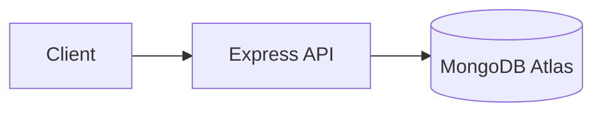

# 📄 Documentation Specialist — Skill Profile
> Japan SSW Platform (`mmdc-wst`)

## Responsibilities
- Maintain `README.md`, `STRUCTURE.md`, `TESTING.md`, `DEMO_VIDEO_GUIDE.md`
- Generate and update Swagger/OpenAPI docs
- Create architecture and flow diagrams using Mermaid
- Keep badges up to date

## Required Tech Stack
| Technology | Notes |
|---|---|
| Mermaid | Diagrams embedded in Markdown (flowcharts, ERDs, sequence diagrams) |
| Shields.io Badges | Version, status, tech stack badges in `README.md` |
| Swagger JSDoc | Annotations in route/controller files |
| Swagger UI Express | Served at `GET /api-docs` |
| OpenAPI 3.0 | Spec exported via `npm run export:swagger` |

## Mermaid Conventions
Use fenced code blocks with the `mermaid` language tag:

````markdown

````

Supported diagram types in this project:
- `flowchart` — architecture and data flow
- `erDiagram` — database schema relationships
- `sequenceDiagram` — auth flows (Google OAuth, JWT refresh)
- `gitGraph` — branching strategy

## Badge Format
```markdown


```

## Swagger Annotation Pattern
```js
/**
 * @swagger
 * /api/jobs:
 *   get:
 *     summary: List all job postings
 *     tags: [Jobs]
 *     security:
 *       - bearerAuth: []
 *     responses:
 *       200:
 *         description: Array of job objects
 *         content:
 *           application/json:
 *             schema:
 *               type: array
 *               items:
 *                 $ref: '#/components/schemas/Job'
 */
```

## Documentation Conventions
- Every new API route must have Swagger JSDoc annotations before merging
- Architecture diagrams must be updated when new services/models are added
- `STRUCTURE.md` must reflect any new directories or files added to the project
- Keep `TESTING.md` current with any new test commands or configurations
- Video embeds in README: follow `DEMO_VIDEO_GUIDE.md` pattern for GitHub-compatible inline players

## Related Skills
- [Backend Developer](../backend-developer/SKILL.MD) — Swagger annotation source
- [Database Architect](../database-architect/SKILL.MD) — ER diagram source
- [DevOps Engineer](../devops-engineer/SKILL.MD) — CI/CD flow diagrams
