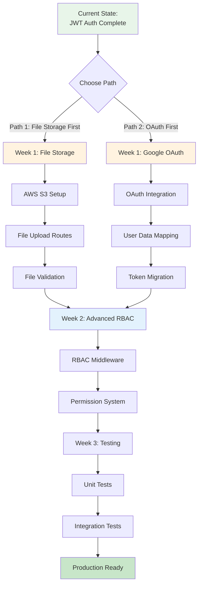
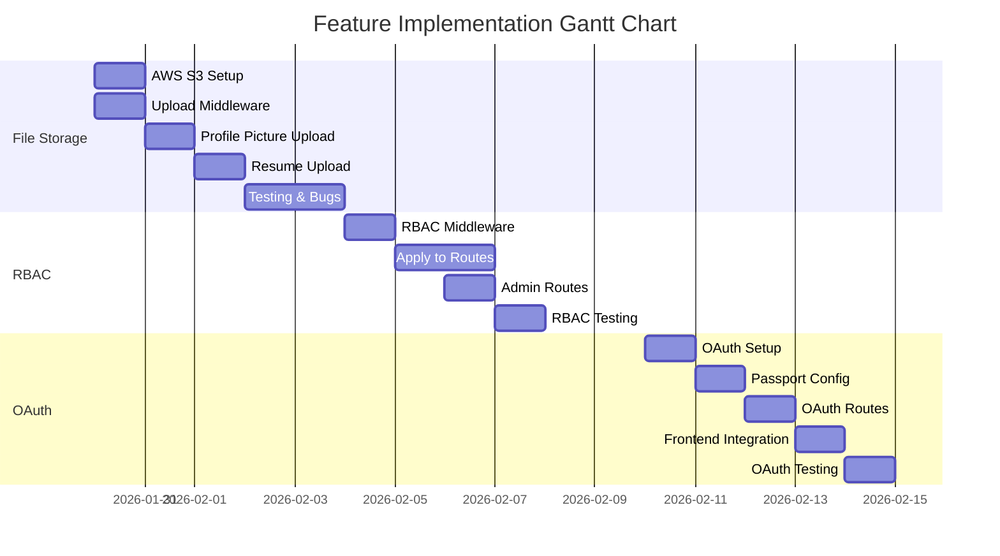

# Feature Implementation Plan - Japan SSW Platform

**Project:** Japan Specified Skilled Worker (SSW) Platform  
**Team:** Team Kaizen MMDC  
**Date:** January 29, 2026  
**Status:** Implementation Roadmap

---

## 📋 Table of Contents

1. [Current State Assessment](#current-state-assessment)
2. [Feature Implementation Roadmap](#feature-implementation-roadmap)
3. [Part I: File Storage and Retrieval](#part-i-file-storage-and-retrieval)
4. [Part II: Google OAuth Integration](#part-ii-google-oauth-integration)
5. [Part III: Middleware Validation](#part-iii-middleware-validation)
6. [Part IV: Role-Based Access Control (RBAC)](#part-iv-role-based-access-control-rbac)
7. [Testing Strategy](#testing-strategy)
8. [Implementation Timeline](#implementation-timeline)

---

## 🎯 Current State Assessment

### ✅ Already Implemented

| Feature               | Status          | Notes                                               |
| --------------------- | --------------- | --------------------------------------------------- |
| User Authentication   | ✅ **Complete** | JWT-based auth with register/login                  |
| Authentication Tokens | ✅ **Complete** | JWT tokens issued at login/register                 |
| Middleware Validation | ✅ **Complete** | `protect` middleware validates JWT                  |
| Basic RBAC            | ✅ **Complete** | Role field in user model (jobseeker/employer/admin) |
| Profile CRUD          | ✅ **Complete** | Full profile management for jobseekers              |
| Jobs API              | ✅ **Complete** | List, filter, search jobs                           |
| Companies API         | ✅ **Complete** | Company directory                                   |
| MongoDB Atlas         | ✅ **Complete** | Cloud database with 26 users, 44 jobs, 10 companies |
| Rate Limiting         | ✅ **Complete** | Configured for auth and general routes              |

### ❌ Not Yet Implemented

| Feature                        | Priority  | Complexity | Estimated Time |
| ------------------------------ | --------- | ---------- | -------------- |
| File Storage (AWS S3/Firebase) | 🔴 High   | Medium     | 2-3 days       |
| File Upload/Retrieval Routes   | 🔴 High   | Medium     | 2 days         |
| Google OAuth                   | 🟡 Medium | Medium     | 2-3 days       |
| Advanced RBAC Middleware       | 🟡 Medium | Low        | 1 day          |
| File Size/Type Validation      | 🔴 High   | Low        | 0.5 day        |

---

## 🗺️ Feature Implementation Roadmap



### Recommended Implementation Order

**🎯 Phase 1: File Storage (Week 1)**

1. Set up AWS S3 bucket or Firebase Storage
2. Implement file upload routes
3. Add file validation middleware
4. Test with profile pictures

**🎯 Phase 2: Advanced RBAC (Week 2)**

1. Create advanced permission system
2. Implement RBAC middleware
3. Protect employer-only routes
4. Add admin routes

**🎯 Phase 3: Google OAuth (Optional - Week 3)**

1. Set up Google OAuth credentials
2. Implement OAuth flow
3. Map OAuth users to existing system
4. Maintain JWT token system

---

## 📦 Part I: File Storage and Retrieval

### Decision: AWS S3 vs Firebase Storage

| Criteria            | AWS S3                        | Firebase Storage             | Recommendation |
| ------------------- | ----------------------------- | ---------------------------- | -------------- |
| Cost (Free Tier)    | 5GB storage, 20K GET requests | 5GB storage, 50K downloads   | AWS S3 ✅      |
| Ease of Setup       | Moderate                      | Easy                         | Firebase ✅    |
| Scalability         | Excellent                     | Good                         | AWS S3 ✅      |
| CDN Support         | CloudFront (built-in)         | Firebase CDN                 | Tie            |
| MongoDB Integration | Excellent                     | Excellent                    | Tie            |
| **Overall**         | **Better for production**     | Better for rapid prototyping | **AWS S3** ✅  |

**Decision: Use AWS S3** for production-ready, scalable file storage.

---

### Implementation Steps

#### Step 1: AWS S3 Setup (30 minutes)

```bash
# Install AWS SDK
cd backend
npm install @aws-sdk/client-s3 @aws-sdk/s3-request-presigner multer multer-s3
```

**Create `.env` additions:**

```bash
# AWS S3 Configuration
AWS_ACCESS_KEY_ID=your_access_key
AWS_SECRET_ACCESS_KEY=your_secret_key
AWS_REGION=us-east-1
AWS_S3_BUCKET=japanssw-uploads
AWS_S3_BUCKET_URL=https://japanssw-uploads.s3.us-east-1.amazonaws.com
```

**Create `backend/src/config/s3.js`:**

```javascript
const { S3Client } = require("@aws-sdk/client-s3");

const s3Client = new S3Client({
  region: process.env.AWS_REGION,
  credentials: {
    accessKeyId: process.env.AWS_ACCESS_KEY_ID,
    secretAccessKey: process.env.AWS_SECRET_ACCESS_KEY,
  },
});

module.exports = s3Client;
```

---

#### Step 2: File Upload Middleware (1 hour)

**Create `backend/src/middleware/upload.js`:**

```javascript
const multer = require("multer");
const multerS3 = require("multer-s3");
const s3Client = require("../config/s3");
const { ApiError } = require("../utils/ApiError");

// Allowed file types
const ALLOWED_IMAGE_TYPES = ["image/jpeg", "image/png", "image/jpg"];
const ALLOWED_DOCUMENT_TYPES = [
  "application/pdf",
  "application/msword",
  "application/vnd.openxmlformats-officedocument.wordprocessingml.document",
];

// File size limits
const MAX_IMAGE_SIZE = 5 * 1024 * 1024; // 5MB
const MAX_DOCUMENT_SIZE = 10 * 1024 * 1024; // 10MB

// File filter function
const fileFilter = (allowedTypes, maxSize) => (req, file, cb) => {
  if (!allowedTypes.includes(file.mimetype)) {
    return cb(
      new ApiError(
        400,
        `Invalid file type. Allowed: ${allowedTypes.join(", ")}`,
      ),
      false,
    );
  }
  cb(null, true);
};

// Profile picture upload
const uploadProfilePicture = multer({
  storage: multerS3({
    s3: s3Client,
    bucket: process.env.AWS_S3_BUCKET,
    metadata: (req, file, cb) => {
      cb(null, { fieldName: file.fieldname });
    },
    key: (req, file, cb) => {
      const fileName = `profiles/${req.user.id}/profile-${Date.now()}.${
        file.mimetype.split("/")[1]
      }`;
      cb(null, fileName);
    },
  }),
  fileFilter: fileFilter(ALLOWED_IMAGE_TYPES),
  limits: { fileSize: MAX_IMAGE_SIZE },
});

// Resume/document upload
const uploadDocument = multer({
  storage: multerS3({
    s3: s3Client,
    bucket: process.env.AWS_S3_BUCKET,
    metadata: (req, file, cb) => {
      cb(null, { fieldName: file.fieldname });
    },
    key: (req, file, cb) => {
      const fileName = `documents/${req.user.id}/resume-${Date.now()}.${file.originalname
        .split(".")
        .pop()}`;
      cb(null, fileName);
    },
  }),
  fileFilter: fileFilter(ALLOWED_DOCUMENT_TYPES),
  limits: { fileSize: MAX_DOCUMENT_SIZE },
});

module.exports = {
  uploadProfilePicture,
  uploadDocument,
};
```

---

#### Step 3: File Upload Routes (1 hour)

**Update `backend/src/routes/profileRoutes.js`:**

```javascript
const express = require("express");
const router = express.Router();
const { protect } = require("../middleware/auth");
const {
  uploadProfilePicture,
  uploadDocument,
} = require("../middleware/upload");
const profileController = require("../controllers/profileController");

// Existing routes...
router.get("/", protect, profileController.getProfile);
router.post("/", protect, profileController.createProfile);
router.put("/", protect, profileController.updateProfile);
router.delete("/", protect, profileController.deleteProfile);

// NEW: File upload routes
router.post(
  "/upload/picture",
  protect,
  uploadProfilePicture.single("profilePicture"),
  profileController.uploadProfilePicture,
);

router.post(
  "/upload/resume",
  protect,
  uploadDocument.single("resume"),
  profileController.uploadResume,
);

router.delete(
  "/upload/picture",
  protect,
  profileController.deleteProfilePicture,
);

router.delete("/upload/resume", protect, profileController.deleteResume);

module.exports = router;
```

---

#### Step 4: Profile Controller File Methods (1 hour)

**Update `backend/src/controllers/profileController.js`:**

```javascript
const { DeleteObjectCommand } = require("@aws-sdk/client-s3");
const s3Client = require("../config/s3");
const Profile = require("../models/Profile");
const { ApiError } = require("../utils/ApiError");

// Upload profile picture
exports.uploadProfilePicture = async (req, res, next) => {
  try {
    if (!req.file) {
      throw new ApiError(400, "No file uploaded");
    }

    const profile = await Profile.findOne({ user: req.user.id });

    if (!profile) {
      throw new ApiError(404, "Profile not found");
    }

    // Delete old picture if exists
    if (profile.profilePicture) {
      const oldKey = profile.profilePicture.split(".com/")[1];
      await s3Client.send(
        new DeleteObjectCommand({
          Bucket: process.env.AWS_S3_BUCKET,
          Key: oldKey,
        }),
      );
    }

    // Update profile with new picture URL
    profile.profilePicture = req.file.location;
    await profile.save();

    res.status(200).json({
      success: true,
      data: {
        profilePicture: profile.profilePicture,
      },
    });
  } catch (error) {
    next(error);
  }
};

// Upload resume
exports.uploadResume = async (req, res, next) => {
  try {
    if (!req.file) {
      throw new ApiError(400, "No file uploaded");
    }

    const profile = await Profile.findOne({ user: req.user.id });

    if (!profile) {
      throw new ApiError(404, "Profile not found");
    }

    // Delete old resume if exists
    if (profile.resume) {
      const oldKey = profile.resume.split(".com/")[1];
      await s3Client.send(
        new DeleteObjectCommand({
          Bucket: process.env.AWS_S3_BUCKET,
          Key: oldKey,
        }),
      );
    }

    // Update profile with new resume URL
    profile.resume = req.file.location;
    profile.resumeName = req.file.originalname;
    await profile.save();

    res.status(200).json({
      success: true,
      data: {
        resume: profile.resume,
        resumeName: profile.resumeName,
      },
    });
  } catch (error) {
    next(error);
  }
};

// Delete profile picture
exports.deleteProfilePicture = async (req, res, next) => {
  try {
    const profile = await Profile.findOne({ user: req.user.id });

    if (!profile) {
      throw new ApiError(404, "Profile not found");
    }

    if (!profile.profilePicture) {
      throw new ApiError(400, "No profile picture to delete");
    }

    // Delete from S3
    const key = profile.profilePicture.split(".com/")[1];
    await s3Client.send(
      new DeleteObjectCommand({
        Bucket: process.env.AWS_S3_BUCKET,
        Key: key,
      }),
    );

    // Remove from profile
    profile.profilePicture = undefined;
    await profile.save();

    res.status(200).json({
      success: true,
      message: "Profile picture deleted successfully",
    });
  } catch (error) {
    next(error);
  }
};

// Delete resume
exports.deleteResume = async (req, res, next) => {
  try {
    const profile = await Profile.findOne({ user: req.user.id });

    if (!profile) {
      throw new ApiError(404, "Profile not found");
    }

    if (!profile.resume) {
      throw new ApiError(400, "No resume to delete");
    }

    // Delete from S3
    const key = profile.resume.split(".com/")[1];
    await s3Client.send(
      new DeleteObjectCommand({
        Bucket: process.env.AWS_S3_BUCKET,
        Key: key,
      }),
    );

    // Remove from profile
    profile.resume = undefined;
    profile.resumeName = undefined;
    await profile.save();

    res.status(200).json({
      success: true,
      message: "Resume deleted successfully",
    });
  } catch (error) {
    next(error);
  }
};
```

---

#### Step 5: Update Profile Model (15 minutes)

**Update `backend/src/models/Profile.js`:**

```javascript
// Add to Profile schema
const ProfileSchema = new mongoose.Schema(
  {
    user: {
      type: mongoose.Schema.Types.ObjectId,
      ref: "User",
      required: true,
      unique: true,
    },
    // ... existing fields ...

    // NEW: File fields
    profilePicture: {
      type: String,
      default: null,
    },
    resume: {
      type: String,
      default: null,
    },
    resumeName: {
      type: String,
      default: null,
    },
  },
  {
    timestamps: true,
  },
);
```

---

## 🔐 Part II: Google OAuth Integration

### Decision: Keep JWT or Switch to OAuth?

**Recommendation: Hybrid Approach** ✅

- Use Google OAuth for **initial authentication**
- Issue JWT tokens after OAuth success
- Maintain existing JWT middleware
- Best of both worlds: OAuth convenience + JWT stateless benefits

---

### Implementation Steps

#### Step 1: Google OAuth Setup (30 minutes)

```bash
# Install Passport.js and Google OAuth strategy
npm install passport passport-google-oauth20
```

**Create Google OAuth App:**

1. Go to [Google Cloud Console](https://console.cloud.google.com)
2. Create new project: "Japan SSW Platform"
3. Enable Google+ API
4. Create OAuth 2.0 credentials
5. Add authorized redirect URI: `http://localhost:3000/api/v1/auth/google/callback`

**Update `.env`:**

```bash
# Google OAuth
GOOGLE_CLIENT_ID=your_google_client_id
GOOGLE_CLIENT_SECRET=your_google_client_secret
GOOGLE_CALLBACK_URL=http://localhost:3000/api/v1/auth/google/callback
```

---

#### Step 2: Passport Configuration (45 minutes)

**Create `backend/src/config/passport.js`:**

```javascript
const passport = require("passport");
const GoogleStrategy = require("passport-google-oauth20").Strategy;
const User = require("../models/User");

passport.use(
  new GoogleStrategy(
    {
      clientID: process.env.GOOGLE_CLIENT_ID,
      clientSecret: process.env.GOOGLE_CLIENT_SECRET,
      callbackURL: process.env.GOOGLE_CALLBACK_URL,
    },
    async (accessToken, refreshToken, profile, done) => {
      try {
        // Check if user already exists
        let user = await User.findOne({ email: profile.emails[0].value });

        if (user) {
          // Update OAuth info
          user.googleId = profile.id;
          user.profilePicture = profile.photos[0]?.value;
          await user.save();
          return done(null, user);
        }

        // Create new user
        user = await User.create({
          email: profile.emails[0].value,
          googleId: profile.id,
          role: "jobseeker", // Default role
          password: "OAUTH_USER_" + Math.random().toString(36), // Random password
          profilePicture: profile.photos[0]?.value,
        });

        done(null, user);
      } catch (error) {
        done(error, null);
      }
    },
  ),
);

module.exports = passport;
```

---

#### Step 3: OAuth Routes (30 minutes)

**Update `backend/src/routes/authRoutes.js`:**

```javascript
const express = require("express");
const router = express.Router();
const passport = require("../config/passport");
const authController = require("../controllers/authController");
const { protect } = require("../middleware/auth");

// Existing routes
router.post("/register", authController.register);
router.post("/login", authController.login);
router.get("/me", protect, authController.getMe);
router.post("/logout", protect, authController.logout);

// NEW: Google OAuth routes
router.get(
  "/google",
  passport.authenticate("google", {
    scope: ["profile", "email"],
    session: false,
  }),
);

router.get(
  "/google/callback",
  passport.authenticate("google", {
    session: false,
    failureRedirect: "/login",
  }),
  authController.googleCallback,
);

module.exports = router;
```

---

#### Step 4: OAuth Controller Methods (30 minutes)

**Update `backend/src/controllers/authController.js`:**

```javascript
// Add this method
exports.googleCallback = async (req, res, next) => {
  try {
    // User is available from passport middleware in req.user
    const user = req.user;

    // Generate JWT token (same as regular login)
    const token = jwt.sign({ id: user._id }, process.env.JWT_SECRET, {
      expiresIn: process.env.JWT_EXPIRE,
    });

    // Redirect to frontend with token
    res.redirect(`${process.env.FRONTEND_URL}/auth/success?token=${token}`);
  } catch (error) {
    next(error);
  }
};
```

---

#### Step 5: Update User Model (15 minutes)

**Update `backend/src/models/User.js`:**

```javascript
const UserSchema = new mongoose.Schema(
  {
    email: {
      type: String,
      required: [true, "Please provide an email"],
      unique: true,
      match: [/^\S+@\S+\.\S+$/, "Please provide a valid email"],
    },
    password: {
      type: String,
      required: [true, "Please provide a password"],
      minlength: 6,
      select: false,
    },
    role: {
      type: String,
      enum: ["jobseeker", "employer", "admin"],
      default: "jobseeker",
    },
    // NEW: OAuth fields
    googleId: {
      type: String,
      sparse: true,
      unique: true,
    },
    profilePicture: {
      type: String,
      default: null,
    },
  },
  {
    timestamps: true,
  },
);
```

---

## 🛡️ Part III: Middleware Validation

**Current Status:** ✅ Already Implemented

Your existing `protect` middleware already validates JWT tokens correctly:

```javascript
// backend/src/middleware/auth.js
exports.protect = async (req, res, next) => {
  try {
    let token;

    if (
      req.headers.authorization &&
      req.headers.authorization.startsWith("Bearer")
    ) {
      token = req.headers.authorization.split(" ")[1];
    }

    if (!token) {
      throw new ApiError(401, "Not authorized to access this route");
    }

    // Verify token
    const decoded = jwt.verify(token, process.env.JWT_SECRET);

    // Get user from token
    req.user = await User.findById(decoded.id);

    if (!req.user) {
      throw new ApiError(401, "User not found");
    }

    next();
  } catch (error) {
    if (error.name === "JsonWebTokenError") {
      return next(new ApiError(401, "Invalid token"));
    }
    if (error.name === "TokenExpiredError") {
      return next(new ApiError(401, "Token expired"));
    }
    next(error);
  }
};
```

**✅ No additional work needed!**

---

## 👥 Part IV: Role-Based Access Control (RBAC)

**Current Status:** ✅ Partial Implementation (role field exists)

### Enhancement: Advanced RBAC Middleware

#### Step 1: Create Advanced RBAC Middleware (30 minutes)

**Create `backend/src/middleware/rbac.js`:**

```javascript
const { ApiError } = require("../utils/ApiError");

/**
 * Restrict access to specific roles
 * @param {...string} roles - Allowed roles
 */
exports.authorize = (...roles) => {
  return (req, res, next) => {
    if (!req.user) {
      return next(new ApiError(401, "Not authenticated"));
    }

    if (!roles.includes(req.user.role)) {
      return next(
        new ApiError(
          403,
          `User role '${req.user.role}' is not authorized to access this route`,
        ),
      );
    }

    next();
  };
};

/**
 * Check if user owns the resource
 */
exports.checkOwnership = (model) => {
  return async (req, res, next) => {
    try {
      const resourceId = req.params.id;
      const resource = await model.findById(resourceId);

      if (!resource) {
        return next(new ApiError(404, "Resource not found"));
      }

      // Check if user owns the resource
      if (
        resource.user.toString() !== req.user.id &&
        req.user.role !== "admin"
      ) {
        return next(
          new ApiError(403, "Not authorized to access this resource"),
        );
      }

      req.resource = resource;
      next();
    } catch (error) {
      next(error);
    }
  };
};

/**
 * Admin only access
 */
exports.adminOnly = (req, res, next) => {
  if (!req.user) {
    return next(new ApiError(401, "Not authenticated"));
  }

  if (req.user.role !== "admin") {
    return next(new ApiError(403, "Admin access required"));
  }

  next();
};
```

---

#### Step 2: Apply RBAC to Routes (45 minutes)

**Update `backend/src/routes/jobRoutes.js`:**

```javascript
const express = require("express");
const router = express.Router();
const { protect } = require("../middleware/auth");
const { authorize } = require("../middleware/rbac");
const jobController = require("../controllers/jobController");

// Public routes
router.get("/", jobController.getAllJobs);
router.get("/:id", jobController.getJob);

// Employer-only routes
router.post(
  "/",
  protect,
  authorize("employer", "admin"),
  jobController.createJob,
);
router.put(
  "/:id",
  protect,
  authorize("employer", "admin"),
  jobController.updateJob,
);
router.delete(
  "/:id",
  protect,
  authorize("employer", "admin"),
  jobController.deleteJob,
);
router.get(
  "/my-jobs",
  protect,
  authorize("employer", "admin"),
  jobController.getMyJobs,
);

module.exports = router;
```

**Update `backend/src/routes/applicationRoutes.js`:**

```javascript
const express = require("express");
const router = express.Router();
const { protect } = require("../middleware/auth");
const { authorize } = require("../middleware/rbac");
const applicationController = require("../controllers/applicationController");

// Jobseeker routes
router.post(
  "/jobs/:id/apply",
  protect,
  authorize("jobseeker"),
  applicationController.applyToJob,
);
router.get(
  "/me",
  protect,
  authorize("jobseeker"),
  applicationController.getMyApplications,
);
router.put(
  "/:id/withdraw",
  protect,
  authorize("jobseeker"),
  applicationController.withdrawApplication,
);

// Employer routes
router.get(
  "/jobs/:id/applications",
  protect,
  authorize("employer", "admin"),
  applicationController.getJobApplications,
);
router.put(
  "/:id/status",
  protect,
  authorize("employer", "admin"),
  applicationController.updateApplicationStatus,
);

// Both can view single application
router.get("/:id", protect, applicationController.getApplication);

module.exports = router;
```

**Create Admin Routes `backend/src/routes/adminRoutes.js`:**

```javascript
const express = require("express");
const router = express.Router();
const { protect } = require("../middleware/auth");
const { adminOnly } = require("../middleware/rbac");
const adminController = require("../controllers/adminController");

// All routes require admin access
router.use(protect, adminOnly);

// User management
router.get("/users", adminController.getAllUsers);
router.get("/users/:id", adminController.getUser);
router.put("/users/:id", adminController.updateUser);
router.delete("/users/:id", adminController.deleteUser);

// Analytics
router.get("/stats", adminController.getStats);

module.exports = router;
```

---

## 🧪 Testing Strategy

### Unit Tests for File Upload

**Create `backend/tests/upload.test.js`:**

```javascript
const request = require("supertest");
const app = require("../src/app");
const User = require("../src/models/User");
const Profile = require("../src/models/Profile");

describe("File Upload Tests", () => {
  let token;
  let userId;

  beforeAll(async () => {
    // Create test user and get token
    const user = await User.create({
      email: "filetest@example.com",
      password: "Test123!",
      role: "jobseeker",
    });
    userId = user._id;
    token = user.getSignedJwtToken();

    // Create profile
    await Profile.create({
      user: userId,
      firstName: "Test",
      lastName: "User",
    });
  });

  test("Upload profile picture - Success", async () => {
    const response = await request(app)
      .post("/api/v1/profile/upload/picture")
      .set("Authorization", `Bearer ${token}`)
      .attach("profilePicture", "__tests__/fixtures/test-image.jpg");

    expect(response.status).toBe(200);
    expect(response.body.success).toBe(true);
    expect(response.body.data.profilePicture).toContain(".jpg");
  });

  test("Upload invalid file type - Fail", async () => {
    const response = await request(app)
      .post("/api/v1/profile/upload/picture")
      .set("Authorization", `Bearer ${token}`)
      .attach("profilePicture", "__tests__/fixtures/test.txt");

    expect(response.status).toBe(400);
  });

  test("Upload file too large - Fail", async () => {
    const response = await request(app)
      .post("/api/v1/profile/upload/picture")
      .set("Authorization", `Bearer ${token}`)
      .attach("profilePicture", "__tests__/fixtures/large-file.jpg");

    expect(response.status).toBe(400);
  });
});
```

---

### Integration Tests for OAuth

**Create `backend/tests/oauth.test.js`:**

```javascript
describe("Google OAuth Tests", () => {
  test("Google OAuth redirect", async () => {
    const response = await request(app).get("/api/v1/auth/google");

    expect(response.status).toBe(302); // Redirect to Google
    expect(response.headers.location).toContain("accounts.google.com");
  });

  test("OAuth callback with valid token", async () => {
    // Mock Google OAuth response
    // Test JWT token issuance
    // Verify user creation/update
  });
});
```

---

### RBAC Tests

**Create `backend/tests/rbac.test.js`:**

```javascript
describe("RBAC Tests", () => {
  let jobseekerToken;
  let employerToken;
  let adminToken;

  beforeAll(async () => {
    // Create users with different roles
    const jobseeker = await User.create({
      email: "jobseeker@test.com",
      password: "Test123!",
      role: "jobseeker",
    });
    jobseekerToken = jobseeker.getSignedJwtToken();

    const employer = await User.create({
      email: "employer@test.com",
      password: "Test123!",
      role: "employer",
    });
    employerToken = employer.getSignedJwtToken();

    const admin = await User.create({
      email: "admin@test.com",
      password: "Test123!",
      role: "admin",
    });
    adminToken = admin.getSignedJwtToken();
  });

  test("Jobseeker cannot create job", async () => {
    const response = await request(app)
      .post("/api/v1/jobs")
      .set("Authorization", `Bearer ${jobseekerToken}`)
      .send({ title: "Test Job" });

    expect(response.status).toBe(403);
  });

  test("Employer can create job", async () => {
    const response = await request(app)
      .post("/api/v1/jobs")
      .set("Authorization", `Bearer ${employerToken}`)
      .send({
        title: "Test Job",
        company: "test-company-id",
        // ... other required fields
      });

    expect(response.status).toBe(201);
  });

  test("Admin can access admin routes", async () => {
    const response = await request(app)
      .get("/api/v1/admin/users")
      .set("Authorization", `Bearer ${adminToken}`);

    expect(response.status).toBe(200);
  });

  test("Non-admin cannot access admin routes", async () => {
    const response = await request(app)
      .get("/api/v1/admin/users")
      .set("Authorization", `Bearer ${employerToken}`);

    expect(response.status).toBe(403);
  });
});
```

---

## 📅 Implementation Timeline

### Week 1: File Storage (Priority 1)

| Day | Task                               | Time | Owner        |
| --- | ---------------------------------- | ---- | ------------ |
| Mon | AWS S3 setup + configuration       | 2h   | Backend Team |
| Mon | Create upload middleware           | 3h   | Backend Team |
| Tue | Implement file upload routes       | 3h   | Backend Team |
| Tue | Add profile picture endpoints      | 2h   | Backend Team |
| Wed | Add resume upload endpoints        | 2h   | Backend Team |
| Wed | Testing file upload flow           | 3h   | QA Team      |
| Thu | Documentation + Postman collection | 2h   | Backend Team |
| Fri | Code review + bug fixes            | 3h   | Full Team    |

**Deliverables:**

- ✅ Working file upload system
- ✅ S3 integration
- ✅ Validation middleware
- ✅ Unit tests (80% coverage)
- ✅ Updated API documentation

---

### Week 2: Advanced RBAC (Priority 2)

| Day | Task                             | Time | Owner        |
| --- | -------------------------------- | ---- | ------------ |
| Mon | Create RBAC middleware           | 2h   | Backend Team |
| Mon | Apply RBAC to job routes         | 2h   | Backend Team |
| Tue | Apply RBAC to application routes | 2h   | Backend Team |
| Tue | Create admin routes              | 3h   | Backend Team |
| Wed | Testing RBAC permissions         | 4h   | QA Team      |
| Thu | Integration testing              | 3h   | QA Team      |
| Fri | Documentation + review           | 2h   | Full Team    |

**Deliverables:**

- ✅ Complete RBAC system
- ✅ Protected employer routes
- ✅ Admin dashboard endpoints
- ✅ Permission tests (100% pass)
- ✅ Updated test suite

---

### Week 3: Google OAuth (Optional - Priority 3)

| Day | Task                        | Time | Owner         |
| --- | --------------------------- | ---- | ------------- |
| Mon | Google OAuth setup          | 2h   | Backend Team  |
| Mon | Passport.js configuration   | 2h   | Backend Team  |
| Tue | OAuth routes implementation | 3h   | Backend Team  |
| Tue | User mapping logic          | 2h   | Backend Team  |
| Wed | Frontend OAuth button       | 3h   | Frontend Team |
| Wed | Testing OAuth flow          | 3h   | QA Team       |
| Thu | Error handling + edge cases | 3h   | Backend Team  |
| Fri | Documentation + deployment  | 2h   | Full Team     |

**Deliverables:**

- ✅ Working OAuth login
- ✅ User account linking
- ✅ Frontend integration
- ✅ OAuth tests
- ✅ Production-ready

---

## 🎯 Success Criteria

### File Storage

- [ ] Users can upload profile pictures (JPEG/PNG, max 5MB)
- [ ] Users can upload resumes (PDF/DOC, max 10MB)
- [ ] Files are stored in AWS S3
- [ ] File URLs are saved in MongoDB
- [ ] Users can delete their uploaded files
- [ ] Invalid file types are rejected
- [ ] Oversized files are rejected
- [ ] 100% test pass rate

### RBAC

- [ ] Jobseekers can only apply to jobs
- [ ] Employers can create/edit/delete their own jobs
- [ ] Employers can view applications for their jobs
- [ ] Admins can access all routes
- [ ] Unauthorized access returns 403 error
- [ ] Role-based tests pass (100%)

### OAuth (Optional)

- [ ] Users can sign in with Google
- [ ] OAuth creates new user if not exists
- [ ] OAuth links to existing email if found
- [ ] JWT token issued after OAuth success
- [ ] User data synced from Google profile
- [ ] OAuth flow works on mobile & web

---

## 📊 Progress Tracking



---

## 🚀 Quick Start Checklist

### Before You Start

- [ ] Read this plan completely
- [ ] Set up AWS S3 account (or Firebase)
- [ ] Create Google OAuth credentials
- [ ] Review current codebase
- [ ] Assign tasks to team members

### Week 1 Setup

- [ ] Install dependencies: `npm install @aws-sdk/client-s3 multer multer-s3`
- [ ] Add AWS credentials to `.env`
- [ ] Create S3 bucket: `japanssw-uploads`
- [ ] Set bucket CORS policy
- [ ] Create `src/config/s3.js`
- [ ] Create `src/middleware/upload.js`

### Testing Setup

- [ ] Install test dependencies: `npm install --save-dev supertest`
- [ ] Create test fixtures folder
- [ ] Add test images/documents
- [ ] Set up test database
- [ ] Run initial tests

---

## 📞 Support & Questions

**Questions about this plan?**

- Slack: #backend-dev channel
- Email: backend-team@japanssw.com
- Daily standup: 10 AM JST

**Need help with:**

- AWS S3 setup → Contact DevOps team
- OAuth credentials → Contact project lead
- Testing strategy → Contact QA team

---

**Plan Created:** January 29, 2026  
**Last Updated:** January 29, 2026  
**Status:** Ready for Implementation ✅

---

_This implementation plan aligns with the Week 1-3 roadmap in [PROJECT_PRESENTATION.md](PROJECT_PRESENTATION.md)._
