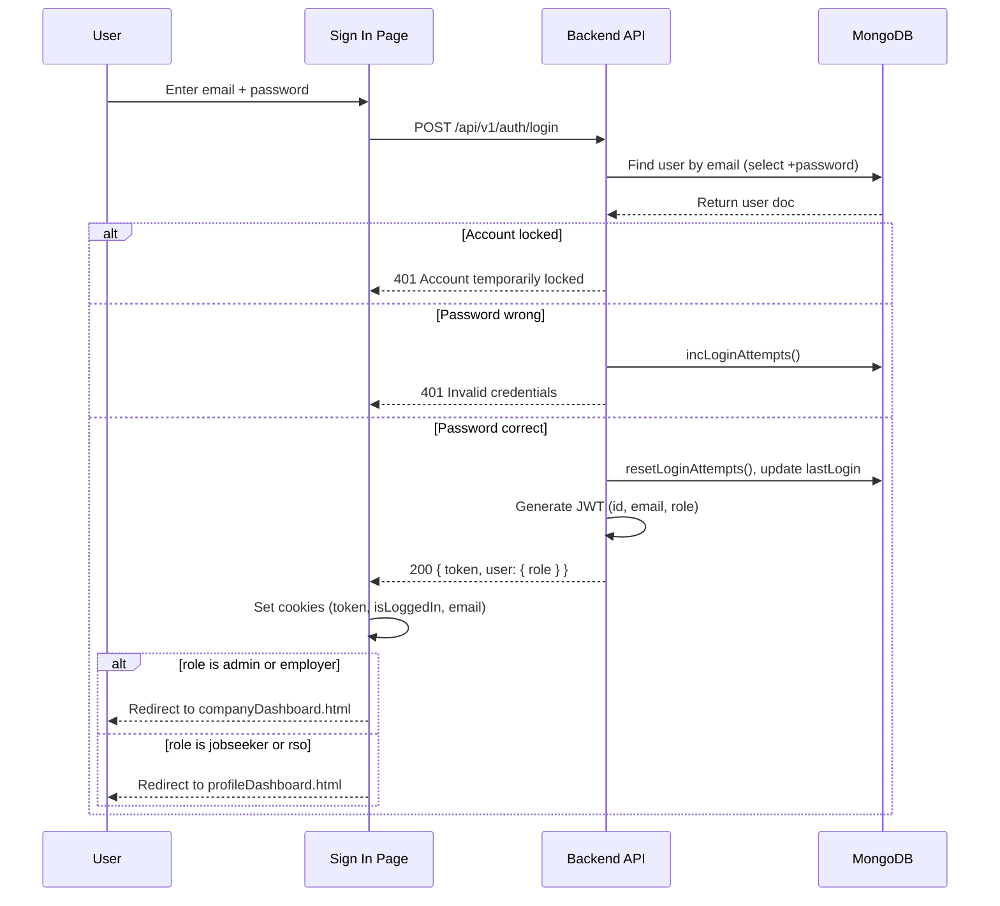
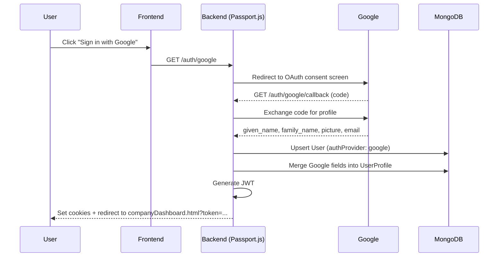
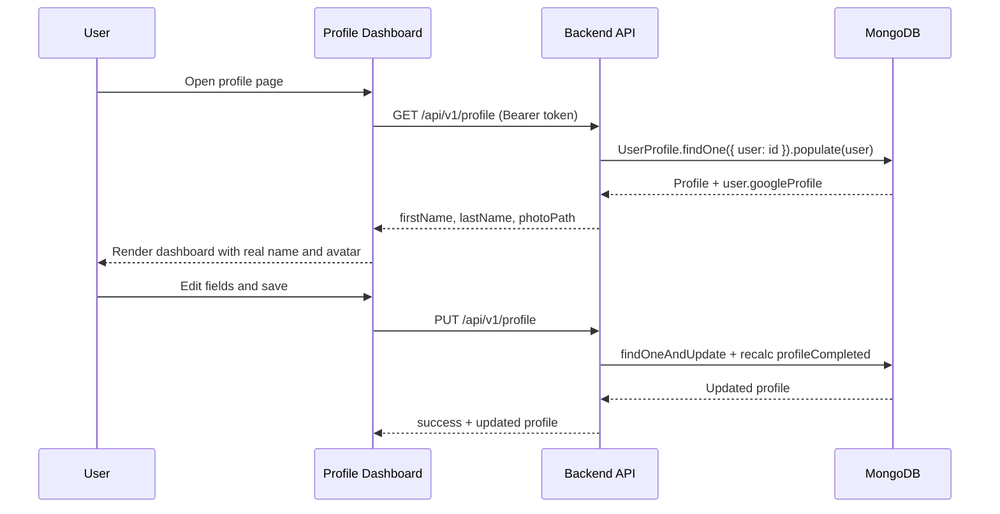
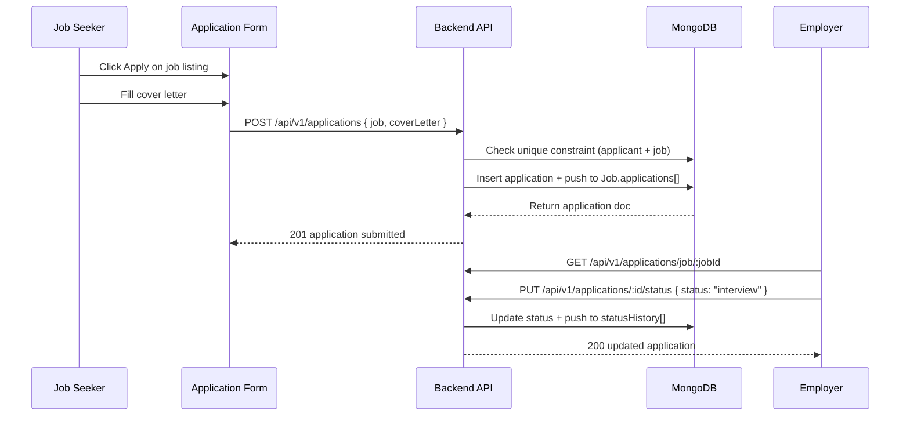
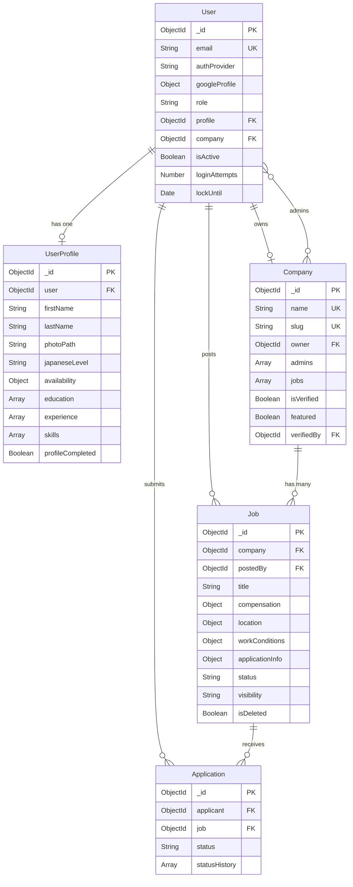
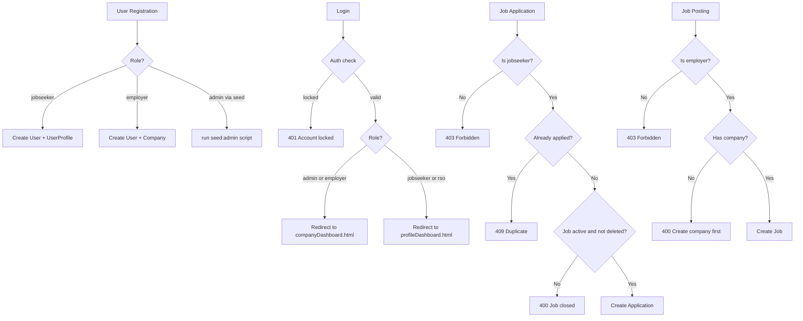

# Database Plan — Japan SSW Job Matching Platform

**Project:** MMDC WST (Web Systems and Technology)
**Database:** MongoDB Atlas
**Cluster:** `japansswcluster0.lvia1ct.mongodb.net`
**Database Name:** `japansswdb`
**Last Updated:** March 20, 2026
**Document Version:** 2.0


> **v2.0 Change Summary:** Added `adminjobs` collection, Google OAuth fields on `users`,
> `cvPath`/`photoPath`/`availability` updates on `userprofiles`, restructured `jobs`
> (`salary→compensation`, `workConditions`, `visibility`, soft-delete), updated `companies`
> (`owner`, `admins`, `jobs`, `isVerified`, `verifiedBy`), updated `contents` (paragraphs
> structure), new indexes across all collections, and `create-admin.js` seed script.

---

## Table of Contents

1. [Collections and Documents](#1-collections-and-documents)
2. [CRUD Operations](#2-crud-operations)
3. [Sample API Requests](#3-sample-api-requests)
4. [UI and Data Flow](#4-ui-and-data-flow)
5. [Database Relationships](#5-database-relationships)
6. [Indexes and Performance](#6-indexes-and-performance)
7. [Data Validation Rules](#7-data-validation-rules)
8. [Future Collections (Not Yet Implemented)](#8-future-collections-not-yet-implemented)
9. [Appendix](#appendix)

---

## 1. Collections and Documents

### Alerts

#### `job_alerts`

| Field | Type | Notes |
|---|---|---|
| `_id` | ObjectId | Primary key |
| `email` | String | Required, lowercase, indexed |
| `createdAt` | Date | Creation timestamp |

Notes: Stores newsletter/subscription emails collected from the frontend job alerts band. Inserted by POST /api/v1/alerts/subscribe. Backend supports native MongoDB driver or Mongoose. Consider a unique index on `email` to prevent duplicates (e.g., `{ email: 1 }` with `unique: true`).

Example document:

```json
{ "_id": "ObjectId(...)", "email": "john@gmail.com", "createdAt": "2026-03-26T11:00:00.000Z" }
```

### User Domain

#### `users`

| Field | Type | Notes |
|---|---|---|
| `_id` | ObjectId | Primary key |
| `email` | String | Required, unique, lowercase |
| `password` | String | bcrypt-hashed (12 rounds); `select: false`; not set for OAuth users |
| `authProvider` | String | `"local"` \| `"google"` (default `"local"`) |
| `googleId` | String | Google OAuth user ID |
| `googleProfile` | Object | `{ id, email, name, given_name, family_name, picture, locale }` |
| `role` | String | `"jobseeker"` \| `"employer"` \| `"admin"` \| `"rso"` (default `"jobseeker"`) |
| `profile` | ObjectId → `userprofiles` | Linked UserProfile document |
| `company` | ObjectId → `companies` | Linked Company (employers only) |
| `isActive` | Boolean | default `true` |
| `isEmailVerified` | Boolean | default `false` |
| `emailVerificationToken` | String | `select: false` |
| `emailVerificationExpire` | Date | — |
| `resetPasswordToken` | String | `select: false` |
| `resetPasswordExpire` | Date | — |
| `lastLogin` | Date | Updated on every login |
| `loginAttempts` | Number | default `0`; auto-locks after 5 failures |
| `lockUntil` | Date | 2-hour lockout window |
| `createdAt` | Date | auto (timestamps) |
| `updatedAt` | Date | auto (timestamps) |

**Virtual:** `isLocked` → `true` when `lockUntil > Date.now()`

**Instance methods:** `comparePassword()`, `getSignedJwtToken()`, `incLoginAttempts()`, `resetLoginAttempts()`

**Document Structure:**

```json
{
  "_id": "69c29ebcc446199ce308b6cc",
  "email": "admin@japanssw.com",
  "password": "$2b$12$92X6Z...hashed...",
  "authProvider": "local",
  "googleId": null,
  "googleProfile": null,
  "role": "admin",
  "isActive": true,
  "isEmailVerified": true,
  "loginAttempts": 0,
  "lockUntil": null,
  "createdAt": "2026-03-24T14:25:01.003Z",
  "updatedAt": "2026-03-24T14:25:01.003Z"
}
```

---

#### `userprofiles`

| Field | Type | Notes |
|---|---|---|
| `_id` | ObjectId | Primary key |
| `user` | ObjectId → `users` | Required, unique |
| `firstName` | String | Required, max 50 chars |
| `lastName` | String | Required, max 50 chars |
| `dateOfBirth` | Date | Required |
| `gender` | String | `"male"` \| `"female"` \| `"other"` \| `"prefer-not-to-say"` |
| `nationality` | String | Required |
| `phone` | String | — |
| `address` | String | — |
| `prefecture` | String | — |
| `city` | String | — |
| `postalCode` | String | — |
| `education` | Array | See subdocument schema below |
| `experience` | Array | See subdocument schema below |
| `skills` | Array | See subdocument schema below |
| `certifications` | Array | See subdocument schema below |
| `languages` | Array | See subdocument schema below |
| `japaneseLevel` | String | `"none"` \| `"N5"` \| `"N4"` \| `"N3"` \| `"N2"` \| `"N1"` |
| `availability.startDate` | Date | — |
| `availability.visaStatus` | String | `"not-applicable"` \| `"student"` \| `"working"` \| `"ssw-1"` \| `"ssw-2"` \| `"spouse"` \| `"pr"` \| `"other"` |
| `availability.visaValidUntil` | Date | — |
| `availability.desiredIndustry` | String | — |
| `availability.relocate` | Boolean | default `true` |
| `availability.remote` | Boolean | default `false` |
| `bio` | String | max 1000 chars |
| `resumePath` | String | S3 key / URL |
| `cvPath` | String | S3 key / URL |
| `photoPath` | String | URL (Google picture or uploaded avatar) |
| `profileCompleted` | Boolean | default `false`; auto-recalculated on save |
| `createdAt` | Date | auto |
| `updatedAt` | Date | auto |

**Virtuals:** `fullName` (firstName + lastName), `age` (from dateOfBirth)

**Pre-save hook:** Recalculates `profileCompleted` — requires firstName, lastName, dateOfBirth, nationality, phone, plus education and at least one of experience/skills.

**Post-query hooks:** `findOneAndUpdate`, `findByIdAndUpdate` — also recalculate `profileCompleted`.

**Subdocument schemas:**

```
education[]      : { school*, degree*, field, startDate*, endDate, current, description }
experience[]     : { company*, title*, description, startDate*, endDate, current }
skills[]         : { name*, level (beginner|intermediate|advanced|expert), category }
certifications[] : { name*, issuer, date, expiryDate, credentialId }
languages[]      : { language*, level (native|fluent|conversational|basic) }
```

*(* = required)*

**Document Structure:**

```json
{
  "_id": "69c29ed2dc4b0d0ef130ffac",
  "user": "69c29ed2dc4b0d0ef130ffa5",
  "firstName": "Maria",
  "lastName": "Santos",
  "dateOfBirth": "1995-08-10T00:00:00.000Z",
  "gender": "female",
  "nationality": "Filipino",
  "phone": "+63-917-000-0000",
  "address": "Quezon City",
  "prefecture": "Tokyo",
  "city": "Shibuya",
  "postalCode": "150-0001",
  "japaneseLevel": "N3",
  "availability": {
    "startDate": "2026-06-01T00:00:00.000Z",
    "visaStatus": "ssw-1",
    "visaValidUntil": "2028-06-01T00:00:00.000Z",
    "desiredIndustry": "Food Service",
    "relocate": true,
    "remote": false
  },
  "bio": "Experienced food service professional seeking SSW opportunities in Japan.",
  "resumePath": "resumes/maria-santos-2026.pdf",
  "cvPath": null,
  "photoPath": null,
  "profileCompleted": true,
  "education": [
    { "school": "De La Salle University", "degree": "Bachelor", "field": "Hospitality Management", "startDate": "2013-06-01T00:00:00.000Z", "endDate": "2017-04-01T00:00:00.000Z", "current": false }
  ],
  "experience": [
    { "company": "Jollibee Foods Corp", "title": "Crew Leader", "description": "Managed front-of-house operations", "startDate": "2017-06-01T00:00:00.000Z", "endDate": "2026-01-01T00:00:00.000Z", "current": false }
  ],
  "skills": [
    { "name": "Food Safety", "level": "advanced", "category": "Technical" }
  ],
  "certifications": [],
  "languages": [
    { "language": "Filipino", "level": "native" },
    { "language": "Japanese", "level": "conversational" }
  ],
  "createdAt": "2026-03-24T14:25:22.668Z",
  "updatedAt": "2026-03-24T14:25:22.668Z"
}
```

---

#### `companies`

| Field | Type | Notes |
|---|---|---|
| `_id` | ObjectId | Primary key |
| `name` | String | Required, unique, max 200 chars |
| `slug` | String | Unique, URL-safe, auto-generated from name pre-save |
| `logo` | String | Absolute URL (`https://…`) or relative path (`/assets/images/company-logos/…`) |
| `industry` | String | Required; enum of 16 industries (see §7) |
| `size` | String | `"1-10"` \| `"11-50"` \| `"51-200"` \| `"201-500"` \| `"501-1000"` \| `"1001-5000"` \| `"5000+"` |
| `founded` | Number | Year (1800 – current year) |
| `website` | String | URL |
| `description` | String | Required, max 2000 chars |
| `tagline` | String | max 200 chars |
| `location.prefecture` | String | Required |
| `location.city` | String | Required |
| `location.address` | String | max 300 chars |
| `location.postalCode` | String | Format `123-4567` |
| `contact.email` | String | Required |
| `contact.phone` | String | Required |
| `contact.fax` | String | Optional |
| `socialMedia.linkedin` | String | — |
| `socialMedia.facebook` | String | — |
| `socialMedia.twitter` | String | — |
| `socialMedia.instagram` | String | — |
| `certifications` | [Object] | `{ name, issuer, date, expiryDate, certificateUrl }` |
| `licenses` | [String] | — |
| `owner` | ObjectId → `users` | Required; employer who created the company |
| `admins` | [ObjectId → `users`] | Additional admin users |
| `jobs` | [ObjectId → `jobs`] | Denormalized list of company job IDs (kept in sync) |
| `isVerified` | Boolean | default `false`; set via `company.verify(userId)` |
| `verifiedAt` | Date | Set when `isVerified` becomes `true` |
| `verifiedBy` | ObjectId → `users` | Admin who verified the company |
| `isActive` | Boolean | default `true`; indexed |
| `featured` | Boolean | default `false`; **`true` = always shown in Top Companies on homepage** |
| `images` | [String] | Gallery image URLs |
| `videos` | [String] | Video URLs |
| `createdAt` | Date | auto |
| `updatedAt` | Date | auto |

**Virtuals:** `jobCount` (jobs array length), `employeeRange` (human-readable size range)

**Instance methods:**
- `verify(userId)` — sets `isVerified: true`, records `verifiedBy` & `verifiedAt`
- `deactivate()` — sets `isActive: false`

**Query helpers:** `.active()` — `{ isActive: true }` · `.verified()` — `{ isVerified: true }`

> **Featured companies:** The `featured` flag identifies the 9 companies with dedicated pages under `pages/companies/` (ANA, ANA InterContinental, Daikin, Kandenko, Mitsubishi Heavy Industries, Nissan, Prince Hotels, SOMPO Care, Yoshinoya). The homepage fetches `GET /api/v1/companies?featured=true` to ensure these always appear in the Top Companies section regardless of other companies in the DB. To feature a new company set `featured: true` via Atlas or the admin API.

**Document Structure:**

```json
{
  "_id": "69c29ec3c446199ce308b709",
  "name": "ANA (All Nippon Airways)",
  "slug": "ana-all-nippon-airways",
  "industry": "Aviation",
  "size": "5000+",
  "founded": 1952,
  "website": "https://www.ana.co.jp",
  "description": "Japan's largest airline group offering aviation and ground handling roles under the SSW program.",
  "logo": "/assets/images/company-logos/ANA.png",
  "location": {
    "prefecture": "Tokyo",
    "city": "Minato",
    "address": "2-5-2 Hanedakuko",
    "postalCode": "144-0041"
  },
  "contact": {
    "email": "ssw-recruit@ana.co.jp",
    "phone": "+81-3-6735-1000",
    "fax": null
  },
  "owner": "69c29ec0c446199ce308b6f5",
  "admins": [],
  "jobs": ["69c29ec4c446199ce308b780", "69c29ec4c446199ce308b782"],
  "isVerified": true,
  "isActive": true,
  "featured": true,
  "images": [],
  "videos": [],
  "certifications": [],
  "licenses": [],
  "createdAt": "2026-03-24T14:25:07.398Z",
  "updatedAt": "2026-03-24T15:21:42.000Z"
}
```

---

### Job Domain

#### `jobs`

| Field | Type | Notes |
|---|---|---|
| `_id` | ObjectId | Primary key |
| `company` | ObjectId → `companies` | Required |
| `postedBy` | ObjectId → `users` | Required |
| `title` | String | Required, max 200 chars |
| `industry` | String | Required; enum of 16 industries |
| `category` | String | — |
| `summary` | String | Job description / overview |
| `responsibilities` | String | — |
| `requirements` | String | — |
| `benefits` | String | — |
| `requiredEducation` | String | `"None"` \| `"High School"` \| `"Vocational"` \| `"Associate"` \| `"Bachelor"` \| `"Master"` \| `"Doctorate"` |
| `requiredExperience` | String | — |
| `japaneseLevel` | String | `"None"` \| `"N5"` \| `"N4"` \| `"N3"` \| `"N2"` \| `"N1"` |
| `location.prefecture` | String | Required |
| `location.city` | String | Required |
| `location.address` | String | — |
| `location.remote` | Boolean | default `false` |
| `location.remoteType` | String | `"None"` \| `"Partial"` \| `"Full"` (default `"None"`) |
| `compensation.salaryMin` | Number | — |
| `compensation.salaryMax` | Number | Must be ≥ salaryMin |
| `compensation.currency` | String | `"JPY"` \| `"USD"` \| `"EUR"` \| `"PHP"` \| `"VND"` \| `"IDR"` (default `"JPY"`) |
| `compensation.period` | String | `"hourly"` \| `"daily"` \| `"monthly"` \| `"yearly"` (default `"monthly"`) |
| `compensation.bonuses` | String | — |
| `compensation.overtimePay` | Boolean | default `true` |
| `workConditions.workHours` | String | — |
| `workConditions.daysOff` | String | — |
| `workConditions.vacation` | String | — |
| `workConditions.insurance` | String | — |
| `workConditions.probationPeriod` | String | — |
| `applicationInfo.deadline` | Date | Must not be in the past (new jobs) |
| `applicationInfo.startDate` | Date | Must be after `deadline` |
| `applicationInfo.numberOfPositions` | Number | — |
| `applicationInfo.applicationMethod` | String | `"Platform"` \| `"Email"` \| `"External URL"` \| `"Phone"` |
| `applicationInfo.applicationUrl` | String | External application URL |
| `applicationInfo.contactPhone` | String | — |
| `applications` | [ObjectId → `applications`] | Denormalized application IDs |
| `status` | String | `"draft"` \| `"active"` \| `"closed"` \| `"filled"` \| `"archived"` (default `"draft"`) |
| `visibility` | String | `"public"` \| `"private"` \| `"rso-only"` (default `"public"`) |
| `featured` | Boolean | default `false` |
| `views` | Number | default `0` |
| `isDeleted` | Boolean | default `false`; soft-delete flag |
| `deletedAt` | Date | Set on soft-delete |
| `createdAt` | Date | auto |
| `updatedAt` | Date | auto |

**Virtuals:** `applicationCount`, `isExpired`, `daysUntilDeadline`

**Instance methods:** `incrementViews()`, `softDelete()`

**Query helper:** `.notDeleted()` — excludes `isDeleted: true` documents

**Pre-save hooks:**
- Validates `applicationInfo.deadline` is not in the past (new jobs only)
- Validates `applicationInfo.startDate` is after `applicationInfo.deadline`
- Auto-sets `status = "closed"` when deadline has passed and status is `"active"`

**Document Structure:**

```json
{
  "_id": "69c29ec4c446199ce308b728",
  "company": "69c29ec3c446199ce308b709",
  "postedBy": "69c29ec0c446199ce308b6f5",
  "title": "Food Service Staff (Hall)",
  "industry": "Food Service",
  "category": "Service",
  "summary": "Serve customers and maintain dining area at ANA airport restaurant.",
  "responsibilities": "Take orders; Serve food and beverages; Maintain cleanliness; Support kitchen staff during peak hours",
  "requirements": "Japanese N4 or higher; Food handler certificate preferred; Customer service experience",
  "requiredEducation": "High School",
  "japaneseLevel": "N4",
  "requiredExperience": {
    "years": 1,
    "description": "Food service or hospitality experience"
  },
  "requiredSkills": ["Customer Service", "Japanese Language", "Teamwork"],
  "requiredCertifications": [],
  "compensation": {
    "salaryMin": 195000,
    "salaryMax": 240000,
    "currency": "JPY",
    "period": "monthly",
    "overtimePay": true
  },
  "location": {
    "prefecture": "Tokyo",
    "city": "Ota",
    "remote": false,
    "remoteType": "None"
  },
  "applicationInfo": {
    "deadline": "2026-06-01T00:00:00.000Z",
    "startDate": "2026-07-01T00:00:00.000Z",
    "contactEmail": "ssw-recruit@ana.co.jp",
    "applicationMethod": "Platform"
  },
  "status": "active",
  "visibility": "public",
  "views": 42,
  "applications": [],
  "featured": false,
  "urgent": false,
  "isDeleted": false,
  "createdAt": "2026-03-24T14:25:08.421Z",
  "updatedAt": "2026-03-24T14:25:08.421Z"
}
```

---

### Application Domain

#### `applications`

| Field | Type | Notes |
|---|---|---|
| `_id` | ObjectId | Primary key |
| `applicant` | ObjectId → `users` | Required |
| `job` | ObjectId → `jobs` | Required |
| `status` | String | `"submitted"` \| `"reviewing"` \| `"interview"` \| `"offer"` \| `"accepted"` \| `"rejected"` \| `"withdrawn"` (default `"submitted"`) |
| `coverLetter` | String | max 2000 chars |
| `resumePath` | String | S3 URL |
| `statusHistory` | Array | `[{ status, changedBy (ObjectId→users), date, notes }]` |
| `employerNotes` | String | Internal; not visible to applicant |
| `interview.date` | Date | — |
| `interview.location` | String | — |
| `interview.notes` | String | — |
| `interview.interviewers` | [String] | — |
| `rejectionReason` | String | — |
| `createdAt` | Date | auto |
| `updatedAt` | Date | auto |

**Unique constraint:** `{ applicant: 1, job: 1 }` — prevents duplicate applications.

**Virtual:** `daysSinceApplication`

**Instance methods:** `canWithdraw()`, `canUpdateStatus()`

**Document Structure:**

```json
{
  "_id": "69c29ec6c446199ce308b78a",
  "applicant": "69c29ebdc446199ce308b6d2",
  "job": "69c29ec4c446199ce308b728",
  "status": "reviewing",
  "coverLetter": "I have 3 years of food service experience and am JLPT N3 certified. I am eager to grow my career in Japan with ANA.",
  "resumePath": "resumes/applicant-cv-2026.pdf",
  "employerNotes": "Strong candidate — proceed to interview",
  "interview": {
    "date": "2026-05-10T09:00:00.000Z",
    "location": "Online (Zoom)",
    "notes": "Confirm availability before booking",
    "interviewers": ["HR Manager"]
  },
  "statusHistory": [
    {
      "status": "submitted",
      "changedBy": "69c29ebdc446199ce308b6d2",
      "date": "2026-03-24T14:25:10.904Z",
      "notes": "Application submitted"
    },
    {
      "status": "reviewing",
      "changedBy": "69c29ec0c446199ce308b6f5",
      "date": "2026-03-25T08:00:00.000Z",
      "notes": "Under review by HR"
    }
  ],
  "rejectionReason": null,
  "createdAt": "2026-03-24T14:25:10.904Z",
  "updatedAt": "2026-03-25T08:00:00.000Z"
}
```

---

### Content Domain

#### `about`

| Field | Type | Notes |
|---|---|---|
| `_id` | ObjectId | Primary key |
| `section` | String | e.g. `"mission"` |
| `content` | String | — |
| `language` | String | `"en"` \| `"ja"` |
| `order` | Number | Display order |

**Document Structure:**

```json
{
  "_id": "69c29eb3ebbf9175f7811564",
  "slug": "about",
  "title": "About Japan SSW",
  "mission": "To empower Filipino workers by providing transparent, ethical, and world-class recruitment services that open doors to rewarding careers in Japan.",
  "vision": "To be the most trusted bridge between Filipino talent and Japanese employers, fostering mutual growth and cultural exchange through the SSW program.",
  "paragraphs": [
    {
      "_id": "69c29eb315172875b9659683",
      "text": "MMDC (Manpower Management Development Corporation) is a licensed recruitment agency dedicated to connecting Filipino skilled workers with quality employment opportunities in Japan."
    },
    {
      "_id": "69c29eb315172875b9659684",
      "text": "We specialize in Japan's Specified Skilled Worker (SSW) program, helping candidates navigate the visa process, skills assessments, and job placement from start to finish."
    },
    {
      "_id": "69c29eb315172875b9659685",
      "text": "Our team of experienced professionals provides end-to-end support — from pre-departure orientation and language training to on-ground assistance once you arrive in Japan."
    }
  ],
  "createdAt": "2026-03-24T14:24:51.041Z",
  "updatedAt": "2026-03-24T14:24:51.041Z"
}
```

---

## 2. CRUD Operations

### Authentication & User Management

| Feature | Operation | Description | Endpoint |
|---|---|---|---|
| **Register** | Create | New local user (jobseeker or employer only) | `POST /api/v1/auth/register` |
| **Login** | Read | Verify credentials, return JWT + role | `POST /api/v1/auth/login` |
| **Google OAuth** | Create/Read | OAuth2 login via Passport.js | `GET /auth/google` → `GET /auth/google/callback` |
| **Get Current User** | Read | Return user doc + role-based `redirectTo` | `GET /api/v1/auth/me` |
| **Logout (OAuth)** | Delete | Destroy Passport session + clear cookies | `GET /auth/logout` |
| **Logout (JWT)** | Delete | Client-side token removal | `POST /api/v1/auth/logout` |
| **Forgot Password** | Update | Send reset email | `POST /api/v1/auth/forgot-password` |
| **Delete Account** | Delete | Admin deactivates user | `DELETE /api/v1/users/:id` |

**Role-based redirect after login:**

| Role | Redirects to |
|---|---|
| `admin` | `pages/companyDashboard.html` |
| `employer` | `pages/companyDashboard.html` |
| `jobseeker` | `pages/profileDashboard.html` |
| `rso` | `pages/profileDashboard.html` |

### User Profile Management

| Feature | Operation | Description | Endpoint |
|---|---|---|---|
| **Profile** | Create | Create profile after registration | `POST /api/v1/profile` |
| | Read | Fetch own profile | `GET /api/v1/profile` |
| | Update | Update personal info | `PUT /api/v1/profile` |
| | Delete | Remove profile | `DELETE /api/v1/profile` |
| **Education** | Create | Add entry | `POST /api/v1/profile/education` |
| | Update | Edit entry | `PUT /api/v1/profile/education/:edu_id` |
| | Delete | Remove entry | `DELETE /api/v1/profile/education/:edu_id` |
| **Experience** | Create | Add entry | `POST /api/v1/profile/experience` |
| **Skills** | Update | Replace skills array | `PUT /api/v1/profile/skills` |
| **Languages** | Update | Replace languages array | `PUT /api/v1/profile/languages` |
| **Certifications** | Update | Replace certifications array | `PUT /api/v1/profile/certifications` |
| **Availability** | Update | Update visa/availability info | `PUT /api/v1/profile/availability` |
| **Resume** | Create/Read/Delete | Upload to S3, get presigned URL | `POST/GET/DELETE /api/v1/profile/resume` |

### Company Management

| Feature | Operation | Description | Endpoint |
|---|---|---|---|
| **Company** | Create | Employer creates company | `POST /api/v1/companies` |
| | Read | View company / list all | `GET /api/v1/companies/:id` / `GET /api/v1/companies` |
| | Update | Update company info | `PUT /api/v1/companies/:id` |
| | Delete | Admin deactivates company | `DELETE /api/v1/companies/:id` |

### Job Posting Management

| Feature | Operation | Description | Endpoint |
|---|---|---|---|
| **Jobs** | Create | Employer posts a job | `POST /api/v1/jobs` |
| | Read | Search / view listings | `GET /api/v1/jobs` / `GET /api/v1/jobs/:id` |
| | Update | Edit job details | `PUT /api/v1/jobs/:id` |
| | Delete | Soft-delete job | `DELETE /api/v1/jobs/:id` |
| **Admin Jobs** | Create | Admin posts a job (preferred via jobs endpoint) | `POST /api/v1/jobs` |
| | Read | List / view admin jobs (legacy endpoint) | `GET /api/v1/admin-jobs` / `GET /api/v1/admin-jobs/:id` |
| | Update | Edit admin job (legacy endpoint) | `PATCH /api/v1/admin-jobs/:id` |
| | Delete | Remove admin job (legacy endpoint) | `DELETE /api/v1/admin-jobs/:id` |

### Application Management

| Feature | Operation | Description | Endpoint |
|---|---|---|---|
| **Applications** | Create | Jobseeker submits application | `POST /api/v1/jobs/:jobId/apply` |
| | Read (own) | Jobseeker views own applications | `GET /api/v1/applications/me` |
| | Read (single) | Applicant or employer views one application | `GET /api/v1/applications/:id` |
| | Read (job) | Employer views all applications for a job | `GET /api/v1/jobs/:jobId/applications` |
| | Update (status) | Employer updates status | `PUT /api/v1/applications/:id/status` |
| | Update (notes) | Employer adds private notes | `PUT /api/v1/applications/:id/notes` |
| | Withdraw | Jobseeker withdraws application | `PUT /api/v1/applications/:id/withdraw` |

### Content Management (Admin)

| Feature | Operation | Description | Endpoint |
|---|---|---|---|
| **Content** | Create | Admin creates page/article | `POST /api/v1/content` |
| | Read | View published content | `GET /api/v1/content/:slug` |
| | Update | Edit content/translations | `PUT /api/v1/content/:id` |
| | Delete | Remove content | `DELETE /api/v1/content/:id` |

---

## 3. Sample API Requests

### Login (local superadmin)

```bash
curl -X POST http://localhost:3000/api/v1/auth/login \
  -H "Content-Type: application/json" \
  -d '{"email":"admin@mmdc.local","password":"SuperAdmin@1234"}'
```

**Response (200 OK):**

```json
{
  "success": true,
  "statusCode": 200,
  "message": "Login successful",
  "data": {
    "token": "eyJhbGciOiJIUzI1NiIsInR5cCI6IkpXVCJ9...",
    "user": { "id": "69bd0fab7ba8c3d0b3125732", "email": "admin@mmdc.local", "role": "admin" }
  }
}
```

### Get Current User

```bash
curl http://localhost:3000/api/v1/auth/me \
  -H "Authorization: Bearer <token>"
```

**Response:**

```json
{
  "success": true,
  "data": { "_id": "...", "email": "admin@mmdc.local", "role": "admin" },
  "redirectTo": "/pages/companyDashboard.html"
}
```

### Create Profile

```bash
curl -X POST http://localhost:3000/api/v1/profile \
  -H "Authorization: Bearer <token>" \
  -H "Content-Type: application/json" \
  -d '{
    "firstName": "Taro", "lastName": "Yamada",
    "dateOfBirth": "1995-06-15",
    "nationality": "Filipino",
    "phone": "+63-912-345-6789",
    "japaneseLevel": "N3",
    "availability": { "visaStatus": "ssw-1" }
  }'
```

### Create Admin Job (Admin or employer)

```bash
curl -X POST http://localhost:3000/api/v1/jobs \
  -H "Authorization: Bearer <admin_token>" \
  -H "Content-Type: application/json" \
  -d '{
    "title": "Factory Worker",
    "company": "<company_id_or_name>",
    "industry": "Manufacturing",
    "location": { "prefecture": "Aichi", "city": "Nagoya" },
    "compensation": { "salaryMin": 200000, "salaryMax": 250000, "currency": "JPY" },
    "employmentType": "Full-time",
    "japaneseLevel": "N4",
    "supportSponsorship": true
  }'
```

### Search Jobs

```bash
curl "http://localhost:3000/api/v1/jobs?industry=Manufacturing&page=1&limit=20"
```

### Update Application Status

```bash
curl -X PUT http://localhost:3000/api/v1/applications/<id>/status \
  -H "Authorization: Bearer <employer_token>" \
  -H "Content-Type: application/json" \
  -d '{"status":"interview","notes":"Strong candidate."}'
```

---

## 4. UI and Data Flow

### UI Elements and Their Collections

| UI Element | Functionality | Collections |
|---|---|---|
| **Sign In Form** | Local email/password or Google OAuth login | `users` |
| **Create Account** | Register as jobseeker or employer | `users` |
| **Profile Dashboard** | View/edit jobseeker profile, resume, experience | `users`, `userprofiles` |
| **Company Dashboard** | Admin/employer manages jobs and company info | `companies`, `jobs` |
| **Job Search & Listing** | Filter by industry, location, visa, salary | `jobs` |
| **Job Detail Page** | Full job info + Apply button | `jobs`, `applications` |
| **Application Form** | Submit cover letter + resume | `applications` |
| **My Applications** | Jobseeker tracks application statuses | `applications` |
| **Applications Management** | Employer reviews and updates statuses | `applications` |
| **Admin Panel** | Manage users, companies, verify employers | `users`, `companies` |

### Authentication Flow



### Google OAuth Flow



### Profile Update Flow



### Job Application Flow



---

## 5. Database Relationships

### Entity Relationship Diagram



### Relationship Summary

| Relationship | Type | Description |
|---|---|---|
| User → UserProfile | One-to-One | Each user has one extended profile |
| User → Company (owner) | One-to-One | Each employer owns one company |
| Company ↔ User (admins) | Many-to-Many | Additional admin users per company |
| User → Application | One-to-Many | Jobseekers submit many applications |
| User → Job (postedBy) | One-to-Many | Employers post many jobs |
| Company → Job | One-to-Many | Company has many job postings |
| Job → Application | One-to-Many | Job receives many applications |

---

## 6. Indexes and Performance

### `users`

```javascript
{ email: 1 }       // unique (auto)
{ role: 1 }
{ isActive: 1 }
{ googleId: 1 }
{ authProvider: 1 }
```

### `userprofiles`

```javascript
{ user: 1 }                          // unique
{ nationality: 1 }
{ japaneseLevel: 1 }
{ "availability.visaStatus": 1 }
```

### `companies`

```javascript
{ name: 1 }                                         // unique
{ slug: 1 }                                         // unique
{ industry: 1, isActive: 1, isVerified: 1 }         // compound
{ "location.prefecture": 1, isActive: 1 }            // compound
{ featured: 1, isActive: 1 }                         // homepage featured query
{ name: "text", description: "text" }                // full-text search
```

### `jobs`

```javascript
{ company: 1 }
{ postedBy: 1 }
{ createdAt: -1 }
{ title: "text", summary: "text", responsibilities: "text" }  // full-text
{ industry: 1, status: 1, isDeleted: 1 }                      // compound
{ "location.prefecture": 1, status: 1, isDeleted: 1 }          // compound
{ "compensation.salaryMin": 1, "compensation.salaryMax": 1 }   // salary range
{ japaneseLevel: 1, status: 1 }
{ "applicationInfo.deadline": 1, status: 1 }
{ featured: 1, status: 1, createdAt: -1 }
```

### `applications`

```javascript
{ applicant: 1, job: 1 }   // unique compound — prevents duplicate applications
{ status: 1 }
{ createdAt: -1 }
```

### Performance Notes

1. Use `.populate()` with field projection — only select needed fields
2. Always apply `.notDeleted()` query helper on `jobs` queries
3. Paginate all list endpoints (default 20–50 per page)
4. Prefer full-text indexes over regex for job/company search
5. Monitor slow queries via MongoDB Atlas Performance Advisor

---

## 7. Data Validation Rules

### Field Validation Summary

| Collection | Field | Validation |
|---|---|---|
| **users** | `email` | Required, unique, valid format |
| | `password` | Min 8 chars; bcrypt 12 rounds; `select: false` |
| | `role` | Enum: `jobseeker`, `employer`, `admin`, `rso` |
| | `authProvider` | Enum: `local`, `google` |
| **userprofiles** | `firstName`, `lastName` | Required, max 50 chars |
| | `dateOfBirth` | Required, valid Date |
| | `nationality` | Required |
| | `japaneseLevel` | Enum: `none`, `N5`, `N4`, `N3`, `N2`, `N1` |
| | `availability.visaStatus` | Enum: `not-applicable`, `student`, `working`, `ssw-1`, `ssw-2`, `spouse`, `pr`, `other` |
| | `bio` | max 1000 chars |
| **companies** | `name` | Required, unique, max 200 chars |
| | `industry` | Required; one of 16 SSW industries |
| | `owner` | Required ObjectId ref |
| | `website`, `contactEmail` | Valid URL / email format |
| **jobs** | `title` | Required, max 200 chars |
| | `compensation.salaryMax` | Must be ≥ `salaryMin` |
| | `japaneseLevel` | Enum: `None`, `N5`, `N4`, `N3`, `N2`, `N1` |
| | `status` | Enum: `draft`, `active`, `closed`, `filled`, `archived` |
| | `visibility` | Enum: `public`, `private`, `rso-only` |
| | `applicationInfo.deadline` | Must not be in the past (new jobs) |
| | `applicationInfo.startDate` | Must be after `deadline` |
| **applications** | `status` | Enum: `submitted`, `reviewing`, `interview`, `offer`, `accepted`, `rejected`, `withdrawn` |
| | `coverLetter` | max 2000 chars |
| | `{ applicant, job }` | Unique compound — no duplicate applications |

### Supported Industries (16)

Manufacturing, Nursing Care, Construction, Agriculture, Food Service, Hospitality,
Food Processing, Industrial Machinery, Electric & Electronics, Building Cleaning,
Shipbuilding, Auto Repair, Aviation, Accommodation, Logistics, Other

### Business Logic Validation



---

## 8. Future Collections (Not Yet Implemented)

The following collections exist in the Atlas database but are **not yet wired to any model, controller, or route**. They are reserved for planned features and should not be dropped. Each is labelled with its intended purpose.

> 🚧 = planned feature &nbsp;|&nbsp; 🔁 = will replace a temporary workaround &nbsp;|&nbsp; ⚠️ = overlaps with embedded sub-doc (needs decision before implementing)

### Notifications & Messaging

#### `notification` 🚧
Push/in-app notifications for job seekers (new match, application status change) and employers (new applicant). Will use a standard `{ user, type, message, read, createdAt }` shape.

#### `authSessions` 🔁
Persistent JWT refresh-token sessions. Currently tokens are stateless; this collection will store `{ user, token, expiresAt, ipAddress, userAgent }` when sliding-session / refresh-token rotation is added.

#### `emailVerification` 🔁
Dedicated email-verification tokens. Currently handled via `emailVerificationToken` fields directly on `users`. Will be extracted here for cleaner querying and TTL index expiry.

#### `passwordReset` 🔁
Dedicated password-reset tokens. Same rationale as `emailVerification` — currently on `users`, will be migrated here with a TTL index.

---

### Job & Application Enhancements

#### `jobBookmarks` 🚧
Saved/bookmarked jobs per job seeker. Shape: `{ user, job, createdAt }`. Powers a "Saved Jobs" tab on the job-seeker dashboard.

#### `jobApplications` 🔁
Intended to supersede `applications` with a richer event-sourced schema (status history log). Migration plan needed before activating.

#### `jobApplictionEvents` 🚧
Audit log of state transitions on a job application (`submitted → reviewing → accepted`). Shape: `{ application, fromStatus, toStatus, actor, note, createdAt }`. *(Note: typo in collection name — will be renamed `jobApplicationEvents` when implemented.)*

#### `jobCategories` 🚧
Master list of SSW industry categories and sub-categories for structured filtering. Currently industries are a plain enum on the `jobs` schema.

#### `moderationFlags` 🚧
Content moderation reports on jobs or companies (`{ targetType, targetId, reporter, reason, status }`). For admin review queue.

---

### Company Enhancements

#### `companyHighlights` ⚠️
Company achievement badges / highlights. Currently embedded as `companies.highlights[]`. Separate collection needed only if highlights grow large or require independent querying.

#### `companyContacts` ⚠️
Named contact persons at a company (HR manager, recruiter). Currently embedded as `companies.contact{}`. Extract when multi-contact support is required.

#### `companyLocations` ⚠️
Multiple office/branch locations per company. Currently single `location` object on `companies`. Extract when multi-location support is needed.

---

### Agency / RSO Feature

#### `agencies` 🚧
Registered Support Organizations (RSOs) / recruitment agencies that sponsor SSW workers. Core of the planned agency portal.

#### `agencyHighlights` 🚧
Achievement highlights for agencies (placements, certifications). Mirrors `companyHighlights` pattern.

#### `agencyServices` 🚧
Services offered by an agency (visa support, housing, language training). Shape: `{ agency, serviceType, description, price }`.

---

### Admin & Audit

#### `adminjobs` 🔁
Legacy simplified job-posting collection with a flat schema (`companyName` as plain string, no FK to `companies`). Was used by an early admin dashboard (`/api/v1/admin-jobs`, `dashboardLoader.js`). Superseded by the main `jobs` collection which uses proper company/user references. When an admin job-management UI is rebuilt, it should post to `jobs` with `role: "admin"` authorization instead.

#### `adminActions` 🚧
Audit log of admin-performed actions (`{ admin, action, targetType, targetId, before, after, createdAt }`). For compliance and change tracking.

#### `adminRoles` 🚧
Fine-grained permission sets for admin users (e.g., `content-moderator`, `user-manager`). Currently all admins have full access via `role: "admin"`.

#### `adminAccounts` 🔁
Legacy collection — superseded by `users` with `role: "admin"`. Will be dropped once confirmed empty and no legacy references remain.

---

### Content & CMS

#### `contents` 🔁
Legacy CMS collection intended for general page content (paragraphs, mission, vision). Was wired to a native-driver `contentController` (`POST /api/content`) that was never registered in the main router and always had 0 documents. All current content is served from the `about` collection. If a full CMS is needed, rebuild against `contents` (or `homepageSections`) with proper auth guards.

#### `homepageBanner` 🚧
Editable hero banners for `index.html` managed by admins. Shape: `{ title, subtitle, imageUrl, ctaText, ctaUrl, isActive, order }`.

#### `homepageSections` 🚧
Dynamic homepage content blocks (feature highlights, testimonials, stats). Allows non-developer content editing.

#### `aboutContent` 🔁
Legacy duplicate of `about`. Will be dropped once `about` is confirmed as the single source of truth for all About page content.

---

### Profile Sub-collections (currently embedded)

#### `education` ⚠️
Currently embedded in `userprofiles.education[]`. Extract only if education records need to be independently searched or linked across profiles.

#### `experiences` ⚠️
Currently embedded in `userprofiles.experience[]`. Extract only if work experience needs richer querying or linking.

#### `skills` ⚠️
Currently embedded in `userprofiles.skills[]`. Extract to a separate collection if a global skills taxonomy (with aliases, JLPT mapping) is needed.

#### `availabilityPreferences` ⚠️
Currently embedded in `userprofiles.availability{}`. Extract if job-matching algorithm needs to query availability independently.

#### `userAccounts` 🔁
Legacy collection — superseded by `users`. Will be dropped once confirmed empty and no legacy references remain.

---

## Appendix

### Environment Variables

```bash
# MongoDB
MONGODB_URI=mongodb+srv://<user>:<pass>@japansswcluster0.lvia1ct.mongodb.net/japansswdb
MONGODB_DB=japansswdb
CONTENT_COLLECTION=contents
ABOUT_COLLECTION=about
USE_MONGOOSE=true

# Auth
JWT_SECRET=<node -e "console.log(require('crypto').randomBytes(32).toString('hex'))">
JWT_EXPIRE=7d
JWT_COOKIE_EXPIRE=7

# Google OAuth
GOOGLE_CLIENT_ID=<from Google Cloud Console>
BASE_URL=http://localhost:3000

# AWS S3
AWS_REGION=ap-southeast-1
RESUME_S3_BUCKET=japanssw-s3-bucket
AWS_ROLE_ARN=arn:aws:iam::182371258083:role/mmdc-wst-s3-access-role-84cafb59

# Server
NODE_ENV=development
PORT=3000
FRONTEND_URL=http://localhost:3000
```

### Seed & Utility Scripts

Location: `backend/` and `backend/scripts/`

| Script | npm Command | Description |
|---|---|---|
| `seedDatabase.js` | `npm run seed` | Basic seed data |
| `seedDatabase-comprehensive.js` | `npm run seed:full` | Full seed — 21 users, 10 companies, 44 jobs, 20 applications (clears first) |
| `seedDatabase.clean.js` | `npm run seed:clean` | Clean, safe seed |
| `scripts/create-admin.js` | `npm run seed:admin` | Create / reset superadmin User + UserProfile |
| `scripts/seed-about.js` | `npm run seed:about` | Seed About page content |
| `scripts/seed-featured-companies.js` | `npm run seed:featured` | Seed 9 featured companies + 10 additional companies (19 total) + 133 SSW jobs with `featured:true` on the first 9 |
| `scripts/backup-db.js` | `npm run backup` | Manual backup — exports all collections to `backups/<timestamp>/` JSON |
| `scripts/backup-db.js` | `npm run backup:atlas` | Local JSON backup + push snapshot to `japansswdb_backups` Atlas database |
| `scripts/backup-db.js` | `npm run backup:atlas-only` | Atlas-only snapshot (no local files) |
| `scripts/restore-db.js` | `npm run restore` | Restore from local JSON backup directory |
| `scripts/restore-from-atlas.js` | `npm run restore:atlas` | Restore from Atlas snapshot (`--list`, `--latest`, `--session`, `--drop`) |
| `scripts/list-collections.js` | — | Audit collections |
| `scripts/check-db.js` | — | Check DB connectivity |

#### `create-admin.js` — Superadmin Seed

Creates or resets the platform superadmin account. Idempotent — safe to run multiple times.

| Field | Default | Override with |
|---|---|---|
| Email | `admin@mmdc.local` | `ADMIN_EMAIL` env var |
| Password | `SuperAdmin@1234` | `ADMIN_PASSWORD` env var |
| Role | `admin` | — |
| authProvider | `local` | — |

```bash
# Default credentials
cd backend && npm run seed:admin

# Custom credentials
ADMIN_EMAIL=me@test.local ADMIN_PASSWORD=MyPass@99 npm run seed:admin
```

**What it creates / updates:**
- `User` — `{ email, password (bcrypt 12r), role: "admin", authProvider: "local", isActive: true, isEmailVerified: true }`
- `UserProfile` — `{ firstName: "Super", lastName: "Admin", nationality: "Filipino", profileCompleted: true, … }`
- Sets `User.profile → UserProfile._id`

> ⚠️ This account lives in `japansswdb` on MongoDB Atlas. Do not use in production.

#### `seed-featured-companies.js` — Featured Companies Seed

Seeds the 9 companies with dedicated pages under `pages/companies/` plus 10 additional SSW companies. Idempotent — skips companies that already exist by slug.

```bash
cd backend

npm run seed:featured            # seed all 19 companies (skip existing)
npm run seed:featured -- --drop  # drop and re-seed all 19 companies
npm run seed:featured -- --dry-run  # preview without writing
```

**Featured companies seeded (`featured: true`):** ANA, ANA InterContinental, Daikin Industries, Kandenko, Mitsubishi Heavy Industries, Nissan Motor Company, Prince Hotels & Resorts, SOMPO Care, Yoshinoya.

**Additional companies seeded (`featured: false`):** Toyota Motor Corporation, Japan Airlines (JAL), Yamato Transport, Komatsu Ltd., Obayashi Corporation, Maruha Nichiro, Seven & i Food Systems, Nihon Anzen Seimei Care, ISS Facility Services Japan, JFE Steel Corporation.

### Backup & Restore Strategy

> **Atlas M0 free tier has no automated backups.** All backups are manual using the scripts below.

#### Local JSON backup

Exports every collection to a timestamped directory of `.json` files at `backups/<ISO-timestamp>/`. The `backups/` directory is gitignored.

```bash
cd backend

npm run backup                                       # local JSON only
npm run backup -- --collections users,companies,jobs # selective
```

#### Atlas cloud snapshot

Pushes a snapshot into the `japansswdb_backups` database on the same Atlas cluster. Visible in MongoDB Compass / Atlas UI. Collections are stored as chunked documents `{ session, chunk, docs: [...] }` under `_sessions` (manifest) + one collection per source collection.

```bash
npm run backup:atlas        # local JSON + Atlas snapshot (recommended)
npm run backup:atlas-only   # Atlas only
```

#### Restore

```bash
# From Atlas snapshot
npm run restore:atlas -- --list                             # list snapshots
npm run restore:atlas -- --latest                           # restore newest
npm run restore:atlas -- --session 2026-03-24T15-21-42     # specific session
npm run restore:atlas -- --latest --drop                    # full replace

# From local JSON
npm run restore -- --from ../backups/2026-03-24T15-21-42 --drop
npm run restore -- --from ../backups/<ts> --collections users,companies
```

#### Recommended backup triggers

| Event | Command |
|---|---|
| Before any seed / import operation | `npm run backup:atlas` |
| Before a co-developer data migration | `npm run backup:atlas` |
| After full reseed completes cleanly | `npm run backup:atlas` |
| Weekly (manual cadence) | `npm run backup:atlas` |

> Never commit backup JSON files — they may contain PII.

---

**Document Version:** 2.4
**Last Updated:** March 24, 2026
**Changelog:**
- v2.4 (2026-03-24): Added Document Structure JSON examples for all 6 active collections (users, userprofiles, companies, jobs, applications, about)
- v2.3 (2026-03-24): Removed `adminjobs` and `contents` from active collections; updated ERD, UI flow, indexes, validation; moved to Section 8
- v2.2 (2026-03-24): Added Section 8 — Future Collections (26 collections documented with planned purpose, status, and implementation notes)
- v2.1 (2026-03-24): Updated Company schema (`featured`, `location.*`, `contact.*`, `size` enum, logo path), indexes, seed scripts (seed:featured, backup, restore), backup strategy (Atlas snapshots via japansswdb_backups)
- v2.0 (2026-03-20): Initial comprehensive schema documentation

**Next Review:** On any schema change
