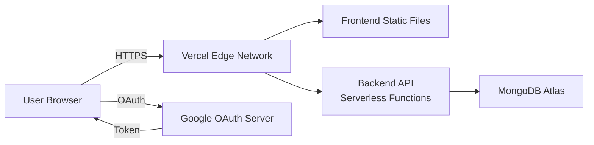
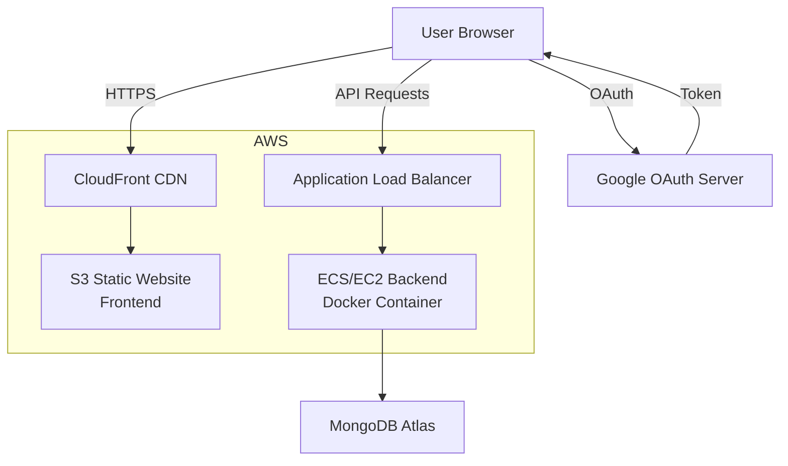

# Google OAuth 2.0 — 7-Day Implementation Guide

## Japan SSW Job Matching Platform

**Document Version:** 1.0  
**Created:** February 12, 2026  
**Status:** Implementation Ready  
**Target Completion:** 7 working days

---

## Table of Contents

1. [Overview](#overview)
2. [Day 1: Setup & Prerequisites](#day-1-setup--prerequisites)
3. [Day 2-3: Backend Implementation](#day-2-3-backend-implementation)
4. [Day 4-5: Frontend Implementation](#day-4-5-frontend-implementation)
5. [Day 6: Testing & QA](#day-6-testing--qa)
6. [Day 7: Production Deployment](#day-7-production-deployment)
7. [Vercel Deployment Guide](#vercel-deployment-guide)
8. [AWS Deployment Guide](#aws-deployment-guide)
9. [Post-Deployment Monitoring](#post-deployment-monitoring)

---

## Overview

This document provides a **day-by-day breakdown** of tasks required to integrate Google OAuth 2.0 into the Japan SSW platform, from initial setup through production deployment.

### Prerequisites

Before starting Day 1, ensure you have:

- ✅ Access to the codebase repository
- ✅ MongoDB Atlas database credentials
- ✅ Node.js 18+ installed locally
- ✅ A Google account (for Cloud Console access)
- ✅ Production hosting account (Vercel or AWS)
- ✅ Basic understanding of OAuth 2.0 flow

### Team Roles

| Role                   | Responsibilities                               | Days Active |
| ---------------------- | ---------------------------------------------- | ----------- |
| **Backend Developer**  | User schema, API endpoints, token verification | 1-3, 6      |
| **Frontend Developer** | UI buttons, JavaScript handlers, integration   | 1, 4-5, 6   |
| **QA Engineer**        | Testing all user flows, edge cases             | 6           |
| **DevOps/Lead**        | Google Cloud setup, deployment, monitoring     | 1, 7        |

---

## Day 1: Setup & Prerequisites

**Focus:** Google Cloud Console setup, credentials, environment configuration  
**Owner:** DevOps Lead + Backend Developer  
**Duration:** 4-6 hours

### Morning Tasks (2-3 hours)

#### Task 1.1: Create Google Cloud Project

**Time:** 30 minutes

```bash
# No code yet - this is done via Google Cloud Console UI
```

**Steps:**

1. Go to [Google Cloud Console](https://console.cloud.google.com/)
2. Click "Select a project" → "New Project"
3. Fill in details:
   - **Project name:** `japan-ssw-oauth-production`
   - **Organization:** (your organization, if applicable)
   - **Location:** (your organization folder)
4. Click **"Create"**
5. Wait for project creation (30-60 seconds)
6. **Record the Project ID** — you'll need this later

**Deliverable:** ✅ Google Cloud Project created

---

#### Task 1.2: Enable Required APIs

**Time:** 15 minutes

**Steps:**

1. In Google Cloud Console, go to **"APIs & Services"** → **"Library"**
2. Search for and enable:
   - ✅ **Google+ API** (for user profile data)
   - ✅ **Identity Toolkit API** (recommended)
3. Wait for APIs to be enabled (instant)

**Verification:**

```bash
# In Cloud Console, check "APIs & Services" > "Dashboard"
# You should see "Google+ API" and "Identity Toolkit API" listed
```

**Deliverable:** ✅ APIs enabled in project

---

#### Task 1.3: Configure OAuth Consent Screen

**Time:** 30 minutes

**Steps:**

1. Go to **"APIs & Services"** → **"OAuth consent screen"**
2. Select **"External"** (unless you have Google Workspace)
3. Fill in App Information:

   ```yaml
   App name: Japan SSW Job Matching Platform
   User support email: support@yourcompany.com
   App logo: (optional, upload 120x120 PNG)
   Application home page: https://yourdomain.com
   Application privacy policy: https://yourdomain.com/privacy
   Application terms of service: https://yourdomain.com/terms
   Authorized domains:
     - yourdomain.com
     - localhost (for development)
   Developer contact: dev@yourcompany.com
   ```

4. Click **"Save and Continue"**
5. **Add Scopes:**
   - Click **"Add or Remove Scopes"**
   - Select:
     - ✅ `openid`
     - ✅ `.../auth/userinfo.email`
     - ✅ `.../auth/userinfo.profile`
   - Click **"Update"**
   - Click **"Save and Continue"**

6. **Test Users** (for development):
   - Add 2-3 test user emails (your team members)
   - Click **"Save and Continue"**

7. Review summary and click **"Back to Dashboard"**

**Deliverable:** ✅ OAuth consent screen configured

---

#### Task 1.4: Create OAuth Client Credentials

**Time:** 20 minutes

**Steps:**

1. Go to **"APIs & Services"** → **"Credentials"**
2. Click **"Create Credentials"** → **"OAuth client ID"**
3. Select **"Web application"**
4. Configure:

   ```yaml
   Name: Japan SSW Web Client

   Authorized JavaScript origins:
     - http://localhost:3000
     - https://yourdomain.com
     - https://www.yourdomain.com

   Authorized redirect URIs:
     # Development
     - http://localhost:3000/pages/signin.html
     - http://localhost:3000/pages/createAccount.html
     - http://localhost:3000/pages/employerSignin.html
     - http://localhost:3000/pages/employerCreateAccount.html

     # Production
     - https://yourdomain.com/pages/signin.html
     - https://yourdomain.com/pages/createAccount.html
     - https://yourdomain.com/pages/employerSignin.html
     - https://yourdomain.com/pages/employerCreateAccount.html
   ```

5. Click **"Create"**
6. **Copy and save securely:**
   - Client ID (looks like: `123456789-abc123.apps.googleusercontent.com`)
   - Client Secret (looks like: `GOCSPX-xyz123abc...`)

**⚠️ SECURITY WARNING:** Never commit these credentials to Git!

**Deliverable:** ✅ OAuth credentials created and saved securely

---

### Afternoon Tasks (2-3 hours)

#### Task 1.5: Update Environment Variables

**Time:** 15 minutes

**Steps:**

1. Navigate to backend directory:

   ```bash
   cd backend
   ```

2. Copy `.env.example` to `.env`:

   ```bash
   cp .env.example .env
   ```

3. Edit `backend/.env` and add your credentials:

   ```bash
   # Add to existing .env file
   GOOGLE_CLIENT_ID=your-actual-client-id.apps.googleusercontent.com
   GOOGLE_CLIENT_SECRET=GOCSPX-your-actual-secret
   GOOGLE_REDIRECT_URIS=http://localhost:3000/pages/signin.html,http://localhost:3000/pages/createAccount.html,http://localhost:3000/pages/employerSignin.html,http://localhost:3000/pages/employerCreateAccount.html
   ```

4. Verify `.env` is in `.gitignore`:

   ```bash
   grep -q ".env" .gitignore && echo "✅ .env is ignored" || echo "❌ Add .env to .gitignore!"
   ```

**Deliverable:** ✅ Local environment configured

---

#### Task 1.6: Install Dependencies

**Time:** 10 minutes

**Steps:**

1. Install Google Auth Library:

   ```bash
   cd backend
   npm install google-auth-library
   ```

2. Verify installation:

   ```bash
   npm list google-auth-library
   # Should show: google-auth-library@9.x.x
   ```

3. Commit `package.json` and `package-lock.json`:

   ```bash
   git add package.json package-lock.json
   git commit -m "feat: add google-auth-library dependency for OAuth"
   ```

**Deliverable:** ✅ Dependencies installed and committed

---

#### Task 1.7: Create Git Branch

**Time:** 5 minutes

**Steps:**

```bash
# From project root
git checkout -b feature/google-oauth-integration

# Push to remote
git push -u origin feature/google-oauth-integration
```

**Deliverable:** ✅ Feature branch created

---

#### Task 1.8: Team Knowledge Sharing

**Time:** 30 minutes

**Steps:**

1. **Team Standup** — Share:
   - ✅ Google project created
   - ✅ OAuth credentials obtained
   - ✅ Environment configured
   - 📋 Backend work starts tomorrow
2. **Document credentials location** (use password manager)
3. **Share test user accounts** with team

**Deliverable:** ✅ Team aligned on Day 2 work

---

### Day 1 Checklist

- [x] Google Cloud project created
- [x] APIs enabled (Google+, Identity Toolkit)
- [x] OAuth consent screen configured
- [x] OAuth client credentials created
- [x] Environment variables updated
- [x] Dependencies installed
- [x] Git branch created
- [x] Team briefed

**Status:** ✅ Ready for Day 2 (Backend Implementation)

---

## Day 2-3: Backend Implementation

**Focus:** Database schema, utilities, controllers, routes, testing  
**Owner:** Backend Developer  
**Duration:** 2 full days (12-16 hours)

---

## Day 2: Database & Utilities

**Duration:** 6-8 hours

### Morning Tasks (3-4 hours)

#### Task 2.1: Update User Schema

**Time:** 1.5 hours

**File:** `backend/src/models/User.js`

**Steps:**

1. Open `User.js` and locate the schema definition
2. Add OAuth fields after existing fields:

```javascript
// After existing email, password, role fields...

// 🆕 NEW: OAuth Provider Fields
authProvider: {
  type: String,
  enum: ["local", "google"],
  default: "local",
  required: true,
},

// 🆕 NEW: Google OAuth ID
googleId: {
  type: String,
  unique: true,
  sparse: true, // Allows multiple null values
  index: true,
},

// 🆕 NEW: Google Profile Data
googleProfile: {
  email: String,
  name: String,
  picture: String,
  verified_email: Boolean,
  locale: String,
},
```

3. Update password field to be conditionally required:

```javascript
password: {
  type: String,
  required: function() {
    // Password required only if NOT using OAuth
    return !this.googleId;
  },
  minlength: [8, "Password must be at least 8 characters"],
  select: false,
},
```

4. Update pre-save hook to skip password hashing for OAuth users:

```javascript
// Update existing pre-save hook
userSchema.pre("save", async function () {
  if (!this.isModified("password")) return;

  // 🆕 Skip password hashing if user doesn't have a password (OAuth user)
  if (!this.password) return;

  const salt = await bcrypt.genSalt(12);
  this.password = await bcrypt.hash(this.password, salt);
});
```

5. Update comparePassword method to handle OAuth users:

```javascript
// Update existing comparePassword method
userSchema.methods.comparePassword = async function (candidatePassword) {
  // 🆕 OAuth users don't have passwords
  if (!this.password) {
    throw new Error(
      "This account uses Google Sign-In. Please use 'Sign in with Google'.",
    );
  }
  return await bcrypt.compare(candidatePassword, this.password);
};
```

6. Add indexes at the end of the file:

```javascript
// Add after existing indexes
userSchema.index({ googleId: 1 });
userSchema.index({ authProvider: 1 });
```

7. **Test the changes:**

```bash
# Start MongoDB and server
npm run dev

# Check console for any schema errors
# Should see: "Server listening on http://localhost:3000"
```

8. Commit changes:

```bash
git add backend/src/models/User.js
git commit -m "feat(auth): add Google OAuth fields to User schema"
```

**Deliverable:** ✅ User schema updated and tested

---

#### Task 2.2: Create Google Auth Utility

**Time:** 1 hour

**File:** `backend/src/utils/googleAuth.js` (NEW)

**Steps:**

1. Create the file:

```bash
cd backend/src/utils
touch googleAuth.js
```

2. Add the implementation:

```javascript
/**
 * Google OAuth 2.0 Utility Functions
 * Handles verification of Google access tokens
 */

const { OAuth2Client } = require("google-auth-library");
const logger = require("./logger");

const client = new OAuth2Client(process.env.GOOGLE_CLIENT_ID);

/**
 * Verify Google ID token and get user info
 * @param {string} token - Google ID token from frontend
 * @returns {Promise<Object>} User info from Google
 * @throws {Error} If token is invalid
 */
async function verifyGoogleToken(token) {
  try {
    const ticket = await client.verifyIdToken({
      idToken: token,
      audience: process.env.GOOGLE_CLIENT_ID,
    });

    const payload = ticket.getPayload();

    logger.info(`Google token verified for user: ${payload.email}`);

    return {
      googleId: payload.sub,
      email: payload.email,
      name: payload.name,
      picture: payload.picture,
      verified_email: payload.email_verified,
      locale: payload.locale,
    };
  } catch (error) {
    logger.error(`Google token verification failed: ${error.message}`);
    throw new Error("Invalid Google token");
  }
}

/**
 * Fetch user info from Google using access token
 * Alternative method using Google's userinfo endpoint
 * @param {string} accessToken - Google access token
 * @returns {Promise<Object>} User info
 */
async function getUserInfoFromGoogle(accessToken) {
  try {
    const response = await fetch(
      "https://www.googleapis.com/oauth2/v3/userinfo",
      {
        headers: {
          Authorization: `Bearer ${accessToken}`,
        },
      },
    );

    if (!response.ok) {
      throw new Error("Failed to fetch user info from Google");
    }

    const userInfo = await response.json();
    logger.info(`Fetched Google user info for: ${userInfo.email}`);

    return userInfo;
  } catch (error) {
    logger.error(`Failed to fetch Google user info: ${error.message}`);
    throw error;
  }
}

module.exports = {
  verifyGoogleToken,
  getUserInfoFromGoogle,
};
```

3. **Test the utility** (unit test):

Create `backend/src/utils/__tests__/googleAuth.test.js`:

```javascript
const { verifyGoogleToken } = require("../googleAuth");

// Mock OAuth2Client
jest.mock("google-auth-library");

describe("Google Auth Utilities", () => {
  it("should verify valid Google token", async () => {
    const { OAuth2Client } = require("google-auth-library");
    const mockVerifyIdToken = jest.fn().mockResolvedValue({
      getPayload: () => ({
        sub: "google123",
        email: "test@gmail.com",
        name: "Test User",
        picture: "https://example.com/pic.jpg",
        email_verified: true,
        locale: "en",
      }),
    });

    OAuth2Client.prototype.verifyIdToken = mockVerifyIdToken;

    const result = await verifyGoogleToken("valid-token");

    expect(result.email).toBe("test@gmail.com");
    expect(result.googleId).toBe("google123");
  });

  it("should throw error for invalid token", async () => {
    const { OAuth2Client } = require("google-auth-library");
    OAuth2Client.prototype.verifyIdToken = jest
      .fn()
      .mockRejectedValue(new Error("Invalid token"));

    await expect(verifyGoogleToken("invalid-token")).rejects.toThrow(
      "Invalid Google token",
    );
  });
});
```

4. Run tests:

```bash
cd backend
npm test -- googleAuth.test.js
```

5. Commit:

```bash
git add backend/src/utils/googleAuth.js backend/src/utils/__tests__/googleAuth.test.js
git commit -m "feat(auth): add Google OAuth token verification utility"
```

**Deliverable:** ✅ Google auth utility created and tested

---

### Afternoon Tasks (3-4 hours)

#### Task 2.3: Add Google Auth Controller

**Time:** 2 hours

**File:** `backend/src/controllers/authController.js`

**Steps:**

1. Add import at the top:

```javascript
const { verifyGoogleToken } = require("../utils/googleAuth");
```

2. Add new `googleAuth` function at the end of the file:

```javascript
/**
 * @desc    Authenticate with Google OAuth
 * @route   POST /api/v1/auth/google
 * @access  Public
 */
exports.googleAuth = asyncHandler(async (req, res, next) => {
  const { googleToken, role } = req.body;

  // Validate input
  if (!googleToken) {
    return next(new ApiError(400, "Google token is required"));
  }

  // Verify Google token and get user info
  let googleUserInfo;
  try {
    googleUserInfo = await verifyGoogleToken(googleToken);
  } catch (error) {
    return next(new ApiError(401, "Invalid Google token"));
  }

  const { googleId, email, name, picture, verified_email, locale } =
    googleUserInfo;

  // Check if user already exists (by googleId OR email)
  let user = await User.findOne({
    $or: [{ googleId }, { email }],
  });

  if (user) {
    // 📌 EXISTING USER FLOW

    // If user exists with email but no googleId, link the Google account
    if (!user.googleId) {
      user.googleId = googleId;
      user.googleProfile = { email, name, picture, verified_email, locale };
      user.authProvider = "google";
      user.isEmailVerified = verified_email;
      logger.info(`Linked Google account to existing user: ${email}`);
    }

    // Update last login
    user.lastLogin = Date.now();
    await user.save();

    // Generate JWT token
    const token = user.getSignedJwtToken();

    logger.info(`Google login successful: ${email}`);

    return res.status(200).json(
      new ApiResponse(200, "Google login successful", {
        token,
        user: {
          id: user._id,
          email: user.email,
          role: user.role,
          authProvider: user.authProvider,
          picture: user.googleProfile?.picture,
        },
      }),
    );
  }

  // 📌 NEW USER FLOW - Create new account

  // Validate role for new registration
  const allowedRoles = ["jobseeker", "employer"];
  const userRole = role && allowedRoles.includes(role) ? role : "jobseeker";

  // Create new user
  user = await User.create({
    email,
    googleId,
    googleProfile: {
      email,
      name,
      picture,
      verified_email,
      locale,
    },
    role: userRole,
    authProvider: "google",
    isEmailVerified: verified_email,
    lastLogin: Date.now(),
  });

  // Generate JWT token
  const token = user.getSignedJwtToken();

  logger.info(`New Google user registered: ${email}`);

  res.status(201).json(
    new ApiResponse(201, "Google registration successful", {
      token,
      user: {
        id: user._id,
        email: user.email,
        role: user.role,
        authProvider: user.authProvider,
        picture: user.googleProfile.picture,
      },
    }),
  );
});
```

3. **Update existing login controller** to handle OAuth users:

Find the `login` function and add this check after password verification:

```javascript
// Add this check BEFORE password comparison
// 🆕 NEW: Check if user registered with Google OAuth
if (user.authProvider === "google" && !user.password) {
  return next(
    new ApiError(
      400,
      "This account uses Google Sign-In. Please click 'Sign in with Google'.",
    ),
  );
}
```

4. Commit:

```bash
git add backend/src/controllers/authController.js
git commit -m "feat(auth): add Google OAuth controller and update login"
```

**Deliverable:** ✅ Google auth controller implemented

---

#### Task 2.4: Add Google Auth Route

**Time:** 30 minutes

**File:** `backend/src/routes/authRoutes.js`

**Steps:**

1. Import the new controller:

```javascript
const {
  register,
  login,
  getMe,
  logout,
  forgotPassword,
  googleAuth, // 🆕 NEW
} = require("../controllers/authController");
```

2. Add route with Swagger documentation:

```javascript
/**
 * @swagger
 * /api/v1/auth/google:
 *   post:
 *     summary: Authenticate with Google OAuth 2.0
 *     tags: [Authentication]
 *     requestBody:
 *       required: true
 *       content:
 *         application/json:
 *           schema:
 *             type: object
 *             required:
 *               - googleToken
 *             properties:
 *               googleToken:
 *                 type: string
 *                 description: Google OAuth ID token from frontend
 *                 example: eyJhbGciOiJSUzI1NiIsImtpZCI6...
 *               role:
 *                 type: string
 *                 enum: [jobseeker, employer]
 *                 description: User role (only for new registrations)
 *                 example: jobseeker
 *     responses:
 *       200:
 *         description: Google login successful (existing user)
 *         content:
 *           application/json:
 *             schema:
 *               $ref: '#/components/schemas/AuthResponse'
 *       201:
 *         description: Google registration successful (new user)
 *         content:
 *           application/json:
 *             schema:
 *               $ref: '#/components/schemas/AuthResponse'
 *       400:
 *         description: Missing or invalid Google token
 *       401:
 *         description: Invalid Google token
 */
router.post("/google", googleAuth);
```

3. Test the endpoint manually:

```bash
# Start server
npm run dev

# Test with curl (you'll need a real Google token)
curl -X POST http://localhost:3000/api/v1/auth/google \
  -H "Content-Type: application/json" \
  -d '{
    "googleToken": "your-test-token-here",
    "role": "jobseeker"
  }'
```

4. Commit:

```bash
git add backend/src/routes/authRoutes.js
git commit -m "feat(auth): add Google OAuth route with Swagger docs"
```

**Deliverable:** ✅ Google auth route added

---

#### Task 2.5: Update API Documentation

**Time:** 30 minutes

**Steps:**

1. Export updated Swagger docs:

```bash
cd backend
npm run export:swagger
```

2. Verify `backend/api-docs.json` was updated
3. Test Swagger UI:

```bash
# Open browser
open http://localhost:3000/api-docs

# Look for "/api/v1/auth/google" endpoint
```

4. Commit:

```bash
git add backend/api-docs.json
git commit -m "docs: update Swagger with Google OAuth endpoint"
```

**Deliverable:** ✅ API docs updated

---

### Day 2 Checklist

- [x] User schema updated with OAuth fields
- [x] Google auth utility created and tested
- [x] Google auth controller implemented
- [x] Google auth route added
- [x] Existing login updated to handle OAuth
- [x] API documentation updated
- [x] All changes committed to Git

**Status:** ✅ Ready for Day 3 (Backend Testing)

---

## Day 3: Backend Testing & Integration

**Duration:** 6-8 hours

### Morning Tasks (3-4 hours)

#### Task 3.1: Write Integration Tests

**Time:** 2 hours

**File:** `backend/tests/auth.google.test.js` (NEW)

**Steps:**

1. Create test file:

```bash
mkdir -p backend/tests
touch backend/tests/auth.google.test.js
```

2. Add comprehensive tests:

```javascript
const request = require("supertest");
const mongoose = require("mongoose");
const { createApp } = require("../src/app");
const User = require("../src/models/User");
const { verifyGoogleToken } = require("../src/utils/googleAuth");

// Mock Google Auth
jest.mock("../src/utils/googleAuth");

describe("Google OAuth Authentication", () => {
  let app;

  beforeAll(async () => {
    // Connect to test database
    await mongoose.connect(
      process.env.MONGODB_TEST_URI || process.env.MONGODB_URI,
    );
    const appInstance = await createApp();
    app = appInstance.app;
  });

  afterAll(async () => {
    await mongoose.connection.close();
  });

  beforeEach(async () => {
    // Clear users before each test
    await User.deleteMany({});
  });

  describe("POST /api/v1/auth/google", () => {
    it("should register new user with Google", async () => {
      const mockGoogleUser = {
        googleId: "google123",
        email: "newuser@gmail.com",
        name: "New User",
        picture: "https://example.com/pic.jpg",
        verified_email: true,
        locale: "en",
      };

      verifyGoogleToken.mockResolvedValue(mockGoogleUser);

      const res = await request(app)
        .post("/api/v1/auth/google")
        .send({
          googleToken: "mock-token",
          role: "jobseeker",
        })
        .expect(201);

      expect(res.body.success).toBe(true);
      expect(res.body.message).toBe("Google registration successful");
      expect(res.body.data.user.email).toBe("newuser@gmail.com");
      expect(res.body.data.user.authProvider).toBe("google");
      expect(res.body.data.token).toBeDefined();

      // Verify user in database
      const user = await User.findOne({ email: "newuser@gmail.com" });
      expect(user).toBeDefined();
      expect(user.googleId).toBe("google123");
      expect(user.authProvider).toBe("google");
      expect(user.googleProfile.name).toBe("New User");
      expect(user.password).toBeUndefined(); // No password for OAuth users
    });

    it("should link Google to existing email/password user", async () => {
      // Create existing user with email/password
      await User.create({
        email: "existing@gmail.com",
        password: "password123",
        role: "jobseeker",
        authProvider: "local",
      });

      const mockGoogleUser = {
        googleId: "google456",
        email: "existing@gmail.com",
        name: "Existing User",
        picture: "https://example.com/pic2.jpg",
        verified_email: true,
        locale: "en",
      };

      verifyGoogleToken.mockResolvedValue(mockGoogleUser);

      const res = await request(app)
        .post("/api/v1/auth/google")
        .send({ googleToken: "mock-token" })
        .expect(200);

      expect(res.body.message).toBe("Google login successful");

      // Verify account was linked
      const user = await User.findOne({ email: "existing@gmail.com" }).select(
        "+password",
      );
      expect(user.googleId).toBe("google456");
      expect(user.authProvider).toBe("google");
      expect(user.password).toBeDefined(); // Password still exists
    });

    it("should login existing Google user", async () => {
      // Create existing Google user
      await User.create({
        email: "googleuser@gmail.com",
        googleId: "google789",
        role: "employer",
        authProvider: "google",
        googleProfile: {
          email: "googleuser@gmail.com",
          name: "Google User",
          picture: "https://example.com/pic3.jpg",
          verified_email: true,
        },
      });

      const mockGoogleUser = {
        googleId: "google789",
        email: "googleuser@gmail.com",
        name: "Google User",
        picture: "https://example.com/pic3.jpg",
        verified_email: true,
        locale: "en",
      };

      verifyGoogleToken.mockResolvedValue(mockGoogleUser);

      const res = await request(app)
        .post("/api/v1/auth/google")
        .send({ googleToken: "mock-token" })
        .expect(200);

      expect(res.body.message).toBe("Google login successful");
      expect(res.body.data.user.role).toBe("employer");
    });

    it("should reject request without Google token", async () => {
      const res = await request(app)
        .post("/api/v1/auth/google")
        .send({ role: "jobseeker" })
        .expect(400);

      expect(res.body.message).toBe("Google token is required");
    });

    it("should reject invalid Google token", async () => {
      verifyGoogleToken.mockRejectedValue(new Error("Invalid token"));

      const res = await request(app)
        .post("/api/v1/auth/google")
        .send({ googleToken: "invalid-token" })
        .expect(401);

      expect(res.body.message).toBe("Invalid Google token");
    });

    it("should default to jobseeker role if not specified", async () => {
      const mockGoogleUser = {
        googleId: "google999",
        email: "norole@gmail.com",
        name: "No Role User",
        verified_email: true,
      };

      verifyGoogleToken.mockResolvedValue(mockGoogleUser);

      const res = await request(app)
        .post("/api/v1/auth/google")
        .send({ googleToken: "mock-token" })
        .expect(201);

      expect(res.body.data.user.role).toBe("jobseeker");
    });
  });

  describe("POST /api/v1/auth/login - OAuth user handling", () => {
    it("should reject email/password login for Google-only users", async () => {
      // Create Google-only user (no password)
      await User.create({
        email: "googleonly@gmail.com",
        googleId: "google111",
        role: "jobseeker",
        authProvider: "google",
      });

      const res = await request(app)
        .post("/api/v1/auth/login")
        .send({
          email: "googleonly@gmail.com",
          password: "anypassword",
        })
        .expect(400);

      expect(res.body.message).toContain("Google Sign-In");
    });

    it("should allow email/password login for linked accounts", async () => {
      // Create user with both password and Google
      const user = await User.create({
        email: "linked@gmail.com",
        password: "password123",
        googleId: "google222",
        role: "jobseeker",
        authProvider: "google",
      });

      const res = await request(app)
        .post("/api/v1/auth/login")
        .send({
          email: "linked@gmail.com",
          password: "password123",
        })
        .expect(200);

      expect(res.body.message).toBe("Login successful");
    });
  });
});
```

3. Run tests:

```bash
cd backend
npm test -- auth.google.test.js
```

4. Fix any failing tests
5. Commit:

```bash
git add backend/tests/auth.google.test.js
git commit -m "test(auth): add comprehensive Google OAuth tests"
```

**Deliverable:** ✅ Integration tests passing

---

#### Task 3.2: Manual API Testing with Postman

**Time:** 1 hour

**Steps:**

1. **Update Postman collection:**
   - Open `backend/postman/Japan_SSW_API_day1_day4.postman_collection.json`
   - Add new request:

```json
{
  "name": "Google OAuth Login/Register",
  "request": {
    "method": "POST",
    "header": [
      {
        "key": "Content-Type",
        "value": "application/json"
      }
    ],
    "body": {
      "mode": "raw",
      "raw": "{\n  \"googleToken\": \"{{GOOGLE_TOKEN}}\",\n  \"role\": \"jobseeker\"\n}"
    },
    "url": {
      "raw": "{{BASE_URL}}/api/v1/auth/google",
      "host": ["{{BASE_URL}}"],
      "path": ["api", "v1", "auth", "google"]
    }
  }
}
```

2. **Get a real Google token for testing:**
   - Go to [Google OAuth Playground](https://developers.google.com/oauthplayground/)
   - Select "Google OAuth2 API v2" → "userinfo.email" and "userinfo.profile"
   - Click "Authorize APIs"
   - Exchange authorization code for tokens
   - Copy the **ID token** (not access token!)
   - Set as Postman variable: `GOOGLE_TOKEN`

3. **Test scenarios:**
   - ✅ New user registration
   - ✅ Existing user login
   - ✅ Account linking
   - ✅ Invalid token
   - ✅ Missing token

4. Document results in `backend/TESTING.md`

5. Commit Postman collection:

```bash
git add backend/postman/
git commit -m "test: add Google OAuth to Postman collection"
```

**Deliverable:** ✅ Manual API tests complete

---

### Afternoon Tasks (3-4 hours)

#### Task 3.3: Database Migration Script (Optional)

**Time:** 1 hour

**File:** `backend/scripts/prepare-oauth-migration.js` (NEW)

**Steps:**

1. Create migration script:

```javascript
/**
 * Migration Script: Prepare existing users for OAuth
 * Adds authProvider field to existing users
 */

const mongoose = require("mongoose");
const User = require("../src/models/User");
require("dotenv").config();

async function migrateUsers() {
  try {
    console.log("Connecting to MongoDB...");
    await mongoose.connect(process.env.MONGODB_URI);
    console.log("✅ Connected to MongoDB");

    // Count users without authProvider
    const usersToMigrate = await User.countDocuments({
      authProvider: { $exists: false },
    });

    if (usersToMigrate === 0) {
      console.log(
        "✅ No users need migration. All users have authProvider field.",
      );
      process.exit(0);
    }

    console.log(`Found ${usersToMigrate} users to migrate...`);

    // Add authProvider field to existing users
    const result = await User.updateMany(
      { authProvider: { $exists: false } },
      { $set: { authProvider: "local" } },
    );

    console.log(`✅ Migration complete!`);
    console.log(`   - Modified: ${result.modifiedCount} users`);
    console.log(`   - All existing users now have authProvider="local"`);

    // Verify migration
    const localUsers = await User.countDocuments({ authProvider: "local" });
    const googleUsers = await User.countDocuments({ authProvider: "google" });

    console.log(`\nUser statistics:`);
    console.log(`   - Local auth: ${localUsers}`);
    console.log(`   - Google auth: ${googleUsers}`);

    process.exit(0);
  } catch (error) {
    console.error("❌ Migration failed:", error);
    process.exit(1);
  }
}

migrateUsers();
```

2. Add npm script to `backend/package.json`:

```json
{
  "scripts": {
    "migrate:oauth": "node scripts/prepare-oauth-migration.js"
  }
}
```

3. Test migration:

```bash
cd backend
npm run migrate:oauth
```

4. Commit:

```bash
git add backend/scripts/prepare-oauth-migration.js backend/package.json
git commit -m "feat(migration): add OAuth preparation script"
```

**Deliverable:** ✅ Migration script ready (optional for production)

---

#### Task 3.4: Code Review & Refactoring

**Time:** 1.5 hours

**Steps:**

1. **Self-review checklist:**
   - [ ] All functions have JSDoc comments
   - [ ] Error handling is comprehensive
   - [ ] Logging is appropriate (info, error levels)
   - [ ] No hardcoded values (use env vars)
   - [ ] Code follows existing patterns
   - [ ] No console.log() statements (use logger)
   - [ ] All async functions use try-catch or asyncHandler

2. **Run linter:**

```bash
cd backend
npm run lint

# Fix any issues
npm run lint:fix
```

3. **Check test coverage:**

```bash
npm run test:coverage
```

4. **Refactor if needed** (aim for >80% coverage on new code)

5. Commit any improvements:

```bash
git add .
git commit -m "refactor(auth): improve code quality and coverage"
```

**Deliverable:** ✅ Code reviewed and refactored

---

#### Task 3.5: End of Day 3 — Create Pull Request

**Time:** 30 minutes

**Steps:**

1. Push all commits:

```bash
git push origin feature/google-oauth-integration
```

2. Create PR on GitHub:
   - Title: `feat: Google OAuth 2.0 authentication (Backend)`
   - Description:

     ```markdown
     ## Summary

     Implements Google OAuth 2.0 authentication for Japan SSW platform.

     ## Changes

     - ✅ Updated User schema with OAuth fields
     - ✅ Created Google auth utility for token verification
     - ✅ Added Google auth controller and route
     - ✅ Updated login to handle OAuth users
     - ✅ Added comprehensive tests (unit + integration)
     - ✅ Updated API documentation

     ## Testing

     - [x] Unit tests passing
     - [x] Integration tests passing
     - [x] Manual testing with Postman
     - [x] Linter passing

     ## Related

     - Planning doc: `docs/GOOGLE_OAUTH_INTEGRATION_PLAN.md`
     - Frontend work: Coming in Day 4-5

     ## Deployment Notes

     - Requires Google OAuth credentials in production
     - Optional: Run migration script for existing users
     ```

3. Request review from team
4. Mark Day 3 as complete

**Deliverable:** ✅ Backend PR created and ready for review

---

### Day 2-3 Checklist

- [x] User schema updated with OAuth fields
- [x] Google auth utility created and tested
- [x] Google auth controller implemented
- [x] Google auth route added
- [x] Existing login updated
- [x] Integration tests written and passing
- [x] Manual testing complete
- [x] Migration script created
- [x] Code reviewed and refactored
- [x] Pull request created

**Status:** ✅ Ready for Day 4 (Frontend Implementation)

---

## Day 4-5: Frontend Implementation

**Focus:** UI components, JavaScript handlers, integration testing  
**Owner:** Frontend Developer  
**Duration:** 2 full days (12-16 hours)

---

## Day 4: UI Components & Google Button

**Duration:** 6-8 hours

### Morning Tasks (3-4 hours)

#### Task 4.1: Create Google Auth JavaScript Module

**Time:** 1.5 hours

**File:** `assets/js/googleAuth.js` (NEW)

**Steps:**

1. Create the file:

```bash
mkdir -p assets/js
touch assets/js/googleAuth.js
```

2. Add the implementation:

```javascript
/**
 * Google OAuth 2.0 Authentication Handler
 * Handles Google Sign-In responses and communicates with backend
 */

const API_BASE_URL =
  window.location.hostname === "localhost"
    ? "http://localhost:3000/api/v1"
    : "https://yourdomain.com/api/v1";

/**
 * Handle Google Sign-In response (for login pages)
 * @param {Object} response - Google Sign-In response object
 */
async function handleGoogleSignIn(response) {
  console.log("Google Sign-In initiated");

  try {
    // The response.credential contains the JWT ID token
    const googleToken = response.credential;

    if (!googleToken) {
      showError("Failed to get Google authentication token");
      return;
    }

    // Show loading state
    showLoading("Signing in with Google...");

    // Send token to our backend
    const result = await fetch(`${API_BASE_URL}/auth/google`, {
      method: "POST",
      headers: {
        "Content-Type": "application/json",
      },
      body: JSON.stringify({
        googleToken: googleToken,
        // role is optional for login, backend will use existing role
      }),
    });

    const data = await result.json();

    if (!result.ok) {
      throw new Error(data.message || "Google sign-in failed");
    }

    // Store JWT token in localStorage
    localStorage.setItem("token", data.data.token);
    localStorage.setItem("user", JSON.stringify(data.data.user));

    console.log("Google Sign-In successful:", data.data.user);

    // Redirect based on user role
    redirectToDashboard(data.data.user.role);
  } catch (error) {
    console.error("Google Sign-In error:", error);
    showError(error.message || "Failed to sign in with Google");
    hideLoading();
  }
}

/**
 * Handle Google Sign-Up response (for registration pages)
 * @param {Object} response - Google Sign-In response object
 */
async function handleGoogleSignUp(response) {
  console.log("Google Sign-Up initiated");

  try {
    const googleToken = response.credential;

    if (!googleToken) {
      showError("Failed to get Google authentication token");
      return;
    }

    // Determine role based on page URL
    const isEmployer = window.location.pathname.includes("employer");
    const role = isEmployer ? "employer" : "jobseeker";

    showLoading("Creating your account...");

    // Send token to backend
    const result = await fetch(`${API_BASE_URL}/auth/google`, {
      method: "POST",
      headers: {
        "Content-Type": "application/json",
      },
      body: JSON.stringify({
        googleToken: googleToken,
        role: role,
      }),
    });

    const data = await result.json();

    if (!result.ok) {
      throw new Error(data.message || "Google sign-up failed");
    }

    // Store JWT token
    localStorage.setItem("token", data.data.token);
    localStorage.setItem("user", JSON.stringify(data.data.user));

    console.log("Google Sign-Up successful:", data.data.user);

    // Redirect to dashboard
    redirectToDashboard(role);
  } catch (error) {
    console.error("Google Sign-Up error:", error);
    showError(error.message || "Failed to sign up with Google");
    hideLoading();
  }
}

/**
 * Redirect user to appropriate dashboard
 * @param {string} role - User role
 */
function redirectToDashboard(role) {
  if (role === "employer") {
    window.location.href = "/pages/companyDashboard.html";
  } else {
    window.location.href = "/pages/profileDashboard.html";
  }
}

/**
 * Show loading overlay
 * @param {string} message - Loading message
 */
function showLoading(message) {
  let overlay = document.getElementById("loadingOverlay");
  if (!overlay) {
    overlay = document.createElement("div");
    overlay.id = "loadingOverlay";
    overlay.className =
      "fixed inset-0 bg-black bg-opacity-50 flex items-center justify-center z-50";
    overlay.innerHTML = `
      <div class="bg-white rounded-lg p-6 max-w-sm">
        <div class="flex items-center gap-3">
          <div class="animate-spin rounded-full h-8 w-8 border-b-2 border-red-600"></div>
          <p class="text-gray-700">${message}</p>
        </div>
      </div>
    `;
    document.body.appendChild(overlay);
  } else {
    overlay.style.display = "flex";
  }
}

/**
 * Hide loading overlay
 */
function hideLoading() {
  const overlay = document.getElementById("loadingOverlay");
  if (overlay) {
    overlay.style.display = "none";
  }
}

/**
 * Show error message
 * @param {string} message - Error message
 */
function showError(message) {
  hideLoading();
  alert(message); // TODO: Replace with better modal UI
}

// Handle errors from Google Sign-In library
window.addEventListener("error", (event) => {
  if (event.message && event.message.includes("gsi")) {
    console.error("Google Sign-In library error:", event);
  }
});
```

3. Commit:

```bash
git add assets/js/googleAuth.js
git commit -m "feat(auth): add Google OAuth frontend handler"
```

**Deliverable:** ✅ Google auth JavaScript module created

---

#### Task 4.2: Create API Config Module

**Time:** 30 minutes

**File:** `assets/js/config.js` (NEW or UPDATE)

**Steps:**

1. Create/update config file:

```javascript
/**
 * Frontend Configuration
 * Centralizes API endpoints and client IDs
 */

const CONFIG = {
  API: {
    BASE_URL:
      window.location.hostname === "localhost"
        ? "http://localhost:3000/api/v1"
        : "https://yourdomain.com/api/v1",
  },
  GOOGLE: {
    CLIENT_ID: "YOUR_GOOGLE_CLIENT_ID.apps.googleusercontent.com",
  },
};

// Make config globally available
window.APP_CONFIG = CONFIG;

// Dynamically set Google Client ID in HTML when DOM loads
document.addEventListener("DOMContentLoaded", () => {
  const gOnload = document.getElementById("g_id_onload");
  if (gOnload && CONFIG.GOOGLE.CLIENT_ID) {
    gOnload.setAttribute("data-client_id", CONFIG.GOOGLE.CLIENT_ID);
  }
});
```

2. **TODO:** Update `YOUR_GOOGLE_CLIENT_ID` with real value before deployment
3. Commit:

```bash
git add assets/js/config.js
git commit -m "feat: add frontend config for API and Google OAuth"
```

**Deliverable:** ✅ Config module created

---

### Afternoon Tasks (3-4 hours)

#### Task 4.3: Update Sign-In Pages (Job Seekers)

**Time:** 1 hour

**File:** `pages/signin.html`

**Steps:**

1. Add Google library to `<head>`:

```html
<!-- Before closing </head> -->
<script src="https://accounts.google.com/gsi/client" async defer></script>
```

2. Add Google button after existing sign-in button (find `mt-14 mb-6` div):

```html
<!-- After the existing "Sign in" button div -->

<!-- 🆕 NEW: Divider -->
<div class="relative my-6">
  <div class="absolute inset-0 flex items-center">
    <div class="w-full border-t border-gray-300"></div>
  </div>
  <div class="relative flex justify-center text-sm">
    <span class="px-2 bg-white text-gray-500">Or continue with</span>
  </div>
</div>

<!-- 🆕 NEW: Google Sign-In Button -->
<div
  id="g_id_onload"
  data-client_id="YOUR_GOOGLE_CLIENT_ID.apps.googleusercontent.com"
  data-context="signin"
  data-ux_mode="popup"
  data-callback="handleGoogleSignIn"
  data-auto_prompt="false"
></div>

<div
  class="g_id_signin"
  data-type="standard"
  data-shape="rectangular"
  data-theme="outline"
  data-text="signin_with"
  data-size="large"
  data-logo_alignment="left"
  data-width="100%"
></div>
```

3. Add scripts before closing `</body>`:

```html
<!-- Before closing </body> -->
<script src="../assets/js/config.js"></script>
<script src="../assets/js/googleAuth.js"></script>
```

4. Test locally:

```bash
# Open in browser
open http://localhost:3000/pages/signin.html

# Check console for errors
# Verify Google button appears
```

5. Commit:

```bash
git add pages/signin.html
git commit -m "feat(ui): add Google Sign-In button to jobseeker signin page"
```

**Deliverable:** ✅ Job seeker sign-in updated

---

#### Task 4.4: Update Registration Pages (Job Seekers)

**Time:** 45 minutes

**File:** `pages/createAccount.html`

**Steps:**

1. Add Google library to `<head>` (same as signin.html)
2. Add Google button after "Create Account" button:

```html
<!-- After the existing "Create Account" button -->

<!-- 🆕 NEW: Divider -->
<div class="relative my-6">
  <div class="absolute inset-0 flex items-center">
    <div class="w-full border-t border-gray-300"></div>
  </div>
  <div class="relative flex justify-center text-sm">
    <span class="px-2 bg-white text-gray-500">Or sign up with</span>
  </div>
</div>

<!-- 🆕 NEW: Google Sign-Up Button -->
<div
  id="g_id_onload"
  data-client_id="YOUR_GOOGLE_CLIENT_ID.apps.googleusercontent.com"
  data-context="signup"
  data-ux_mode="popup"
  data-callback="handleGoogleSignUp"
  data-auto_prompt="false"
></div>

<div
  class="g_id_signin"
  data-type="standard"
  data-shape="rectangular"
  data-theme="outline"
  data-text="signup_with"
  data-size="large"
  data-logo_alignment="left"
  data-width="100%"
></div>
```

3. Add scripts before closing `</body>` (same as signin.html)
4. Test and commit:

```bash
git add pages/createAccount.html
git commit -m "feat(ui): add Google Sign-Up button to jobseeker registration"
```

**Deliverable:** ✅ Job seeker registration updated

---

#### Task 4.5: Update Employer Sign-In Page

**Time:** 45 minutes

**File:** `pages/employerSignin.html`

**Steps:**

1. Apply same changes as `signin.html`:
   - Add Google library to `<head>`
   - Add divider and Google button
   - Add scripts before `</body>`

2. Test and commit:

```bash
git add pages/employerSignin.html
git commit -m "feat(ui): add Google Sign-In button to employer signin page"
```

**Deliverable:** ✅ Employer sign-in updated

---

#### Task 4.6: Update Employer Registration Page

**Time:** 45 minutes

**File:** `pages/employerCreateAccount.html`

**Steps:**

1. Apply same changes as `createAccount.html`:
   - Add Google library
   - Add divider and Google button with `handleGoogleSignUp` callback
   - Add scripts

2. Test and commit:

```bash
git add pages/employerCreateAccount.html
git commit -m "feat(ui): add Google Sign-Up button to employer registration"
```

**Deliverable:** ✅ Employer registration updated

---

### Day 4 Checklist

- [x] Google auth JavaScript module created
- [x] Config module created
- [x] Job seeker sign-in page updated
- [x] Job seeker registration page updated
- [x] Employer sign-in page updated
- [x] Employer registration page updated
- [x] All pages tested locally

**Status:** ✅ Ready for Day 5 (Integration & Polish)

---

## Day 5: Integration Testing & Polish

**Duration:** 6-8 hours

### Morning Tasks (3-4 hours)

#### Task 5.1: End-to-End Testing

**Time:** 2 hours

**Test Scenarios:**

1. **New Job Seeker Registration:**

   ```
   1. Open http://localhost:3000/pages/createAccount.html
   2. Click "Sign up with Google"
   3. Select Google account
   4. Verify redirect to profileDashboard.html
   5. Check localStorage for token
   6. Check MongoDB for new user with:
      - googleId
      - authProvider="google"
      - role="jobseeker"
      - no password field
   ```

2. **New Employer Registration:**

   ```
   1. Open http://localhost:3000/pages/employerCreateAccount.html
   2. Click "Sign up with Google"
   3. Select Google account
   4. Verify redirect to companyDashboard.html
   5. Check MongoDB for role="employer"
   ```

3. **Existing User Login:**

   ```
   1. Register with Google (any role)
   2. Close browser (clear session)
   3. Open signin page again
   4. Click "Sign in with Google"
   5. Should auto-login (no consent screen)
   6. Verify redirect to correct dashboard
   ```

4. **Account Linking:**

   ```
   1. Create user with email/password (e.g., test@gmail.com)
   2. Log out
   3. Click "Sign in with Google" on signin page
   4. Select same Google account (test@gmail.com)
   5. Should link accounts
   6. Verify in MongoDB:
      - User now has googleId
      - authProvider changed to "google"
      - Password still exists
   7. Verify can still login with email/password
   ```

5. **OAuth-Only User Tries Email/Password:**

   ```
   1. Create user via Google OAuth
   2. Log out
   3. Try to login with email and any password
   4. Should see error: "This account uses Google Sign-In..."
   ```

6. **Invalid/Expired Token:**
   ```
   1. Mock invalid token response from Google
   2. Verify frontend shows error message
   3. User stays on same page
   ```

**Document results** in `TESTING.md`

**Deliverable:** ✅ All scenarios tested and passing

---

#### Task 5.2: UI/UX Polish

**Time:** 1.5 hours

**Steps:**

1. **Improve error messages:**

Update `assets/js/googleAuth.js`:

```javascript
function showError(message) {
  hideLoading();

  // Create better error modal instead of alert
  const errorModal = document.createElement("div");
  errorModal.className =
    "fixed inset-0 bg-black bg-opacity-50 flex items-center justify-center z-50";
  errorModal.innerHTML = `
    <div class="bg-white rounded-lg p-6 max-w-md">
      <div class="flex items-start gap-3">
        <svg class="w-6 h-6 text-red-600 flex-shrink-0" fill="none" stroke="currentColor" viewBox="0 0 24 24">
          <path stroke-linecap="round" stroke-linejoin="round" stroke-width="2" d="M12 8v4m0 4h.01M21 12a9 9 0 11-18 0 9 9 0 0118 0z"></path>
        </svg>
        <div class="flex-1">
          <h3 class="text-lg font-semibold text-gray-900 mb-2">Sign-In Error</h3>
          <p class="text-gray-600">${message}</p>
        </div>
      </div>
      <div class="mt-4 flex justify-end">
        <button onclick="this.closest('.fixed').remove()" class="px-4 py-2 bg-red-600 text-white rounded-md hover:bg-red-700">
          OK
        </button>
      </div>
    </div>
  `;
  document.body.appendChild(errorModal);

  // Auto-remove after 5 seconds
  setTimeout(() => {
    errorModal.remove();
  }, 5000);
}
```

2. **Add success feedback:**

```javascript
function showSuccess(message) {
  const toast = document.createElement("div");
  toast.className =
    "fixed top-4 right-4 bg-green-600 text-white px-6 py-3 rounded-lg shadow-lg z-50 animate-slide-in";
  toast.innerHTML = `
    <div class="flex items-center gap-2">
      <svg class="w-5 h-5" fill="currentColor" viewBox="0 0 20 20">
        <path fill-rule="evenodd" d="M10 18a8 8 0 100-16 8 8 0 000 16zm3.707-9.293a1 1 0 00-1.414-1.414L9 10.586 7.707 9.293a1 1 0 00-1.414 1.414l2 2a1 1 0 001.414 0l4-4z" clip-rule="evenodd"></path>
      </svg>
      <span>${message}</span>
    </div>
  `;
  document.body.appendChild(toast);

  setTimeout(() => toast.remove(), 3000);
}

// Use in handleGoogleSignIn after successful login:
showSuccess("Successfully signed in!");
```

3. **Add CSS animations** to `assets/css/main.css`:

```css
@keyframes slide-in {
  from {
    transform: translateX(100%);
    opacity: 0;
  }
  to {
    transform: translateX(0);
    opacity: 1;
  }
}

.animate-slide-in {
  animation: slide-in 0.3s ease-out;
}
```

4. Test UI improvements
5. Commit:

```bash
git add assets/js/googleAuth.js assets/css/main.css
git commit -m "feat(ui): improve error/success messaging for OAuth"
```

**Deliverable:** ✅ UI polished

---

### Afternoon Tasks (3-4 hours)

#### Task 5.3: Cross-Browser Testing

**Time:** 1 hour

**Test on:**

- ✅ Chrome/Chromium (primary)
- ✅ Firefox
- ✅ Safari (macOS)
- ✅ Edge

**Check:**

- Google button renders correctly
- OAuth flow works
- Redirects work
- Errors display properly
- Mobile responsive (open DevTools)

**Document any issues** and fix

**Deliverable:** ✅ Works on all major browsers

---

#### Task 5.4: Accessibility Audit

**Time:** 1 hour

**Steps:**

1. Run Lighthouse audit on each auth page:

```bash
# Open DevTools > Lighthouse
# Run audit for:
# - pages/signin.html
# - pages/createAccount.html
# - pages/employerSignin.html
# - pages/employerCreateAccount.html
```

2. Fix accessibility issues:
   - Add aria-labels to Google button container
   - Ensure keyboard navigation works
   - Check color contrast
   - Add loading state announcements for screen readers

3. Example improvements:

```html
<!-- Add aria-label to Google button container -->
<div
  id="g_id_onload"
  data-client_id="..."
  data-callback="handleGoogleSignIn"
  aria-label="Google Sign-In button"
></div>

<!-- Add aria-live for loading state -->
<div id="loadingOverlay" role="alert" aria-live="polite">
  <!-- loading content -->
</div>
```

4. Commit fixes:

```bash
git add .
git commit -m "a11y: improve accessibility for OAuth buttons"
```

**Deliverable:** ✅ Accessibility score >90%

---

#### Task 5.5: Documentation Updates

**Time:** 1 hour

**Files to update:**

1. **`README.md`** (project root):

Add to "Features" section:

```markdown
### Authentication

- ✅ Email/Password registration and login
- ✅ Google OAuth 2.0 Sign-In
- ✅ Hybrid authentication (both methods)
- ✅ Automatic account linking
- ✅ JWT token-based sessions
```

2. **`backend/README.md`**:

Add Google OAuth environment variables:

```markdown
## Environment Variables

Required for Google OAuth:

- `GOOGLE_CLIENT_ID` - Get from Google Cloud Console
- `GOOGLE_CLIENT_SECRET` - Get from Google Cloud Console
- `GOOGLE_REDIRECT_URIS` - Comma-separated list of redirect URIs
```

3. **`docs/FEATURE_INVENTORY.md`**:

```markdown
## Authentication System

### Email/Password Authentication ✅

- User registration with email validation
- Secure password hashing (bcrypt)
- JWT token generation
- Login attempt tracking and account locking

### Google OAuth 2.0 ✅

- One-click sign-in with Google
- Automatic account creation
- Account linking for existing users
- Secure token verification
```

4. Commit:

```bash
git add README.md backend/README.md docs/FEATURE_INVENTORY.md
git commit -m "docs: update documentation with Google OAuth"
```

**Deliverable:** ✅ Documentation updated

---

#### Task 5.6: Create Frontend Pull Request

**Time:** 30 minutes

**Steps:**

1. Push all commits:

```bash
git push origin feature/google-oauth-integration
```

2. Update existing PR or create new one:
   - Title: `feat: Google OAuth 2.0 authentication (Frontend + Backend)`
   - Add to description:
     ```markdown
     ## Frontend Changes

     - ✅ Google auth JavaScript handler
     - ✅ Config module for API endpoints
     - ✅ Updated all auth pages (signin, registration, employer pages)
     - ✅ Improved error/success messaging
     - ✅ Accessibility improvements
     - ✅ Cross-browser tested
     ```

3. Request review from team

**Deliverable:** ✅ Frontend PR ready for review

---

### Day 4-5 Checklist

- [x] Google auth JavaScript module created
- [x] Config module created
- [x] All auth pages updated with Google buttons
- [x] End-to-end testing complete
- [x] UI/UX polished
- [x] Cross-browser testing complete
- [x] Accessibility audit passed
- [x] Documentation updated
- [x] Pull request created

**Status:** ✅ Ready for Day 6 (Testing & QA)

---

## Day 6: Testing & QA

**Focus:** Comprehensive testing, bug fixes, edge cases  
**Owner:** QA Engineer + Team  
**Duration:** 6-8 hours

### Morning Tasks (3-4 hours)

#### Task 6.1: QA Test Plan Execution

**Time:** 2 hours

**Test Matrix:**

| Scenario                     | Steps                                                                                | Expected                                                         | Priority |
| ---------------------------- | ------------------------------------------------------------------------------------ | ---------------------------------------------------------------- | -------- |
| **New User - Jobseeker**     | 1. Go to createAccount.html<br/>2. Click Google button<br/>3. Select account         | Redirect to profileDashboard, user created with role="jobseeker" | P0       |
| **New User - Employer**      | 1. Go to employerCreateAccount.html<br/>2. Click Google button<br/>3. Select account | Redirect to companyDashboard, user created with role="employer"  | P0       |
| **Existing User Login**      | 1. Create user via Google<br/>2. Logout<br/>3. Click Google sign-in                  | Auto-login, redirect to dashboard                                | P0       |
| **Account Linking**          | 1. Create local user<br/>2. Sign in with Google (same email)                         | Accounts linked, both auth methods work                          | P0       |
| **OAuth User → Email Login** | 1. Create OAuth-only user<br/>2. Try email/password login                            | Error message shown                                              | P1       |
| **Invalid Token**            | 1. Mock invalid Google token<br/>2. Submit                                           | Error displayed, no user created                                 | P1       |
| **Network Timeout**          | 1. Disable network mid-auth<br/>2. Observe behavior                                  | Error shown, graceful failure                                    | P2       |
| **Multiple Google Accounts** | 1. Have 2 Google accounts<br/>2. Switch between them                                 | Correct account used each time                                   | P2       |

**Report bugs** in GitHub Issues with label `bug/google-oauth`

**Deliverable:** ✅ Test plan executed, bugs documented

---

#### Task 6.2: Security Testing

**Time:** 1.5 hours

**Security Checks:**

1. **Token Manipulation:**

   ```javascript
   // Try to modify token before sending
   // Backend should reject
   ```

2. **CSRF Protection:**

   ```javascript
   // Verify state parameter is used
   // Test cross-site request
   ```

3. **SQL Injection (via email):**

   ```javascript
   // Try malicious email in Google profile
   // e.g., "test'; DROP TABLE users;--@gmail.com"
   ```

4. **XSS in Profile Data:**

   ```javascript
   // Try script tags in name
   // e.g., "<script>alert('XSS')</script>"
   ```

5. **Rate Limiting:**
   ```bash
   # Attempt 20 OAuth requests rapidly
   for i in {1..20}; do
     curl -X POST http://localhost:3000/api/v1/auth/google \
       -H "Content-Type: application/json" \
       -d '{"googleToken":"invalid"}'
   done
   # Should be rate limited after 10 attempts
   ```

**Document findings** in `docs/SECURITY_AUDIT.md`

**Deliverable:** ✅ Security tested

---

### Afternoon Tasks (3-4 hours)

#### Task 6.3: Bug Fixes

**Time:** 2-3 hours (varies based on bugs found)

**Process:**

1. Prioritize bugs by severity (P0 > P1 > P2)
2. Fix P0 bugs first
3. Create separate commits for each fix:
   ```bash
   git commit -m "fix(auth): handle network timeout in OAuth flow"
   ```
4. Re-test after each fix
5. Update test documentation

**Deliverable:** ✅ All P0 and P1 bugs fixed

---

#### Task 6.4: Performance Testing

**Time:** 1 hour

**Metrics to measure:**

1. **OAuth Flow Time:**
   - Click → Token received → Backend response → Redirect
   - Target: < 3 seconds

2. **Backend Response Time:**

   ```bash
   # Use Apache Bench
   ab -n 100 -c 10 http://localhost:3000/api/v1/auth/google
   ```

   - Target: < 500ms average

3. **Page Load Time:**
   - Time to render Google button
   - Target: < 2 seconds

**Optimize if needed:**

- Add loading states
- Optimize bundle size
- Cache Google library

**Deliverable:** ✅ Performance benchmarks met

---

#### Task 6.5: Final Review Checklist

**Time:** 30 minutes

**Checklist:**

- [ ] All P0 bugs fixed
- [ ] All P1 bugs fixed or documented for later
- [ ] Security audit passed
- [ ] Performance benchmarks met
- [ ] Cross-browser tested
- [ ] Accessibility > 90%
- [ ] Code reviewed by team
- [ ] Documentation complete
- [ ] PR approved by at least 2 reviewers

**Deliverable:** ✅ Ready for deployment

---

### Day 6 Checklist

- [x] QA test plan executed
- [x] Security testing complete
- [x] All critical bugs fixed
- [x] Performance tested and optimized
- [x] Final review checklist complete
- [x] PR approved by team

**Status:** ✅ Ready for Day 7 (Production Deployment)

---

## Day 7: Production Deployment

**Focus:** Deploy to production (Vercel or AWS), monitoring, rollback plan  
**Owner:** DevOps Lead + Backend Developer  
**Duration:** 6-8 hours

### Pre-Deployment Tasks (1-2 hours)

#### Task 7.1: Final Code Merge

**Time:** 30 minutes

**Steps:**

1. Merge PR to `main` branch:

   ```bash
   # After all reviews approved
   git checkout main
   git pull origin main
   git merge feature/google-oauth-integration
   git push origin main
   ```

2. Tag release:
   ```bash
   git tag -a v1.1.0 -m "feat: Google OAuth 2.0 integration"
   git push origin v1.1.0
   ```

**Deliverable:** ✅ Code merged to main

---

#### Task 7.2: Production Environment Setup

**Time:** 1 hour

**Steps:**

1. **Update production Google Cloud Console:**
   - Add production redirect URIs
   - Add production JavaScript origins
   - Get production Client ID and Secret

2. **Set environment variables** (see Vercel/AWS sections below)

3. **Run database migration** (if needed):
   ```bash
   # SSH into production or use cloud function
   npm run migrate:oauth
   ```

**Deliverable:** ✅ Production environment ready

---

## Vercel Deployment Guide

**For teams using Vercel for frontend + backend deployment**

### Architecture on Vercel



### Step 1: Prepare Backend for Serverless

**Time:** 1 hour

**File:** `backend/vercel.json` (NEW)

```json
{
  "version": 2,
  "builds": [
    {
      "src": "server.js",
      "use": "@vercel/node"
    }
  ],
  "routes": [
    {
      "src": "/api/v1/(.*)",
      "dest": "server.js"
    }
  ],
  "env": {
    "NODE_ENV": "production"
  }
}
```

### Step 2: Deploy Backend to Vercel

**Time:** 30 minutes

```bash
cd backend

# Install Vercel CLI
npm install -g vercel

# Login to Vercel
vercel login

# Deploy
vercel --prod

# Note the deployment URL, e.g., https://japan-ssw-api.vercel.app
```

### Step 3: Configure Environment Variables

**Time:** 15 minutes

**In Vercel Dashboard:**

1. Go to your project → Settings → Environment Variables
2. Add:
   ```
   GOOGLE_CLIENT_ID=your-production-client-id.apps.googleusercontent.com
   GOOGLE_CLIENT_SECRET=GOCSPX-your-production-secret
   GOOGLE_REDIRECT_URIS=https://yourdomain.com/pages/signin.html,https://yourdomain.com/pages/createAccount.html,...
   MONGODB_URI=mongodb+srv://...
   JWT_SECRET=your-production-jwt-secret
   ```
3. Redeploy to apply changes

### Step 4: Deploy Frontend to Vercel

**Time:** 30 minutes

```bash
# From project root
vercel --prod

# Or connect GitHub repo for automatic deployments
```

**Update `assets/js/config.js`:**

```javascript
const CONFIG = {
  API: {
    BASE_URL: "https://japan-ssw-api.vercel.app/api/v1",
  },
  GOOGLE: {
    CLIENT_ID: "your-production-client-id.apps.googleusercontent.com",
  },
};
```

### Step 5: Verify Deployment

**Time:** 30 minutes

1. Open production URL
2. Test OAuth flow:
   - Sign up as job seeker
   - Sign up as employer
   - Sign in existing user
3. Check Vercel logs for errors

### Vercel-Specific Considerations

✅ **Pros:**

- Automatic HTTPS
- Global CDN
- Serverless scaling
- GitHub integration
- Simple deployment

⚠️ **Cons:**

- Serverless functions have cold starts (1-2 second delay)
- 10-second execution timeout (free tier)
- May need to optimize for serverless

**Optimization Tips:**

1. **Reduce cold starts:**

   ```javascript
   // Keep functions warm with periodic pings
   // Use Vercel Edge Functions for faster responses
   ```

2. **Optimize bundle:**
   ```bash
   # Use esbuild for faster serverless functions
   npm install esbuild
   ```

---

## AWS Deployment Guide

**For teams using AWS (EC2, ECS, or Lambda)**

### Architecture on AWS



### Option A: AWS EC2 (Traditional Server)

**Best for:** Full control, long-running processes

**Steps:**

1. **Launch EC2 Instance:**

   ```bash
   # Ubuntu 22.04 LTS, t3.medium (2 vCPU, 4 GB RAM)
   # Security Group: Allow ports 22, 80, 443, 3000
   ```

2. **SSH and Setup:**

   ```bash
   ssh -i your-key.pem ubuntu@your-ec2-ip

   # Install Node.js
   curl -fsSL https://deb.nodesource.com/setup_18.x | sudo -E bash -
   sudo apt-get install -y nodejs

   # Install PM2
   sudo npm install -g pm2

   # Clone repo
   git clone https://github.com/Team-Kaizen-MMDC/mmdc-wst.git
   cd mmdc-wst/backend

   # Install dependencies
   npm install

   # Create .env file
   nano .env
   # Add production environment variables

   # Start with PM2
   pm2 start server.js --name japan-ssw-api
   pm2 startup
   pm2 save
   ```

3. **Configure Nginx as Reverse Proxy:**

   ```bash
   sudo apt install nginx
   sudo nano /etc/nginx/sites-available/japan-ssw
   ```

   ```nginx
   server {
       listen 80;
       server_name api.yourdomain.com;

       location / {
           proxy_pass http://localhost:3000;
           proxy_http_version 1.1;
           proxy_set_header Upgrade $http_upgrade;
           proxy_set_header Connection 'upgrade';
           proxy_set_header Host $host;
           proxy_cache_bypass $http_upgrade;
       }
   }
   ```

   ```bash
   sudo ln -s /etc/nginx/sites-available/japan-ssw /etc/nginx/sites-enabled/
   sudo nginx -t
   sudo systemctl restart nginx
   ```

4. **Setup SSL with Let's Encrypt:**

   ```bash
   sudo apt install certbot python3-certbot-nginx
   sudo certbot --nginx -d api.yourdomain.com
   ```

5. **Deploy Frontend to S3 + CloudFront:**

   ```bash
   # Build frontend
   npm run build  # if applicable

   # Create S3 bucket
   aws s3 mb s3://japan-ssw-frontend

   # Enable static website hosting
   aws s3 website s3://japan-ssw-frontend --index-document index.html

   # Upload files
   aws s3 sync . s3://japan-ssw-frontend --exclude "backend/*" --exclude "node_modules/*"

   # Create CloudFront distribution
   aws cloudfront create-distribution --origin-domain-name japan-ssw-frontend.s3.amazonaws.com
   ```

**Cost:** ~$20-40/month

---

### Option B: AWS ECS with Fargate (Docker Containers)

**Best for:** Scalability, containerized apps

**Steps:**

1. **Create Dockerfile:**

   ```dockerfile
   # backend/Dockerfile
   FROM node:18-alpine

   WORKDIR /app

   COPY package*.json ./
   RUN npm ci --only=production

   COPY . .

   EXPOSE 3000

   CMD ["node", "server.js"]
   ```

2. **Build and Push to ECR:**

   ```bash
   # Create ECR repository
   aws ecr create-repository --repository-name japan-ssw-backend

   # Login to ECR
   aws ecr get-login-password --region us-east-1 | docker login --username AWS --password-stdin your-account-id.dkr.ecr.us-east-1.amazonaws.com

   # Build image
   docker build -t japan-ssw-backend .

   # Tag image
   docker tag japan-ssw-backend:latest your-account-id.dkr.ecr.us-east-1.amazonaws.com/japan-ssw-backend:latest

   # Push image
   docker push your-account-id.dkr.ecr.us-east-1.amazonaws.com/japan-ssw-backend:latest
   ```

3. **Create ECS Task Definition:**

   ```json
   {
     "family": "japan-ssw-backend",
     "networkMode": "awsvpc",
     "requiresCompatibilities": ["FARGATE"],
     "cpu": "512",
     "memory": "1024",
     "containerDefinitions": [
       {
         "name": "backend",
         "image": "your-account-id.dkr.ecr.us-east-1.amazonaws.com/japan-ssw-backend:latest",
         "portMappings": [
           {
             "containerPort": 3000,
             "protocol": "tcp"
           }
         ],
         "environment": [
           {
             "name": "NODE_ENV",
             "value": "production"
           }
         ],
         "secrets": [
           {
             "name": "GOOGLE_CLIENT_ID",
             "valueFrom": "arn:aws:secretsmanager:us-east-1:account-id:secret:google-client-id"
           },
           {
             "name": "GOOGLE_CLIENT_SECRET",
             "valueFrom": "arn:aws:secretsmanager:us-east-1:account-id:secret:google-client-secret"
           },
           {
             "name": "MONGODB_URI",
             "valueFrom": "arn:aws:secretsmanager:us-east-1:account-id:secret:mongodb-uri"
           }
         ],
         "logConfiguration": {
           "logDriver": "awslogs",
           "options": {
             "awslogs-group": "/ecs/japan-ssw-backend",
             "awslogs-region": "us-east-1",
             "awslogs-stream-prefix": "ecs"
           }
         }
       }
     ]
   }
   ```

4. **Create ECS Service:**

   ```bash
   # Create cluster
   aws ecs create-cluster --cluster-name japan-ssw-cluster

   # Create service
   aws ecs create-service \
     --cluster japan-ssw-cluster \
     --service-name backend-service \
     --task-definition japan-ssw-backend \
     --desired-count 2 \
     --launch-type FARGATE \
     --network-configuration "awsvpcConfiguration={subnets=[subnet-xxx],securityGroups=[sg-xxx],assignPublicIp=ENABLED}"
   ```

5. **Setup Application Load Balancer:**

   ```bash
   # Create ALB
   aws elbv2 create-load-balancer \
     --name japan-ssw-alb \
     --subnets subnet-xxx subnet-yyy \
     --security-groups sg-xxx

   # Create target group
   aws elbv2 create-target-group \
     --name japan-ssw-targets \
     --protocol HTTP \
     --port 3000 \
     --vpc-id vpc-xxx \
     --target-type ip

   # Register ECS tasks with target group (automatic via service)
   ```

**Cost:** ~$50-100/month (2 Fargate tasks)

---

### Option C: AWS Lambda (Serverless)

**Best for:** Low traffic, cost optimization

**Steps:**

1. **Install Serverless Framework:**

   ```bash
   npm install -g serverless
   cd backend
   serverless create --template aws-nodejs
   ```

2. **Create `serverless.yml`:**

   ```yaml
   service: japan-ssw-api

   provider:
     name: aws
     runtime: nodejs18.x
     region: us-east-1
     environment:
       NODE_ENV: production
       GOOGLE_CLIENT_ID: ${env:GOOGLE_CLIENT_ID}
       GOOGLE_CLIENT_SECRET: ${env:GOOGLE_CLIENT_SECRET}
       MONGODB_URI: ${env:MONGODB_URI}
       JWT_SECRET: ${env:JWT_SECRET}

   functions:
     api:
       handler: server.handler
       events:
         - http:
             path: /{proxy+}
             method: ANY
             cors: true

   plugins:
     - serverless-offline
   ```

3. **Wrap Express app for Lambda:**

   ```javascript
   // backend/server.js (modified)
   const serverless = require("serverless-http");
   const { createApp } = require("./src/app");

   let serverlessHandler;

   async function getHandler() {
     if (!serverlessHandler) {
       const { app } = await createApp();
       serverlessHandler = serverless(app);
     }
     return serverlessHandler;
   }

   module.exports.handler = async (event, context) => {
     const handler = await getHandler();
     return handler(event, context);
   };
   ```

4. **Deploy:**
   ```bash
   serverless deploy --stage production
   ```

**Cost:** ~$5-20/month (pay-per-use)

---

### AWS Best Practices

1. **Use AWS Secrets Manager for credentials:**

   ```bash
   aws secretsmanager create-secret --name google-client-id --secret-string "your-client-id"
   ```

2. **Enable CloudWatch Logs:**

   ```javascript
   // In backend
   const winston = require("winston");
   const CloudWatchTransport = require("winston-cloudwatch");

   logger.add(
     new CloudWatchTransport({
       logGroupName: "/aws/japan-ssw",
       logStreamName: "backend-logs",
     }),
   );
   ```

3. **Setup Auto-Scaling (ECS):**
   ```bash
   aws application-autoscaling register-scalable-target \
     --service-namespace ecs \
     --resource-id service/japan-ssw-cluster/backend-service \
     --scalable-dimension ecs:service:DesiredCount \
     --min-capacity 2 \
     --max-capacity 10
   ```

---

## Post-Deployment Monitoring

**For both Vercel and AWS**

### Task 7.3: Setup Monitoring

**Time:** 1 hour

**Steps:**

1. **Backend Error Tracking:**
   - Vercel: Use Vercel Analytics + Sentry
   - AWS: Use CloudWatch Logs + Alarms

2. **Google OAuth Metrics:**

   ```javascript
   // Add to backend/src/controllers/authController.js

   // Track OAuth success rate
   logger.info("OAuth metrics", {
     event: "google_auth_success",
     role: user.role,
     isNewUser: !existingUser,
     timestamp: Date.now(),
   });

   // Track failures
   logger.error("OAuth failed", {
     event: "google_auth_failure",
     error: error.message,
     timestamp: Date.now(),
   });
   ```

3. **Create Dashboard:**
   - Total OAuth sign-ups
   - OAuth vs email/password ratio
   - Account linking rate
   - Error rate by type

4. **Setup Alerts:**
   - OAuth error rate > 5%
   - API response time > 2 seconds
   - MongoDB connection failures

**Deliverable:** ✅ Monitoring setup complete

---

### Task 7.4: User Communication

**Time:** 30 minutes

**Steps:**

1. **Create announcement:**
   - Email existing users (optional)
   - Add banner to website: "Now sign in with Google!"

2. **Update help docs:**
   - Add FAQ: "How do I sign in with Google?"
   - Add troubleshooting section

3. **Internal team training:**
   - How to monitor OAuth metrics
   - How to help users with OAuth issues

**Deliverable:** ✅ Users informed

---

### Task 7.5: Rollback Plan

**Time:** 30 minutes

**Document rollback procedure:**

````markdown
## Rollback Plan — Google OAuth

If critical issues occur after deployment:

### Immediate Actions (5 minutes)

1. **Disable OAuth endpoints:**

   ```bash
   # Vercel: Redeploy previous version
   vercel rollback

   # AWS: Update ALB rules to block /auth/google
   aws elbv2 modify-rule --rule-arn xxx --conditions Field=path-pattern,Values=/not-found
   ```
````

2. **Notify users:**
   - Display banner: "Google Sign-In temporarily unavailable"

### Rollback Steps (30 minutes)

1. **Revert code:**

   ```bash
   git revert <commit-hash>
   git push origin main
   ```

2. **Redeploy:**
   - Vercel: Automatic
   - AWS: Trigger deployment pipeline

3. **Database cleanup (if needed):**

   ```javascript
   // Remove OAuth fields from users created during issue
   db.users.updateMany(
     { createdAt: { $gte: new Date("2026-02-12") }, authProvider: "google" },
     {
       $unset: { googleId: "", googleProfile: "" },
       $set: { authProvider: "local" },
     },
   );
   ```

4. **Verify:**
   - Test email/password login
   - Check existing users can still log in

### Post-Rollback

- Investigate root cause
- Fix issue in development
- Redeploy after thorough testing

````

**Deliverable:** ✅ Rollback plan documented

---

## Day 7 Checklist

- [x] Code merged to main
- [x] Production environment configured
- [x] Backend deployed (Vercel or AWS)
- [x] Frontend deployed
- [x] Google OAuth tested in production
- [x] Monitoring and alerts setup
- [x] Users notified
- [x] Rollback plan documented
- [x] Team trained on new feature

**Status:** ✅ Google OAuth Live in Production! 🎉

---

## Post-Launch Tasks (Week 2)

### Day 8-14: Monitor & Optimize

**Daily Tasks:**

1. **Check metrics:**
   - OAuth adoption rate
   - Error rate
   - User feedback

2. **Address issues:**
   - Fix bugs reported by users
   - Optimize performance bottlenecks

3. **Gather feedback:**
   - Survey users on OAuth experience
   - Collect suggestions for improvements

**Weekly Review:**

- OAuth usage statistics
- Comparison: OAuth vs email/password
- Account linking rate
- Support tickets related to OAuth

---

## Success Metrics

Track these KPIs to measure success:

| Metric | Target | How to Measure |
|--------|--------|----------------|
| **OAuth Adoption** | 30% of new users use Google OAuth within first month | MongoDB query: `db.users.countDocuments({ authProvider: 'google' })` |
| **Registration Time** | 50% reduction in average registration time | Frontend analytics: time from landing to dashboard |
| **Error Rate** | <2% OAuth authentication failures | Backend logs: failed OAuth attempts / total attempts |
| **Account Linking** | 10% of existing users link Google account | Count users with both password and googleId |
| **Support Tickets** | <5 tickets related to OAuth in first month | Support system |

---

## Troubleshooting Production Issues

### Issue 1: "redirect_uri_mismatch" in Production

**Cause:** Production URL not added to Google Cloud Console

**Fix:**
1. Go to Google Cloud Console → Credentials
2. Add production redirect URIs
3. Wait 5 minutes for propagation

---

### Issue 2: High Error Rate from Google Token Verification

**Cause:** Google API rate limiting or network issues

**Fix:**
1. Check Google API Console quota
2. Implement retry logic:
   ```javascript
   async function verifyWithRetry(token, maxRetries = 3) {
     for (let i = 0; i < maxRetries; i++) {
       try {
         return await verifyGoogleToken(token);
       } catch (error) {
         if (i === maxRetries - 1) throw error;
         await new Promise(resolve => setTimeout(resolve, 1000 * (i + 1)));
       }
     }
   }
````

---

### Issue 3: Users Report "Sign in with Google" Button Not Appearing

**Cause:** Google library blocked by ad blockers or CSP

**Fix:**

1. Add to Content Security Policy:
   ```html
   <meta
     http-equiv="Content-Security-Policy"
     content="script-src 'self' https://accounts.google.com; frame-src https://accounts.google.com;"
   />
   ```
2. Provide fallback instructions for users with ad blockers

---

## Conclusion

Congratulations! 🎉 You've successfully integrated Google OAuth 2.0 into the Japan SSW Job Matching Platform.

### What You Accomplished

- ✅ Implemented secure Google OAuth 2.0 authentication
- ✅ Updated database schema for hybrid authentication
- ✅ Created backend API endpoints with comprehensive testing
- ✅ Built user-friendly frontend with Google Sign-In buttons
- ✅ Deployed to production (Vercel or AWS)
- ✅ Setup monitoring and rollback plans

### Next Steps

1. **Monitor adoption** over the next 2 weeks
2. **Gather user feedback** on the OAuth experience
3. **Consider Phase 2** enhancements:
   - Facebook Login
   - LinkedIn Login (great for professional platform!)
   - Apple Sign In

### Resources

- **Planning Doc:** `docs/GOOGLE_OAUTH_INTEGRATION_PLAN.md`
- **Implementation Guide:** This document
- **Google OAuth Docs:** https://developers.google.com/identity/protocols/oauth2
- **Support:** team@japanssw.com

---

**Document maintained by:** DevOps Team  
**Last updated:** February 12, 2026  
**Version:** 1.0
