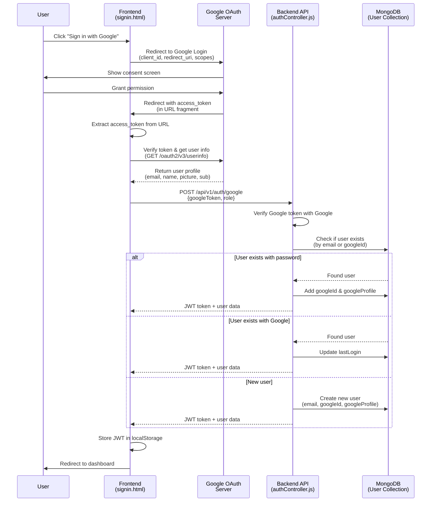
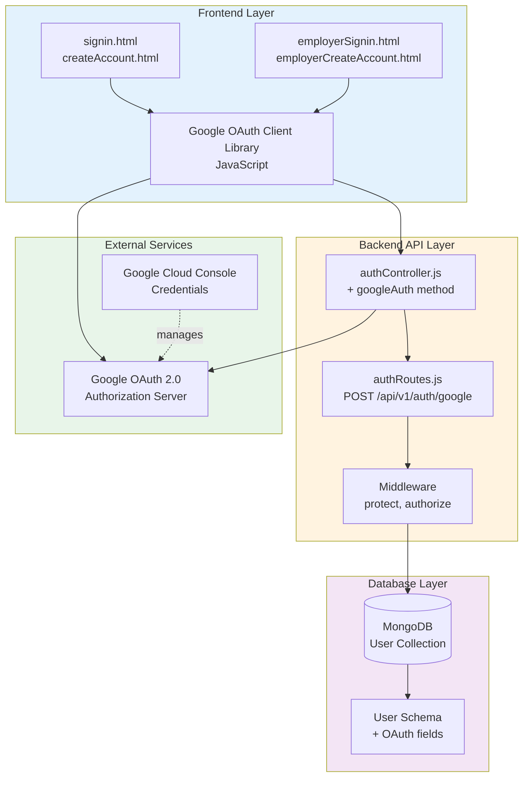

# Google OAuth 2.0 Integration Plan

## Japan SSW Job Matching Platform

**Document Version:** 1.0  
**Last Updated:** February 12, 2026  
**Status:** Planning Phase

---

## Table of Contents

1. [Overview](#overview)
2. [Why Google OAuth?](#why-google-oauth)
3. [Architecture Overview](#architecture-overview)
4. [Prerequisites & Setup](#prerequisites--setup)
5. [Database Schema Changes](#database-schema-changes)
6. [Backend Implementation](#backend-implementation)
7. [Frontend Implementation](#frontend-implementation)
8. [Security Considerations](#security-considerations)
9. [Testing Strategy](#testing-strategy)
10. [Deployment Checklist](#deployment-checklist)

---

## Overview

This document outlines the step-by-step plan to integrate Google OAuth 2.0 authentication into the Japan SSW Job Matching Platform, enabling users to sign up and log in using their Google accounts alongside the existing email/password authentication.

### Goals

✅ **Enable Google Sign-In** for both job seekers and employers  
✅ **Seamless user experience** with one-click authentication  
✅ **Maintain existing authentication** (hybrid approach)  
✅ **Store OAuth data securely** in MongoDB  
✅ **Auto-link accounts** when email matches existing user

### What is OAuth 2.0?

**OAuth 2.0** is an authorization framework that allows third-party applications (like our platform) to access user information from other services (like Google) **without sharing passwords**.

**Think of it like this:** Instead of giving someone your house key, you give them a temporary access card that only works for specific rooms and expires after a set time.

---

## Why Google OAuth?

### Benefits

| Benefit                    | Description                                            |
| -------------------------- | ------------------------------------------------------ |
| 🔐 **Enhanced Security**   | No password storage or management for OAuth users      |
| 🚀 **Faster Registration** | Users can sign up in 2 clicks instead of filling forms |
| ✅ **Verified Emails**     | Google accounts are already verified                   |
| 🌍 **Better UX**           | Users prefer familiar "Sign in with Google" buttons    |
| 📱 **Cross-Device**        | Google accounts work seamlessly across devices         |

### Use Cases in Our Platform

1. **Job Seeker Registration** - Quick sign-up to browse and apply for jobs
2. **Employer Registration** - Fast onboarding to post jobs
3. **Existing User Login** - Alternative login method for current users
4. **Account Recovery** - Easier to recover access via Google

---

## Architecture Overview

### Authentication Flow Diagram



### System Components



---

## Prerequisites & Setup

### Step 1: Create Google OAuth Credentials

1. **Go to Google Cloud Console**
   - Visit: https://console.cloud.google.com/

2. **Create or Select a Project**
   - Click "Select a project" → "New Project"
   - Name: `japan-ssw-platform` or similar
   - Click "Create"

3. **Enable Google+ API** (for user profile access)
   - Navigate to "APIs & Services" → "Library"
   - Search for "Google+ API"
   - Click "Enable"

4. **Configure OAuth Consent Screen**
   - Go to "APIs & Services" → "OAuth consent screen"
   - Select "External" (unless you have Google Workspace)
   - Fill in:
     - **App name:** Japan SSW Job Platform
     - **User support email:** your-email@example.com
     - **Developer contact:** your-email@example.com
   - Add scopes:
     - `openid`
     - `https://www.googleapis.com/auth/userinfo.email`
     - `https://www.googleapis.com/auth/userinfo.profile`
   - Save

5. **Create OAuth Client ID**
   - Go to "APIs & Services" → "Credentials"
   - Click "Create Credentials" → "OAuth client ID"
   - Application type: **Web application**
   - Name: `Japan SSW Web Client`
   - **Authorized JavaScript origins:**
     ```
     http://localhost:3000
     https://yourdomain.com
     ```
   - **Authorized redirect URIs:**
     ```
     http://localhost:3000/pages/signin.html
     http://localhost:3000/pages/createAccount.html
     http://localhost:3000/pages/employerSignin.html
     http://localhost:3000/pages/employerCreateAccount.html
     https://yourdomain.com/pages/signin.html
     https://yourdomain.com/pages/createAccount.html
     ```
   - Click "Create"
   - **Copy your Client ID** (you'll need this!)

### Step 2: Update Environment Variables

Add to `backend/.env`:

```bash
# ============================================
# GOOGLE OAUTH 2.0 CONFIGURATION
# ============================================
# Get these from Google Cloud Console > APIs & Services > Credentials
GOOGLE_CLIENT_ID=your-client-id-here.apps.googleusercontent.com
GOOGLE_CLIENT_SECRET=your-client-secret-here

# Allowed redirect URIs (comma-separated)
GOOGLE_REDIRECT_URIS=http://localhost:3000/pages/signin.html,http://localhost:3000/pages/createAccount.html,http://localhost:3000/pages/employerSignin.html,http://localhost:3000/pages/employerCreateAccount.html
```

Update `backend/.env.example` with the same structure (without real values).

---

## Database Schema Changes

### Current User Schema

```javascript
// backend/src/models/User.js (CURRENT)
{
  email: String,
  password: String,  // required
  role: String,
  profile: ObjectId,
  company: ObjectId,
  isActive: Boolean,
  isEmailVerified: Boolean,
  lastLogin: Date,
  // ... other fields
}
```

### Updated User Schema with OAuth Support

```javascript
// backend/src/models/User.js (UPDATED)
const userSchema = new mongoose.Schema(
  {
    email: {
      type: String,
      required: [true, "Email is required"],
      unique: true,
      lowercase: true,
      trim: true,
      match: [/^\S+@\S+\.\S+$/, "Please provide a valid email"],
    },
    password: {
      type: String,
      // ⚠️ NO LONGER ALWAYS REQUIRED - Optional for OAuth users
      required: function () {
        // Password required only if NOT using OAuth
        return !this.googleId;
      },
      minlength: [8, "Password must be at least 8 characters"],
      select: false,
    },

    // 🆕 NEW: OAuth Provider Fields
    authProvider: {
      type: String,
      enum: ["local", "google"],
      default: "local",
      required: true,
    },

    // 🆕 NEW: Google OAuth ID
    googleId: {
      type: String,
      unique: true,
      sparse: true, // Allows multiple null values
      index: true,
    },

    // 🆕 NEW: Google Profile Data
    googleProfile: {
      email: String,
      name: String,
      picture: String,
      verified_email: Boolean,
      locale: String,
    },

    role: {
      type: String,
      enum: ["jobseeker", "employer", "admin", "rso"],
      default: "jobseeker",
    },
    profile: {
      type: mongoose.Schema.Types.ObjectId,
      ref: "UserProfile",
    },
    company: {
      type: mongoose.Schema.Types.ObjectId,
      ref: "Company",
    },
    isActive: {
      type: Boolean,
      default: true,
    },
    isEmailVerified: {
      type: Boolean,
      default: false,
    },

    // ... rest of existing fields
    lastLogin: Date,
    loginAttempts: {
      type: Number,
      default: 0,
    },
    lockUntil: Date,
  },
  {
    timestamps: true,
    toJSON: { virtuals: true },
    toObject: { virtuals: true },
  },
);

// 🔒 Update password hashing middleware to skip for OAuth users
userSchema.pre("save", async function () {
  if (!this.isModified("password")) return;

  // Skip password hashing if user doesn't have a password (OAuth user)
  if (!this.password) return;

  const salt = await bcrypt.genSalt(12);
  this.password = await bcrypt.hash(this.password, salt);
});

// 🔒 Update comparePassword to handle OAuth users
userSchema.methods.comparePassword = async function (candidatePassword) {
  // OAuth users don't have passwords
  if (!this.password) {
    throw new Error(
      "This account uses Google Sign-In. Please use 'Sign in with Google'.",
    );
  }
  return await bcrypt.compare(candidatePassword, this.password);
};
```

### Database Indexes

Add these indexes for optimal performance:

```javascript
// Add to User.js after schema definition
userSchema.index({ email: 1 }); // Existing
userSchema.index({ googleId: 1 }); // 🆕 NEW
userSchema.index({ authProvider: 1 }); // 🆕 NEW
userSchema.index({ role: 1 }); // Existing
```

### Migration Strategy

**For Existing Users:**

All existing users already have:

- ✅ `email` field
- ✅ `password` field
- ✅ `authProvider` will default to `"local"`

**No data migration needed!** The schema is backward compatible.

If a user later signs in with Google and the email matches:

1. We add their `googleId`
2. We set `authProvider` to `"google"`
3. Their `password` remains intact (they can still use email/password)

---

## Backend Implementation

### Step 1: Install Dependencies

```bash
cd backend
npm install google-auth-library
```

### Step 2: Create Google Auth Utility

Create `backend/src/utils/googleAuth.js`:

```javascript
/**
 * Google OAuth 2.0 Utility Functions
 * Handles verification of Google access tokens
 */

const { OAuth2Client } = require("google-auth-library");
const logger = require("./logger");

const client = new OAuth2Client(process.env.GOOGLE_CLIENT_ID);

/**
 * Verify Google access token and get user info
 * @param {string} token - Google access token from frontend
 * @returns {Promise<Object>} User info from Google
 * @throws {Error} If token is invalid
 */
async function verifyGoogleToken(token) {
  try {
    const ticket = await client.verifyIdToken({
      idToken: token,
      audience: process.env.GOOGLE_CLIENT_ID,
    });

    const payload = ticket.getPayload();

    logger.info(`Google token verified for user: ${payload.email}`);

    return {
      googleId: payload.sub,
      email: payload.email,
      name: payload.name,
      picture: payload.picture,
      verified_email: payload.email_verified,
      locale: payload.locale,
    };
  } catch (error) {
    logger.error(`Google token verification failed: ${error.message}`);
    throw new Error("Invalid Google token");
  }
}

/**
 * Fetch user info from Google using access token
 * Alternative method using Google's userinfo endpoint
 * @param {string} accessToken - Google access token
 * @returns {Promise<Object>} User info
 */
async function getUserInfoFromGoogle(accessToken) {
  try {
    const response = await fetch(
      "https://www.googleapis.com/oauth2/v3/userinfo",
      {
        headers: {
          Authorization: `Bearer ${accessToken}`,
        },
      },
    );

    if (!response.ok) {
      throw new Error("Failed to fetch user info from Google");
    }

    const userInfo = await response.json();
    logger.info(`Fetched Google user info for: ${userInfo.email}`);

    return userInfo;
  } catch (error) {
    logger.error(`Failed to fetch Google user info: ${error.message}`);
    throw error;
  }
}

module.exports = {
  verifyGoogleToken,
  getUserInfoFromGoogle,
};
```

### Step 3: Add Google Auth Controller

Add to `backend/src/controllers/authController.js`:

```javascript
const { verifyGoogleToken } = require("../utils/googleAuth");

/**
 * @desc    Authenticate with Google OAuth
 * @route   POST /api/v1/auth/google
 * @access  Public
 */
exports.googleAuth = asyncHandler(async (req, res, next) => {
  const { googleToken, role } = req.body;

  // Validate input
  if (!googleToken) {
    return next(new ApiError(400, "Google token is required"));
  }

  // Verify Google token and get user info
  let googleUserInfo;
  try {
    googleUserInfo = await verifyGoogleToken(googleToken);
  } catch (error) {
    return next(new ApiError(401, "Invalid Google token"));
  }

  const { googleId, email, name, picture, verified_email, locale } =
    googleUserInfo;

  // Check if user already exists (by googleId OR email)
  let user = await User.findOne({
    $or: [{ googleId }, { email }],
  });

  if (user) {
    // 📌 EXISTING USER FLOW

    // If user exists with email but no googleId, link the Google account
    if (!user.googleId) {
      user.googleId = googleId;
      user.googleProfile = { email, name, picture, verified_email, locale };
      user.authProvider = "google";
      user.isEmailVerified = verified_email;
      logger.info(`Linked Google account to existing user: ${email}`);
    }

    // Update last login
    user.lastLogin = Date.now();
    await user.save();

    // Generate JWT token
    const token = user.getSignedJwtToken();

    logger.info(`Google login successful: ${email}`);

    return res.status(200).json(
      new ApiResponse(200, "Google login successful", {
        token,
        user: {
          id: user._id,
          email: user.email,
          role: user.role,
          authProvider: user.authProvider,
          picture: user.googleProfile?.picture,
        },
      }),
    );
  }

  // 📌 NEW USER FLOW - Create new account

  // Validate role for new registration
  const allowedRoles = ["jobseeker", "employer"];
  const userRole = role && allowedRoles.includes(role) ? role : "jobseeker";

  // Create new user
  user = await User.create({
    email,
    googleId,
    googleProfile: {
      email,
      name,
      picture,
      verified_email,
      locale,
    },
    role: userRole,
    authProvider: "google",
    isEmailVerified: verified_email,
    lastLogin: Date.now(),
  });

  // Generate JWT token
  const token = user.getSignedJwtToken();

  logger.info(`New Google user registered: ${email}`);

  res.status(201).json(
    new ApiResponse(201, "Google registration successful", {
      token,
      user: {
        id: user._id,
        email: user.email,
        role: user.role,
        authProvider: user.authProvider,
        picture: user.googleProfile.picture,
      },
    }),
  );
});
```

### Step 4: Add Google Auth Route

Update `backend/src/routes/authRoutes.js`:

```javascript
const {
  register,
  login,
  getMe,
  logout,
  forgotPassword,
  googleAuth, // 🆕 NEW
} = require("../controllers/authController");

/**
 * @swagger
 * /api/v1/auth/google:
 *   post:
 *     summary: Authenticate with Google OAuth 2.0
 *     tags: [Authentication]
 *     requestBody:
 *       required: true
 *       content:
 *         application/json:
 *           schema:
 *             type: object
 *             required:
 *               - googleToken
 *             properties:
 *               googleToken:
 *                 type: string
 *                 description: Google OAuth access token (ID token)
 *                 example: ya29.a0AfH6SMB...
 *               role:
 *                 type: string
 *                 enum: [jobseeker, employer]
 *                 description: User role (only for new registrations)
 *                 example: jobseeker
 *     responses:
 *       200:
 *         description: Google login successful (existing user)
 *       201:
 *         description: Google registration successful (new user)
 *       400:
 *         description: Missing Google token
 *       401:
 *         description: Invalid Google token
 */
router.post("/google", googleAuth); // 🆕 NEW ROUTE
```

### Step 5: Update Existing Login to Handle OAuth Users

Update the `login` function in `authController.js`:

```javascript
exports.login = asyncHandler(async (req, res, next) => {
  const { email, password } = req.body;

  // Validate input
  if (!email || !password) {
    return next(new ApiError(400, "Please provide email and password"));
  }

  // Find user (include password field)
  const user = await User.findOne({ email }).select("+password");

  if (!user) {
    return next(new ApiError(401, "Invalid credentials"));
  }

  // Check if account is locked
  if (user.isLocked) {
    return next(
      new ApiError(
        401,
        "Account is locked due to too many failed login attempts. Try again later.",
      ),
    );
  }

  // 🆕 NEW: Check if user registered with Google OAuth
  if (user.authProvider === "google" && !user.password) {
    return next(
      new ApiError(
        400,
        "This account uses Google Sign-In. Please click 'Sign in with Google'.",
      ),
    );
  }

  // Check password
  const isPasswordCorrect = await user.comparePassword(password);

  if (!isPasswordCorrect) {
    await user.incLoginAttempts();
    return next(new ApiError(401, "Invalid credentials"));
  }

  // Reset login attempts on successful login
  if (user.loginAttempts > 0) {
    await user.resetLoginAttempts();
  }

  // Update last login
  user.lastLogin = Date.now();
  await user.save();

  // Generate token
  const token = user.getSignedJwtToken();

  logger.info(`User logged in: ${email}`);

  res.status(200).json(
    new ApiResponse(200, "Login successful", {
      token,
      user: {
        id: user._id,
        email: user.email,
        role: user.role,
        authProvider: user.authProvider,
      },
    }),
  );
});
```

---

## Frontend Implementation

### Step 1: Load Google OAuth Library

Add this to the `<head>` section of all auth pages:

```html
<!-- Google OAuth 2.0 Client Library -->
<script src="https://accounts.google.com/gsi/client" async defer></script>
```

### Step 2: Add "Sign in with Google" Button

#### For Job Seekers (signin.html)

Update `pages/signin.html`:

```html
<!-- After the Sign in button -->
<div class="mt-14 mb-6">
  <button
    type="submit"
    class="w-full flex justify-center py-2 px-4 border border-transparent rounded-md shadow-sm text-sm font-medium text-white bg-red-600 hover:bg-red-700 focus:outline-none focus:ring-2 focus:ring-offset-2 focus:ring-red-500"
  >
    Sign in
  </button>
</div>

<!-- 🆕 NEW: Divider -->
<div class="relative my-6">
  <div class="absolute inset-0 flex items-center">
    <div class="w-full border-t border-gray-300"></div>
  </div>
  <div class="relative flex justify-center text-sm">
    <span class="px-2 bg-white text-gray-500">Or continue with</span>
  </div>
</div>

<!-- 🆕 NEW: Google Sign-In Button -->
<div
  id="g_id_onload"
  data-client_id="YOUR_GOOGLE_CLIENT_ID.apps.googleusercontent.com"
  data-context="signin"
  data-ux_mode="popup"
  data-callback="handleGoogleSignIn"
  data-auto_prompt="false"
></div>

<div
  class="g_id_signin"
  data-type="standard"
  data-shape="rectangular"
  data-theme="outline"
  data-text="signin_with"
  data-size="large"
  data-logo_alignment="left"
  data-width="100%"
></div>

<!-- Fallback: Custom Google Button (if library doesn't load) -->
<button
  type="button"
  id="customGoogleBtn"
  class="hidden w-full flex items-center justify-center gap-3 py-2 px-4 border border-gray-300 rounded-md shadow-sm text-sm font-medium text-gray-700 bg-white hover:bg-gray-50 focus:outline-none focus:ring-2 focus:ring-offset-2 focus:ring-red-500"
>
  <svg class="w-5 h-5" viewBox="0 0 24 24">
    <path
      fill="#4285F4"
      d="M22.56 12.25c0-.78-.07-1.53-.2-2.25H12v4.26h5.92c-.26 1.37-1.04 2.53-2.21 3.31v2.77h3.57c2.08-1.92 3.28-4.74 3.28-8.09z"
    />
    <path
      fill="#34A853"
      d="M12 23c2.97 0 5.46-.98 7.28-2.66l-3.57-2.77c-.98.66-2.23 1.06-3.71 1.06-2.86 0-5.29-1.93-6.16-4.53H2.18v2.84C3.99 20.53 7.7 23 12 23z"
    />
    <path
      fill="#FBBC05"
      d="M5.84 14.09c-.22-.66-.35-1.36-.35-2.09s.13-1.43.35-2.09V7.07H2.18C1.43 8.55 1 10.22 1 12s.43 3.45 1.18 4.93l2.85-2.22.81-.62z"
    />
    <path
      fill="#EA4335"
      d="M12 5.38c1.62 0 3.06.56 4.21 1.64l3.15-3.15C17.45 2.09 14.97 1 12 1 7.7 1 3.99 3.47 2.18 7.07l3.66 2.84c.87-2.6 3.3-4.53 6.16-4.53z"
    />
  </svg>
  Sign in with Google
</button>
```

#### For Employers (employerSignin.html)

Add the same Google button structure to `pages/employerSignin.html`.

#### For Registration Pages

Add to `pages/createAccount.html` and `pages/employerCreateAccount.html`:

```html
<!-- After the Create Account button -->
<div class="relative my-6">
  <div class="absolute inset-0 flex items-center">
    <div class="w-full border-t border-gray-300"></div>
  </div>
  <div class="relative flex justify-center text-sm">
    <span class="px-2 bg-white text-gray-500">Or sign up with</span>
  </div>
</div>

<!-- Google Sign-Up Button -->
<div
  id="g_id_onload"
  data-client_id="YOUR_GOOGLE_CLIENT_ID.apps.googleusercontent.com"
  data-context="signup"
  data-ux_mode="popup"
  data-callback="handleGoogleSignUp"
  data-auto_prompt="false"
></div>

<div
  class="g_id_signin"
  data-type="standard"
  data-shape="rectangular"
  data-theme="outline"
  data-text="signup_with"
  data-size="large"
  data-logo_alignment="left"
  data-width="100%"
></div>
```

### Step 3: Add JavaScript Handlers

Create `assets/js/googleAuth.js`:

```javascript
/**
 * Google OAuth 2.0 Authentication Handler
 * Handles Google Sign-In responses and communicates with backend
 */

const API_BASE_URL = "http://localhost:3000/api/v1";

/**
 * Handle Google Sign-In response (for login pages)
 * @param {Object} response - Google Sign-In response object
 */
async function handleGoogleSignIn(response) {
  console.log("Google Sign-In initiated");

  try {
    // The response.credential contains the JWT ID token
    const googleToken = response.credential;

    if (!googleToken) {
      showError("Failed to get Google authentication token");
      return;
    }

    // Show loading state
    showLoading("Signing in with Google...");

    // Send token to our backend
    const result = await fetch(`${API_BASE_URL}/auth/google`, {
      method: "POST",
      headers: {
        "Content-Type": "application/json",
      },
      body: JSON.stringify({
        googleToken: googleToken,
        // role is optional for login, backend will use existing role
      }),
    });

    const data = await result.json();

    if (!result.ok) {
      throw new Error(data.message || "Google sign-in failed");
    }

    // Store JWT token in localStorage
    localStorage.setItem("token", data.data.token);
    localStorage.setItem("user", JSON.stringify(data.data.user));

    console.log("Google Sign-In successful:", data.data.user);

    // Redirect based on user role
    redirectToDashboard(data.data.user.role);
  } catch (error) {
    console.error("Google Sign-In error:", error);
    showError(error.message || "Failed to sign in with Google");
    hideLoading();
  }
}

/**
 * Handle Google Sign-Up response (for registration pages)
 * @param {Object} response - Google Sign-In response object
 */
async function handleGoogleSignUp(response) {
  console.log("Google Sign-Up initiated");

  try {
    const googleToken = response.credential;

    if (!googleToken) {
      showError("Failed to get Google authentication token");
      return;
    }

    // Determine role based on page URL
    const isEmployer = window.location.pathname.includes("employer");
    const role = isEmployer ? "employer" : "jobseeker";

    showLoading("Creating your account...");

    // Send token to backend
    const result = await fetch(`${API_BASE_URL}/auth/google`, {
      method: "POST",
      headers: {
        "Content-Type": "application/json",
      },
      body: JSON.stringify({
        googleToken: googleToken,
        role: role,
      }),
    });

    const data = await result.json();

    if (!result.ok) {
      throw new Error(data.message || "Google sign-up failed");
    }

    // Store JWT token
    localStorage.setItem("token", data.data.token);
    localStorage.setItem("user", JSON.stringify(data.data.user));

    console.log("Google Sign-Up successful:", data.data.user);

    // Redirect to dashboard
    redirectToDashboard(role);
  } catch (error) {
    console.error("Google Sign-Up error:", error);
    showError(error.message || "Failed to sign up with Google");
    hideLoading();
  }
}

/**
 * Redirect user to appropriate dashboard
 * @param {string} role - User role
 */
function redirectToDashboard(role) {
  if (role === "employer") {
    window.location.href = "/pages/companyDashboard.html";
  } else {
    window.location.href = "/pages/profileDashboard.html";
  }
}

/**
 * Show loading overlay
 * @param {string} message - Loading message
 */
function showLoading(message) {
  // Create or show loading overlay
  let overlay = document.getElementById("loadingOverlay");
  if (!overlay) {
    overlay = document.createElement("div");
    overlay.id = "loadingOverlay";
    overlay.className =
      "fixed inset-0 bg-black bg-opacity-50 flex items-center justify-center z-50";
    overlay.innerHTML = `
      <div class="bg-white rounded-lg p-6 max-w-sm">
        <div class="flex items-center gap-3">
          <div class="animate-spin rounded-full h-8 w-8 border-b-2 border-red-600"></div>
          <p class="text-gray-700">${message}</p>
        </div>
      </div>
    `;
    document.body.appendChild(overlay);
  } else {
    overlay.style.display = "flex";
  }
}

/**
 * Hide loading overlay
 */
function hideLoading() {
  const overlay = document.getElementById("loadingOverlay");
  if (overlay) {
    overlay.style.display = "none";
  }
}

/**
 * Show error message
 * @param {string} message - Error message
 */
function showError(message) {
  alert(message); // Simple alert for now, can be improved with modal
}

// Handle errors from Google Sign-In library
window.addEventListener("error", (event) => {
  if (event.message.includes("gsi")) {
    console.error("Google Sign-In library error:", event);
  }
});
```

### Step 4: Include Scripts in HTML Pages

Add to all auth pages (`signin.html`, `createAccount.html`, `employerSignin.html`, `employerCreateAccount.html`):

```html
<!-- Before closing </body> tag -->
<script src="../assets/js/googleAuth.js"></script>
```

### Step 5: Update API Configuration

Create or update `assets/js/config.js`:

```javascript
// API Configuration
const API_CONFIG = {
  BASE_URL:
    window.location.hostname === "localhost"
      ? "http://localhost:3000/api/v1"
      : "https://yourdomain.com/api/v1",

  GOOGLE_CLIENT_ID: "YOUR_GOOGLE_CLIENT_ID.apps.googleusercontent.com",
};

// Replace YOUR_GOOGLE_CLIENT_ID in HTML with this config
// Or use JavaScript to set it dynamically
document.addEventListener("DOMContentLoaded", () => {
  const gOnload = document.getElementById("g_id_onload");
  if (gOnload) {
    gOnload.setAttribute("data-client_id", API_CONFIG.GOOGLE_CLIENT_ID);
  }
});
```

---

## Security Considerations

### 1. Token Verification ✅

**Always verify Google tokens on the backend**, never trust the frontend.

```javascript
// ✅ CORRECT - Backend verifies token with Google
const googleUserInfo = await verifyGoogleToken(googleToken);

// ❌ WRONG - Never trust client-provided user info
const { email, name } = req.body; // Can be faked!
```

### 2. CSRF Protection

Use the `state` parameter to prevent CSRF attacks:

```javascript
// Generate random state before OAuth flow
const state = crypto.randomBytes(16).toString("hex");
localStorage.setItem("oauth_state", state);

// Verify state after OAuth callback
if (receivedState !== localStorage.getItem("oauth_state")) {
  throw new Error("Possible CSRF attack detected");
}
```

### 3. HTTPS in Production

⚠️ **Never use OAuth over HTTP in production!**

```bash
# Development: http://localhost:3000 ✅
# Production: https://yourdomain.com ✅
```

### 4. Secure Token Storage

```javascript
// ✅ CORRECT - Store JWT in localStorage (for SPA)
localStorage.setItem("token", jwtToken);

// ⚠️ ALTERNATIVE - HttpOnly cookies (better for SSR)
// Set in backend: res.cookie('token', jwtToken, { httpOnly: true, secure: true });
```

### 5. Rate Limiting

Add to `backend/server.js` or middleware:

```javascript
const rateLimit = require("express-rate-limit");

const googleAuthLimiter = rateLimit({
  windowMs: 15 * 60 * 1000, // 15 minutes
  max: 10, // Max 10 Google auth attempts per IP
  message: "Too many Google authentication attempts, please try again later",
});

app.use("/api/v1/auth/google", googleAuthLimiter);
```

### 6. Environment Variables

**Never commit real credentials!**

```bash
# ✅ CORRECT
GOOGLE_CLIENT_ID=your-id.apps.googleusercontent.com  # in .env (gitignored)

# ❌ WRONG
GOOGLE_CLIENT_ID=123456789.apps.googleusercontent.com  # in .env.example (committed)
```

### 7. Account Linking Security

When linking Google to existing account:

```javascript
// Only link if email is verified on BOTH sides
if (user.isEmailVerified && googleUserInfo.verified_email) {
  user.googleId = googleUserInfo.googleId;
  await user.save();
}
```

---

## Testing Strategy

### Manual Testing Checklist

#### Scenario 1: New User Signs Up with Google

| Step | Action                      | Expected Result                                        |
| ---- | --------------------------- | ------------------------------------------------------ |
| 1    | Go to `createAccount.html`  | Page loads with Google button                          |
| 2    | Click "Sign up with Google" | Google consent screen appears                          |
| 3    | Select Google account       | Redirects back to site                                 |
| 4    | Backend receives token      | Token is verified with Google                          |
| 5    | Backend creates new user    | User saved with `googleId` and `authProvider="google"` |
| 6    | Frontend receives JWT       | Token stored in localStorage                           |
| 7    | User redirected             | Goes to `profileDashboard.html`                        |
| 8    | Check MongoDB               | User exists with no password field, has `googleId`     |

#### Scenario 2: Existing User (Email/Password) Links Google

| Step | Action                                                 | Expected Result                                       |
| ---- | ------------------------------------------------------ | ----------------------------------------------------- |
| 1    | User exists with email `john@example.com` and password | User can log in with email/password                   |
| 2    | User clicks "Sign in with Google"                      | Google consent screen appears                         |
| 3    | User selects same email `john@example.com`             | Backend finds existing user by email                  |
| 4    | Backend links accounts                                 | Adds `googleId` to user, sets `authProvider="google"` |
| 5    | User can now use both methods                          | Can log in with email/password OR Google              |

#### Scenario 3: OAuth User Tries Email/Password Login

| Step | Action                                    | Expected Result                            |
| ---- | ----------------------------------------- | ------------------------------------------ |
| 1    | User registered with Google (no password) | User has `googleId`, no `password`         |
| 2    | User tries email/password login           | Backend checks `authProvider`              |
| 3    | Backend blocks login                      | Returns error: "Use 'Sign in with Google'" |
| 4    | User sees error message                   | "This account uses Google Sign-In..."      |

#### Scenario 4: Token Expiration

| Step | Action                            | Expected Result                     |
| ---- | --------------------------------- | ----------------------------------- |
| 1    | User logs in with Google          | JWT token issued, expires in 7 days |
| 2    | Token expires after 7 days        | Protected routes return 401         |
| 3    | User clicks "Sign in with Google" | New JWT issued, user logged back in |

### Automated Testing

Create `backend/tests/auth.google.test.js`:

```javascript
const request = require("supertest");
const app = require("../src/app");
const User = require("../src/models/User");
const { verifyGoogleToken } = require("../src/utils/googleAuth");

// Mock Google Auth
jest.mock("../src/utils/googleAuth");

describe("Google OAuth Authentication", () => {
  beforeEach(async () => {
    await User.deleteMany({});
  });

  describe("POST /api/v1/auth/google", () => {
    it("should register new user with Google", async () => {
      const mockGoogleUser = {
        googleId: "google123",
        email: "newuser@gmail.com",
        name: "New User",
        picture: "https://example.com/pic.jpg",
        verified_email: true,
        locale: "en",
      };

      verifyGoogleToken.mockResolvedValue(mockGoogleUser);

      const res = await request(app)
        .post("/api/v1/auth/google")
        .send({
          googleToken: "mock-token",
          role: "jobseeker",
        })
        .expect(201);

      expect(res.body.success).toBe(true);
      expect(res.body.data.user.email).toBe("newuser@gmail.com");
      expect(res.body.data.token).toBeDefined();

      const user = await User.findOne({ email: "newuser@gmail.com" });
      expect(user).toBeDefined();
      expect(user.googleId).toBe("google123");
      expect(user.authProvider).toBe("google");
    });

    it("should link Google to existing email user", async () => {
      // Create existing user with email/password
      await User.create({
        email: "existing@gmail.com",
        password: "password123",
        role: "jobseeker",
      });

      const mockGoogleUser = {
        googleId: "google456",
        email: "existing@gmail.com",
        name: "Existing User",
        verified_email: true,
      };

      verifyGoogleToken.mockResolvedValue(mockGoogleUser);

      const res = await request(app)
        .post("/api/v1/auth/google")
        .send({ googleToken: "mock-token" })
        .expect(200);

      const user = await User.findOne({ email: "existing@gmail.com" });
      expect(user.googleId).toBe("google456");
      expect(user.authProvider).toBe("google");
      expect(user.password).toBeDefined(); // Password still exists
    });

    it("should reject invalid Google token", async () => {
      verifyGoogleToken.mockRejectedValue(new Error("Invalid token"));

      await request(app)
        .post("/api/v1/auth/google")
        .send({ googleToken: "invalid-token" })
        .expect(401);
    });
  });
});
```

Run tests:

```bash
cd backend
npm test -- auth.google.test.js
```

---

## Deployment Checklist

### Pre-Deployment

- [ ] Update `.env` with production Google Client ID
- [ ] Add production URLs to Google Cloud Console authorized origins
- [ ] Test OAuth flow on staging environment
- [ ] Verify HTTPS is enabled on production domain
- [ ] Update CORS settings to allow production domain
- [ ] Run all automated tests
- [ ] Perform manual testing on all user flows

### Environment Variables (Production)

```bash
# Production .env
NODE_ENV=production
GOOGLE_CLIENT_ID=your-production-client-id.apps.googleusercontent.com
GOOGLE_CLIENT_SECRET=your-production-secret
GOOGLE_REDIRECT_URIS=https://yourdomain.com/pages/signin.html,https://yourdomain.com/pages/createAccount.html
```

### Frontend Configuration (Production)

Update `assets/js/config.js`:

```javascript
const API_CONFIG = {
  BASE_URL: "https://yourdomain.com/api/v1",
  GOOGLE_CLIENT_ID: "your-production-client-id.apps.googleusercontent.com",
};
```

### Database Migration (If Needed)

If you have existing users and want to prepare for OAuth:

```javascript
// Optional migration script: backend/scripts/prepare-oauth-migration.js
const mongoose = require("mongoose");
const User = require("../src/models/User");

async function migrateUsers() {
  await mongoose.connect(process.env.MONGODB_URI);

  // Add authProvider field to existing users
  await User.updateMany(
    { authProvider: { $exists: false } },
    { $set: { authProvider: "local" } },
  );

  console.log("Migration complete");
  process.exit(0);
}

migrateUsers();
```

Run migration:

```bash
node backend/scripts/prepare-oauth-migration.js
```

### Post-Deployment

- [ ] Monitor logs for any OAuth errors
- [ ] Check MongoDB for new OAuth users
- [ ] Test Google Sign-In on production
- [ ] Verify account linking works
- [ ] Check error handling for invalid tokens
- [ ] Monitor rate limiting effectiveness

---

## Troubleshooting Guide

### Common Issues

#### 1. "redirect_uri_mismatch" Error

**Problem:** Google OAuth shows error page with `redirect_uri_mismatch`.

**Solution:**

- Go to Google Cloud Console → Credentials
- Check **Authorized redirect URIs** includes exact URL
- Make sure protocol (http/https), port, and path match exactly
- Example: `http://localhost:3000/pages/signin.html` (not `/signin.html`)

#### 2. "Invalid Google token" on Backend

**Problem:** Backend returns 401 "Invalid Google token".

**Solution:**

- Verify `GOOGLE_CLIENT_ID` in `.env` matches Google Cloud Console
- Check token hasn't expired (tokens expire after 1 hour)
- Ensure `google-auth-library` is installed: `npm install google-auth-library`

#### 3. Google Button Doesn't Appear

**Problem:** "Sign in with Google" button not rendering.

**Solution:**

- Check browser console for errors
- Verify Google library loaded: `<script src="https://accounts.google.com/gsi/client" async defer></script>`
- Check `data-client_id` matches your Client ID
- Test in incognito mode (extensions may block)

#### 4. User Created Without Role

**Problem:** New Google users default to "jobseeker" even on employer page.

**Solution:**

- Check `handleGoogleSignUp` correctly detects page URL
- Verify `role` parameter sent to backend
- Check backend logs for received role value

#### 5. CORS Error When Calling Backend

**Problem:** `Access-Control-Allow-Origin` error in browser console.

**Solution:**

- Update CORS settings in `backend/server.js`:
  ```javascript
  const cors = require("cors");
  app.use(
    cors({
      origin: ["http://localhost:3000", "https://yourdomain.com"],
      credentials: true,
    }),
  );
  ```

---

## Future Enhancements

### Phase 2: Additional OAuth Providers

Once Google OAuth is working, consider adding:

- **Facebook Login**
- **LinkedIn Login** (great for professional networking!)
- **Apple Sign In** (required for iOS apps)

### Phase 3: Social Profile Integration

Pull additional data from Google profile:

- Profile picture (already included)
- Locale/language preference
- Time zone
- Google Calendar integration (for interview scheduling)

### Phase 4: Advanced Features

- **One-Tap Sign-In:** Auto-sign in returning users
- **Account Merging UI:** Let users manually link/unlink accounts
- **OAuth Scope Management:** Request additional permissions as needed
- **Refresh Token Flow:** Keep users logged in longer

---

## Summary

### What We're Adding

✅ **Google OAuth 2.0** authentication  
✅ **Hybrid auth** (email/password + Google)  
✅ **Account linking** for existing users  
✅ **Secure token verification** on backend  
✅ **User-friendly UI** with Google buttons

### Key Files to Create/Modify

| File                                        | Action | Purpose                  |
| ------------------------------------------- | ------ | ------------------------ |
| `backend/src/models/User.js`                | Modify | Add OAuth fields         |
| `backend/src/utils/googleAuth.js`           | Create | Token verification       |
| `backend/src/controllers/authController.js` | Modify | Add `googleAuth()`       |
| `backend/src/routes/authRoutes.js`          | Modify | Add POST `/google` route |
| `backend/.env`                              | Update | Add Google credentials   |
| `assets/js/googleAuth.js`                   | Create | Frontend OAuth handler   |
| `pages/signin.html`                         | Modify | Add Google button        |
| `pages/createAccount.html`                  | Modify | Add Google button        |
| `pages/employerSignin.html`                 | Modify | Add Google button        |
| `pages/employerCreateAccount.html`          | Modify | Add Google button        |

### Development Timeline

| Phase          | Duration   | Tasks                                    |
| -------------- | ---------- | ---------------------------------------- |
| **Setup**      | 1 day      | Google Cloud Console setup, credentials  |
| **Backend**    | 2 days     | Schema changes, API endpoint, testing    |
| **Frontend**   | 2 days     | UI changes, JavaScript handlers, testing |
| **Testing**    | 1 day      | Manual testing, automated tests          |
| **Deployment** | 1 day      | Production setup, monitoring             |
| **Total**      | **7 days** | Full integration                         |

### Next Steps

1. ✅ Review this document with team
2. 📋 Create Google Cloud project and get credentials
3. 🔧 Update User schema in MongoDB
4. 💻 Implement backend API endpoint
5. 🎨 Add Google buttons to frontend
6. 🧪 Test all user flows
7. 🚀 Deploy to production
8. 📊 Monitor adoption and errors

---

## Questions?

If you have questions about this integration plan:

1. **Technical Questions:** Review the code snippets and diagrams above
2. **Security Concerns:** See [Security Considerations](#security-considerations)
3. **Testing:** Follow the [Testing Strategy](#testing-strategy)
4. **Deployment:** Use the [Deployment Checklist](#deployment-checklist)

**Happy Coding! 🚀**

---

_Document created by: GitHub Copilot_  
_Last updated: February 12, 2026_
